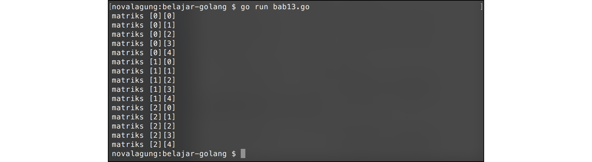

# A.13. Perulangan

Perulangan adalah proses mengulang-ulang eksekusi blok kode tanpa henti, selama kondisi yang dijadikan acuan terpenuhi. Biasanya disiapkan variabel untuk iterasi atau variabel penanda kapan perulangan akan diberhentikan.

Di Go keyword perulangan hanya **for** saja, tetapi meski demikian, kemampuannya merupakan gabungan `for`, `foreach`, dan `while` ibarat bahasa pemrograman lain.

## A.13.1. Perulangan Menggunakan Keyword `for`

Ada beberapa cara standar menggunakan `for`. Cara pertama dengan memasukkan variabel counter perulangan beserta kondisinya setelah keyword. Perhatikan dan praktekan kode berikut.

```go
for i := 0; i < 5; i++ {
    fmt.Println("Angka", i)
}
```

Perulangan di atas hanya akan berjalan ketika variabel `i` bernilai dibawah `5`, dengan ketentuan setiap kali perulangan, nilai variabel `i` akan di-iterasi atau ditambahkan 1 (`i++` artinya ditambah satu, sama seperti `i = i + 1`). Karena `i` pada awalnya bernilai 0, maka perulangan akan berlangsung 5 kali, yaitu ketika `i` bernilai 0, 1, 2, 3, dan 4.


## A.13.2. Penggunaan Keyword `for` Dengan Argumen Hanya Kondisi

Cara ke-2 adalah dengan menuliskan kondisi setelah keyword `for` (hanya kondisi). Deklarasi dan iterasi variabel counter tidak dituliskan setelah keyword, hanya kondisi perulangan saja. Konsepnya mirip seperti `while` milik bahasa pemrograman lain.

Kode berikut adalah contoh `for` dengan argumen hanya kondisi (seperti `if`), output yang dihasilkan sama seperti penerapan for cara pertama.

```go
var i = 0

for i < 5 {
    fmt.Println("Angka", i)
    i++
}
```

## A.13.3. Penggunaan Keyword `for` Tanpa Argumen

Cara ke-3 adalah `for` ditulis tanpa kondisi. Dengan ini akan dihasilkan perulangan tanpa henti (sama dengan `for true`). Pemberhentian perulangan dilakukan dengan menggunakan keyword `break`.

```go
var i = 0

for {
    fmt.Println("Angka", i)

    i++
    if i == 5 {
        break
    }
}
```

Dalam perulangan tanpa henti di atas, variabel `i` yang nilai awalnya `0` di-inkrementasi. Ketika nilai `i` sudah mencapai `5`, keyword `break` digunakan, dan perulangan akan berhenti.

## A.13.4. Penggunaan Keyword `for` - `range`

Cara ke-4 adalah perulangan dengan menggunakan kombinasi keyword `for` dan `range`. Cara ini biasa digunakan untuk me-looping data bertipe array. Detailnya akan dibahas dalam bab selanjutnya (bab 14).

## A.13.5. Penggunaan Keyword `break` & `continue`

Keyword `break` digunakan untuk menghentikan secara paksa sebuah perulangan, sedangkan `continue` dipakai untuk memaksa maju ke perulangan berikutnya.

Berikut merupakan contoh penerapan `continue` dan `break`. Kedua keyword tersebut dimanfaatkan untuk menampilkan angka genap berurutan yang lebih besar dari 0 dan dibawah 8.

```go
for i := 1; i <= 10; i++ {
    if i % 2 == 1 {
        continue
    }

    if i > 8 {
        break
    }

    fmt.Println("Angka", i)
}
```

Kode di atas akan lebih mudah dicerna jika dijelaskan secara berurutan. Berikut adalah penjelasannya.

 1. Dilakukan perulangan mulai angka 1 hingga 10 dengan `i` sebagai variabel iterasi.
 2. Ketika `i` adalah ganjil (dapat diketahui dari `i % 2`, jika hasilnya `1`, berarti ganjil), maka akan dipaksa lanjut ke perulangan berikutnya.
 3. Ketika `i` lebih besar dari 8, maka perulangan akan berhenti.
 4. Nilai `m` ditampilkan.


## A.13.6. Perulangan Bersarang

Tak hanya seleksi kondisi yang bisa bersarang, perulangan juga bisa. Cara pengaplikasiannya kurang lebih sama, tinggal tulis blok statement perulangan didalam perulangan.

```go
for i := 0; i < 5; i++ {
    for j := i; j < 5; j++ {
        fmt.Print(j, " ")
    }

    fmt.Println()
}
```

Pada kode di atas, untuk pertama kalinya fungsi `fmt.Println()` dipanggil tanpa disisipkan parameter. Cara seperti ini bisa digunakan untuk menampilkan baris baru. Kegunaannya sama seperti output dari statement `fmt.Print("\n")`.


## A.13.7. Pemanfaatan Label Dalam Perulangan

Di perulangan bersarang, `break` dan `continue` akan berlaku pada blok perulangan dimana ia digunakan saja. Ada cara agar kedua keyword ini bisa tertuju pada perulangan terluar atau perulangan tertentu, yaitu dengan memanfaatkan teknik pemberian **label**.

Program untuk memunculkan matriks berikut merupakan contoh penerapan label perulangan.

```go
outerLoop:
for i := 0; i < 5; i++ {
    for j := 0; j < 5; j++ {
        if i == 3 {
            break outerLoop
        }
        fmt.Print("matriks [", i, "][", j, "]", "\n")
    }
}
```

Tepat sebelum keyword `for` terluar, terdapat baris kode `outerLoop:`. Maksud dari kode tersebut adalah disiapkan sebuah label bernama `outerLoop` untuk `for` dibawahnya. Nama label bisa diganti dengan nama lain (dan harus diakhiri dengan tanda titik dua atau *colon* (`:`) ).

Pada `for` bagian dalam, terdapat seleksi kondisi untuk pengecekan nilai `i`. Ketika nilai tersebut sama dengan `3`, maka `break` dipanggil dengan target adalah perulangan yang dilabeli `outerLoop`, perulangan tersebut akan dihentikan.



---

Source code praktek pada bab ini tersedia di [Github](https://github.com/novalagung/dasarpemrogramangolang/tree/master/chapter-A.13-perulangan)
