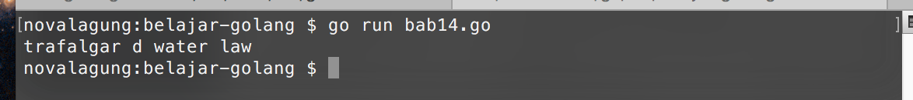
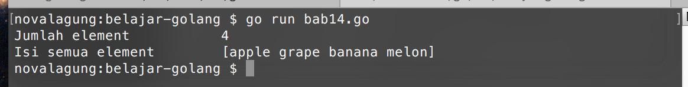
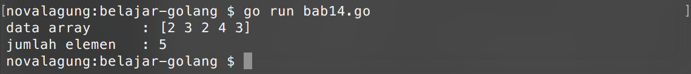
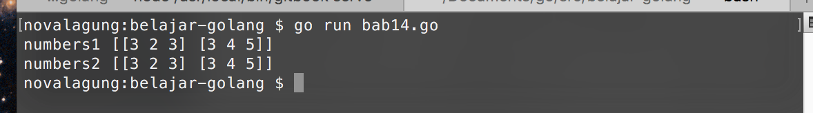
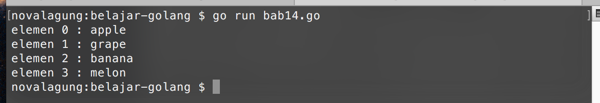
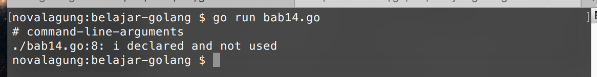
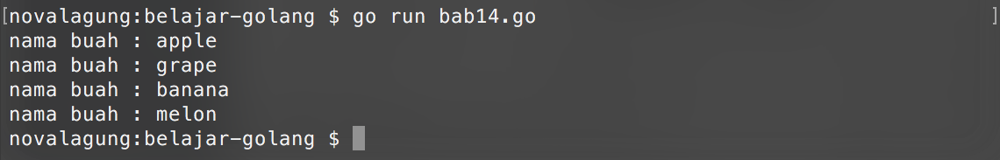

# Array

Array adalah kumpulan data bertipe sama, yang disimpan dalam sebuah variabel. Array memiliki kapasitas yang nilainya ditentukan pada saat pembuatan, menjadikan elemen/data yang disimpan di array tersebut jumlahnya tidak boleh melebihi yang sudah dialokasikan. Default nilai tiap elemen array pada awalnya tergantung dari tipe datanya. Jika `int` maka default nya `0`, jika `bool` maka default-nya `false`, dan tipe data lain. Setiap elemen array memiliki indeks berupa angka yang merepresentasikan posisi urutan elemen tersebut. Indeks array dimulai dari 0.

Contoh penerapan array:

```go
var names [4]string
names[0] = "trafalgar"
names[1] = "d"
names[2] = "water"
names[3] = "law"

fmt.Println(names[0], names[1], names[2], names[3])
```

Variabel `names` dideklarasikan sebagai `array string` dengan alokasi elemen `4` slot. Cara mengisi slot elemen array bisa dilihat di kode di atas, yaitu dengan langsung mengakses elemen menggunakan indeks, lalu mengisinya.



## Inisialisasi Nilai Awal Array

Pengisian elemen array bisa dilakukan pada saat deklarasi variabel. Caranya dengan menuliskan data elemen dalam kurung kurawal setelah tipe data, dengan pembatas antar elemen adalah tanda koma (`,`). Berikut merupakan contohnya.

```go
var fruits = [4]string{"apple", "grape", "banana", "melon"}

fmt.Println("Jumlah element \t\t", len(fruits))
fmt.Println("Isi semua element \t", fruits)
```

Penggunaan fungsi `fmt.Println()` pada data array tanpa mengakses indeks tertentu, akan menghasilkan output dalam bentuk string dari semua array yang ada. Teknik ini biasa digunakan untuk **debugging** data array.



Fungsi `len()` digunakan untuk menghitung jumlah elemen sebuah array.

## Inisialisasi Nilai Array Dengan Gaya Vertikal

Elemen array bisa dituliskan dalam bentuk horizontal (seperti yang sudah dicontohkan di atas) ataupun dalam bentuk vertikal. Contohnya bisa dilihat di kode berikut.

```go
var fruits [4]string

// cara vertikal
fruits  = [4]string{"apple", "grape", "banana", "melon"}

// cara horizontal
fruits  = [4]string{
    "apple", 
    "grape", 
    "banana", 
    "melon",
}
```

Perlu diperhatikan, khusus deklarasi menggunakan cara vertikal, perlu dituliskan tanda koma pada akhir elemen terakhir. Jika tidak ditulis akan muncul error.

## Inisialisasi Nilai Awal Array Tanpa Jumlah Elemen

Deklarasi array yang nilainya diset di awal, boleh tidak dituliskan jumlah lebar array-nya, cukup ganti dengan tanda 3 titik (`...`). Jumlah elemen akan dikalkulasi secara otomatis menyesuaikan data elemen yang diisikan.

```go
var numbers = [...]int{2, 3, 2, 4, 3}

fmt.Println("data array \t:", numbers)
fmt.Println("jumlah elemen \t:", len(numbers))
```

Variabel `numbers` akan secara ajaib ditentukan jumlah alokasinya yaitu `5`, karena pada saat deklarasi disiapkan 5 buah elemen.



## Array Multidimensi

Array multidimensi adalah array yang tiap elemennya juga berupa array (dan bisa seterusnya, tergantung jumlah dimensinya).

Cara deklarasi array multidimensi secara umum sama dengan cara deklarasi array biasa. Cukup masukan data array yang merupakan dimensi selanjutnya, sebagai elemen array dimensi sebelumnya.

Khusus untuk array yang merupakan sub dimensi atau elemen, boleh tidak dituliskan jumlah datanya. Contohnya bisa dilihat pada deklarasi variabel `numbers2` di kode berikut.

```go
var numbers1 = [2][3]int{[3]int{3, 2, 3}, [3]int{3, 4, 5}}
var numbers2 = [2][3]int{{3, 2, 3}, {3, 4, 5}}

fmt.Println("numbers1", numbers1)
fmt.Println("numbers2", numbers2)
```

Kedua array di atas adalah sama nilainya.



## Perulangan Elemen Array Menggunakan Keyword `for`

Keyword `for` dan array memiliki hubungan yang sangat erat. Dengan memanfaatkan perulangan menggunakan keyword ini, elemen-elemen dalam array bisa didapat.

Ada beberapa cara yang bisa digunakan untuk me-looping data array, yg pertama adalah dengan memanfaatkan variabel iterasi perulangan untuk mengakses elemen berdasarkan indeks-nya. Contoh:

```go
var fruits = [4]string{"apple", "grape", "banana", "melon"}

for i := 0; i < len(fruits); i++ {
    fmt.Printf("elemen %d : %s\n", i, fruits[i])
}
```

Perulangan di atas dijalankan sebanyak jumlah elemen array `fruits` (bisa diketahui dari kondisi `i < len(fruits`). Di tiap perulangan, elemen array diakses dengan memanfaatkan variabel iterasi `i`.



## Perulangan Elemen Array Menggunakan Keyword `for` - `range`

Ada cara yang lebih mudah yang bisa dimanfaatkan untuk me-looping sebuah data array, yaitu menggunakan keyword `for` - `range`. Contoh pengaplikasiannya bisa dilihat di kode berikut.

```go
var fruits = [4]string{"apple", "grape", "banana", "melon"}

for i, fruit := range fruits {
    fmt.Printf("elemen %d : %s\n", i, fruit)
}
```

Array `fruits` diambil elemen-nya secara berurutan. Nilai tiap elemen ditampung variabel oleh `fruit` (tanpa huruf s), sedangkan indeks nya ditampung variabel `i`.

Output program di atas, sama dengan output program sebelumnya, hanya cara yang digunakan berbeda.

## Penggunaan Variabel Underscore `_` Dalam `for` - `range`

Kadang kala ketika *looping* menggunakan `for` - `range`, ada kemungkinan dimana data yang dibutuhkan adalah elemen-nya saja, indeks-nya tidak. Sedangkan seperti di kode di atas, `range` mengembalikan 2 data, yaitu indeks dan elemen.

Seperti yang sudah diketahui, bahwa di Golang tidak memperbolehkan adanya variabel yang menaggur atau tidak dipakai. Jika dipaksakan, error akan muncul.



Disinilah salah satu kegunaan variabel pengangguran, atau underscore (`_`). Tampung saja nilai yang tidak ingin digunakan ke underscore.

```go
var fruits = [4]string{"apple", "grape", "banana", "melon"}

for _, fruit := range fruits {
    fmt.Printf("nama buah : %s\n", fruit)
}
```

Pada kode di atas, yang sebelumnya adalah variabel `i` diganti dengan `_`, karena kebetulan variabel `i` tidak digunakan.



Jika yang dibutuhkan hanya indeks elemen-nya saja, bisa gunakan 1 buah variabel setelah keyword `for`. Contoh:

```go
for i := range fruits { }
// atau
for i, _ := range fruits { }
```

## Alokasi Elemen Array Menggunakan Keyword `make`

Deklarasi sekaligus alokasi data array bisa dilakukan lewat keyword `make`. Contohnya bisa dilihat pada kode berikut.

```go
var fruits = make([]string, 2)
fruits[0] = "apple"
fruits[1] = "manggo"

fmt.Println(fruits)  // [apple manggo]
```

Parameter pertama keyword tersebut diisi dengan tipe data array yang akan dibuat, parameter kedua adalah jumlah elemennya. Pada kode di atas, variabel `fruits` tercetak sebagai array string dengan alokasi 2 slot.
