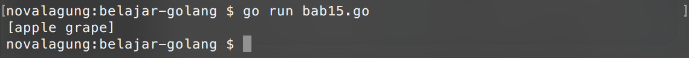
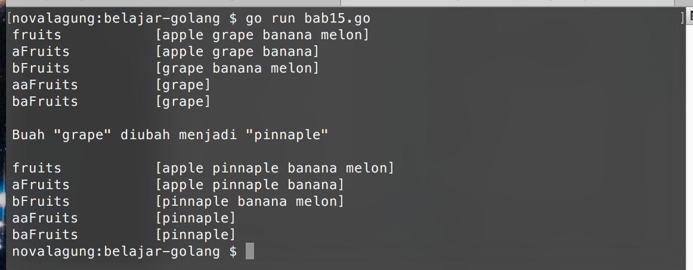

# Slice 

> Slice adalah array yang tidak 100% array.

**Slice** adalah referensi tiap elemen array, dengan jumlah maksimal elemen adalah bebas. Slice bisa dibuat, atau bisa juga dihasilkan dari manipulasi sebuah array ataupun slice lainnya. Karena merupakan referensi, menjadikan perubahan data di tiap elemen slice akan berdampak pada slice lain yang memiliki alamat memori yang sama.

## Inisialisasi Slice

Cara pembuatannya mirip dengan array, bedanya tidak perlu mendefinisikan jumlah elemen ketika awal deklarasi. Pengaksesan nilai elemen juga sama seperti pada array. Kode berikut adalah contoh pembuatan slice.

```go
var fruits = []string{"apple", "grape", "banana", "melon"}
fmt.Println(fruits[0]) // "apple"
```

Salah satu perbedaan slice dan array bisa diketahui pada saat deklarasi variabel-nya, jika jumlah elemen tidak dituliskan, maka variabel tersebut adalah slice.

```go
var fruitsA = []string{"apple", "grape"}      // slice
var fruitsB = [2]string{"banana", "melon"}    // array
var fruitsC = [...]string{"papaya", "grape"}  // array
```

## Hubungan Slice Dengan Array

Kalau bedanya cuma di penentuan nilai pada saat inisialisasi, kenapa tidak menggunakan satu istilah saja? atau adakah perbedann lainnya?

Sebenarnya slice dan array tidak bisa dibedakan karena merupakan sebuah kesatuan. Array adalah kumpulan nilai, sedang slice adalah referensi-nya. Bisa dibilang slice adalah jati diri array.

Cara membentuk slice dari array yang sudah didefinisikan adalah, dengan memainkan indeks-nya.

```go
var fruits = []string{"apple", "grape", "banana", "melon"}
var newFruits = fruits[0:2]

fmt.Println(newFruits) // ["apple", "grape"]
```

Kode `fruits[0:2]`  maksudnya adalah pengaksesan elemen dalam slice `fruits` yang **dimulai dari indeks ke 0, sebanyak 2 elemen**. Elemen yang memenuhi kriteria tersebut kemudian dikembalikan, untuk disimpan pada variabel sebagai slice baru. Pada contoh di atas, `newFruits` adalah slice baru yang tercetak dari slice `fruits`, dengan isi 2 elemen, yaitu `"apple"` dan `"grape"`.



Ketika mengakses elemen dalam array, data elemen yang dikembalikan merupakan hasil **copy** dari referensi aslinya. Berbeda dengan slice, yang dikembalikan ketika pengaksesan data adalah referensi aslinya. Hal inilah yang membuat slice powerful.

Agar lebih jelas, silakan pelajari tabel di bawah ini. Tabel berikut berisikan berbagai macam operasi slice yang bisa dilakukan.

```go
var fruits = []string{"apple", "grape", "banana", "melon"}
```

| Kode | Output | Penjelasan |
| :--------- | :--------------------- | :---------- |
| **`fruits[0:2]`** | **`[apple, grape]`** | semua elemen mulai indeks ke-0 hingga sebelum indeks ke-2 |
| **`fruits[0:0]`** | **`[]`** | menghasilkan slice kosong, karena indeks terendah adalah 0, tidak ada elemen sebelum indeks ke-0 |
| **`fruits[4:4]`** | **`[]`** | menghasilkan slice kosong, karena tidak ada elemen indeks ke-4 |
| **`fruits[0:4]`** | **`[apple, grape, banana, melon]`** | menghasilkan slice kosong, karena tidak ada elemen indeks ke-4 |
| **`fruits[:]`** | **`[apple, grape, banana, melon]`** | semua elemen |
| **`fruits[1:]`** | **`[grape, banana, melon]`** | semua elemen mulai indeks ke-1 |
| **`fruits[:1]`** | **`[apple]`** | semua elemen sebelum indeks ke-1 |

## Slice Merupakan Tipe Data Reference

Slice merupakan tipe data reference. Jika ada slice baru yang terbentuk dari slice lama, maka elemen-elemen dari slice baru tersebut merupakan referensi dari elemen slice lama. Yang artinya, setiap perubahan yang terjadi di elemen slice baru, akan berdampak juga pada elemen slice lama yang memiliki referensi yang sama.

Program berikut merupakan pembuktian tentang teori yang baru kita bahas. Kita akan mencoba mengubah data elemen slice baru, yang terbentuk dari slice lama.

```go
var fruits = []string{"apple", "grape", "banana", "melon"}

var aFruits = fruits[0:3]
var bFruits = fruits[1:4]

var aaFruits = aFruits[1:2]
var baFruits = bFruits[0:1]

fmt.Println(fruits)   // [apple grape banana melon]
fmt.Println(aFruits)  // [apple grape banana]
fmt.Println(bFruits)  // [grape banana melon]
fmt.Println(aaFruits) // [grape]
fmt.Println(baFruits) // [grape]

// Buah "grape" diubah menjadi "pinnaple"
baFruits[0] = "pinnaple"

fmt.Println(fruits)   // [apple pinnaple banana melon]
fmt.Println(aFruits)  // [apple pinnaple banana]
fmt.Println(bFruits)  // [pinnaple banana melon]
fmt.Println(aaFruits) // [pinnaple]
fmt.Println(baFruits) // [pinnaple]
```

Variabel `aFruits`, `bFruits` merupakan slice baru yang terbentuk dari variabel `fruits`. Dengan menggunakan dua slice baru tersebut, diciptakan lagi slice lainnya, yaitu `aaFruits`, dan `baFruits`. Kelima slice tersebut ditampilkan nilainya.

Selanjutnya, nilai dari `baFruits[0]` diubah, dan 5 slice tadi ditampilkan lagi. Hasilnya akan ada banyak slice yang elemennya ikut berubah. Yaitu elemen-elemen yang referensi-nya sama dengan referensi elemen `baFruits[0]`.



Ada beberapa *built in function* bawaan Golang, yang bisa dimanfaatkan untuk keperluan operasi slice. Berikut adalah pembahasan mengenai fungsi-fungsi tersebut.

## Penggunaan Fungsi `len()`

Fungsi `len()` digunakan untuk menghitung lebar slice yang ada. Sebagai contoh jika sebuah variabel adalah slice dengan data 4 buah elemen, maka penggunaan fungsi ini pada variabel tersebut akan mengembalikan angka **4**, yang angka tersebut didapat dari jumlah elemen yang ada. Contoh penerapannya bisa dilihat di kode berikut

```go
var fruits = []string{"apple", "grape", "banana", "melon"}
fmt.Println(len(fruits)) // 4
```

## Penggunaan Fungsi `cap()`

Fungsi `cap()` digunakan untuk menghitung lebar maksimum/kapasitas slice. Nilai kembalian fungsi ini sama dengan `len`, tapi bisa berubah tergantung dari operasi slice yang dilakukan. Agar lebih jelas, silakan disimak kode berikut.

```go
var fruits = []string{"apple", "grape", "banana", "melon"}
fmt.Println(len(fruits))  // len: 4
fmt.Println(cap(fruits))  // cap: 4

var aFruits = fruits[0:3]
fmt.Println(len(aFruits)) // len: 3
fmt.Println(cap(aFruits)) // cap: 4

var bFruits = fruits[1:4]
fmt.Println(len(bFruits)) // len: 3
fmt.Println(cap(bFruits)) // cap: 3
```

Variabel `fruits` disiapkan di awal dengan jumlah elemen 4. Maka fungsi `len(fruits)` dan `cap(fruits)` akan menghasilkan angka 4. 

Variabel `aFruits` dan `bFruits` merupakan slice baru berisikan 3 buah elemen milik slice `fruits`. Variabel `aFruits` mengambil elemen index 0, 1, 2; sedangkan `bFruits` 1, 2, 3.

Fungsi `len()` menghasilkan angka 3, karena jumlah elemen kedua slice ini adalah 3. Tetapi `cap(aFruits)` menghasilkan angka yang berbeda, yaitu 4 untuk `aFruits` dan 3 untuk `bFruits`. kenapa? jawabannya bisa dilihat pada tabel berikut.

| Kode | Output |
| :--- | :----- |
| **`fruits[0:4]`** | **[`buah` `buah` `buah` `buah`]** |
| **`aFruits[0:3]`** | **[`buah` `buah` `buah` `----`]** |
| **`bFruits[1:3]`** | **`----` [`buah` `buah` `buah`]** |

**Slicing** yang dimulai dari indeks **0** hingga **x** akan mengembalikan elemen-elemen mulai indeks **0** sebanyak **x**, dengan lebar kapasitas adalah sama dengan slice aslinya. Sedangkan slicing yang dimulai dari indeks **y**, yang dimana nilai **y** adalah lebih dari **0**, membuat elemen ke-**y** slice yang diambil menjadi elemen ke-0 slice baru. Hal inilah yang membuat kapasitas slice berubah.

## Penggunaan Fungsi `append()`

Fungsi `append()` digunakan untuk menambahkan elemen baru ke dalam slice. Elemen baru tersebut diposisikan setelah indeks paling akhir. Nilai balik fungsi ini adalah slice yang sudah ditambahkan nilai barunya. Contoh penggunaannya bisa dilihat di kode berikut.

```go
var fruits = []string{"apple", "grape", "banana"}
var cFruits = append(fruits, "papaya")

fmt.Println(fruits)  // ["apple", "grape", "banana"]
fmt.Println(cFruits) // ["apple", "grape", "banana", "papaya"]
```

Perlu diketahui, ketika jumlah elemen dan lebar kapasitas adalah sama (`len(fruits) == cap(fruits)`), maka elemen baru hasil `append` akan dimasukkan sebagai referensi baru. Jika jumlah elemen lebih kecil dibanding kapasitas, elemen baru akan ditempatkan didalam cakupan kapasitas, menjadikan semua slice yang memiliki referensi yang sama juga ikut berubah. Sedangkan jika ada slice lain dengan referensi yang sama kapasitasnya penuh, maka elemen-nya akan tertimpa atau ter-replace. Contoh:

```go
var fruits = []string{"apple", "grape", "banana"}
var bFruits = fruits[0:2]

fmt.Println(fruits)  // ["apple", "grape", "banana"]
fmt.Println(bFruits) // ["apple", "grape"]

var cFruits = append(bFruits, "papaya")

fmt.Println(fruits)  // ["apple", "grape", "papaya"]
fmt.Println(bFruits) // ["apple", "grape"]
fmt.Println(cFruits) // ["apple", "grape", "papaya"]
```

## Penggunaan Fungsi `copy()`

Fungsi `copy` digunakan untuk duplikasi elemen. Fungsi ini memiliki nilai balik yaitu jumlah elemen yang di-copy. Contoh penerapannya:

```go
var fruits = []string{"apple"}
var aFruits = []string{"watermelon", "pinnaple"}

var copied = copy(fruits, aFruits)

fmt.Println(fruits)  // ["apple", "watermelon", "pinnaple"]
fmt.Println(aFruits) // ["watermelon", "pinnaple"]
fmt.Println(copied)  // 2
```

## Pengaksesan Elemen Slice Dengan 3 Indeks

**3 indeks slice** adalah teknik slicing elemen dengan sekaligus menentukan kapasitasnya. Cara menggunakannnya yaitu dengan menyisipkan angka kapasitas di belakang, seperti `fruits[0:1:1]`. Angka kapasitas yang diisikan tidak boleh melebihi kapasitas slice yang akan di slicing.

Berikut merupakan contoh penerapannya.

```go
var fruits = []string{"apple", "grape", "banana"}
var aFruits = fruits[0:2]
var bFruits = fruits[0:2:2]

fmt.Println(fruits)      // ["apple", "grape", "banana"]
fmt.Println(len(fruits)) // len: 3
fmt.Println(cap(fruits)) // cap: 3

fmt.Println(aFruits)      // ["apple", "grape"]
fmt.Println(len(aFruits)) // len: 2
fmt.Println(cap(aFruits)) // cap: 3

fmt.Println(bFruits)      // ["apple", "grape"]
fmt.Println(len(bFruits)) // len: 2
fmt.Println(cap(bFruits)) // cap: 2
```
