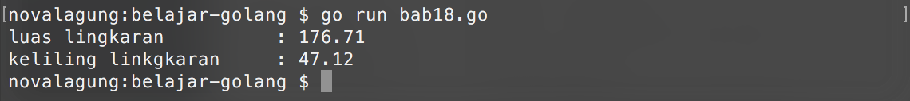

# Fungsi Multiple Return

Umumnya fungsi hanya memiliki satu buah nilai balik saja. Jika ada kebutuhan dimana data yang dikembalikan harus banyak, biasanya digunakanlah tipe seperti `map`, slice, atau `struct` sebagai nilai balik.

Golang menyediakan kapabilitas bagi programmer untuk membuat fungsi memiliki banyak nilai balik. Di bab ini akan dibahas bagaimana penerapannya.

## Penerapan Fungsi Multiple Return

Cara membuat fungsi yang memiliki banyak nilai balik tidaklah sulit. Tinggal tulis saja pada saat deklarasi fungsi semua tipe data nilai yang dikembalikan, dan pada keyword `return` tulis semua data yang ingin dikembalikan. Contoh bisa dilihat pada berikut.

```go
package main

import "fmt"
import "math"

func calculate(d float64) (float64, float64) {
    // hitung luas
    var area = math.Pi * math.Pow(d / 2, 2)
    // hitung keliling
    var circumference = math.Pi * d

    // kembalikan 2 nilai
    return area, circumference
}
```

Fungsi `calculate()` di atas menerima satu buah parameter (`diameter`) yang digunakan dalam proses perhitungan. Di dalam fungsi tersebut ada 2 hal yang dihitung, yaitu nilai **keliling** dan **lingkaran**. Kedua nilai tersebut kemudian dijadikan sebagai return value fungsi.

Cara pendefinisian banyak nilai balik bisa dilihat pada kode di atas, yaitu dengan langsung menuliskan tipe-tipe data nilai balik dengan pemisah tanda koma, dan ditambahkan kurung diantaranya.

```go
func calculate(d float64) (float64, float64)
```

Tak lupa di bagian penulisan keyword `return` harus dituliskan juga semua data yang dijadikan nilai balik (dengan pemisah tanda koma).

```go
return area, circumference
```

Implementasi dari fungsi `calculate()` di atas, bisa dilihat pada kode berikut. 

```go
func main() {
    var diameter float64 = 15
    var area, circumference = calculate(diameter)

    fmt.Printf("luas lingkaran\t\t: %.2f \n", area)
    fmt.Printf("keliling lingkaran\t: %.2f \n", circumference)
}
```

Output program:



Karena fungsi tersebut memiliki banyak nilai balik, maka pada pemanggilannya harus disiapkan juga banyak variabel untuk menampung nilai kembalian yang ada (sesuai jumlah nilai balik fungsi).

```go
var area, circumference = calculate(diameter)
```

## 

Ada beberapa hal baru dari kode di atas yang perlu dibahas, seperti `math.Pow()` dan `math.Pi`. Berikut adalah penjelasannya.

## Penggunaan Fungsi `math.Pow()`

Fungsi `math.Pow()` digunakan untuk memangkat nilai. `math.Pow(2, 3)` berarti 2 pangkat 3, hasilnya 8. Fungsi ini berada dalam package `math`.

## Penggunaan Konstanta `math.Pi`

`math.Pi` adalah konstanta bawaan `package math` yang merepresentasikan **Pi** atau **22/7**.
