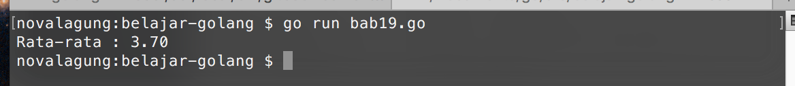
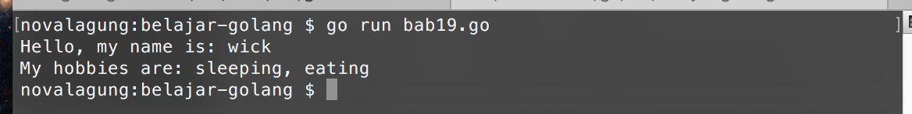

# Fungsi Variadic

Golang mengadopsi konsep **variadic function** atau pembuatan fungsi dengan parameter sejenis yang tak terbatas. Maksud **tak terbatas** disini adalah jumlah parameter yang disisipkan ketika pemanggilan fungsi bisa berapa saja.

Parameter variadic memiliki sifat yang mirip dengan slice. Nilai parameter-parameter yang disisipkan memiliki tipe data yang sama, dan akan ditampung oleh sebuah variabel saja. Cara pengaksesan tiap datanya juga sama, dengan menggunakan indeks.

Di bab ini kita akan belajar mengenai cara penerapan fungsi variadic.

## Penerapan Fungsi Variadic

Deklarasi parameter variadic sama dengan cara deklarasi variabel biasa, pembedanya pada parameter jenis ini ditambahkan tanda 3 titik (`...`) setelah penulisan variabel (sebelum tipe data). Nantinya semua nilai yang disisipkan sebagai parameter akan ditampung oleh variabel tersebut.

Berikut merupakan contoh penerepannya.

```go
func main() {
    var avg = calculate(2, 4, 3, 5, 4, 3, 3, 5, 5, 3)
    var msg = fmt.Sprintf("Rata-rata : %.2f", avg)
    fmt.Println(msg)
}

func calculate(numbers ...int) float64 {
    var total int = 0
    for _, number := range numbers {
        total += number
    }

    var avg = float64(total) / float64(len(numbers))
    return avg
}
```

Output program:



Bisa dilihat pada fungsi `calculate()`, parameter `numbers` dideklarasikan dengan disisipkan tanda 3 titik (`...`) sebelum penulisan tipe data-nya. Menandakan bahwa `numbers` adalah sebuah parameter variadic dengan tipe data `int`.

```go
func calculate(numbers ...int) float64 {
```

Pada pemanggilan fungsi disisipkan banyak parameter sesuai kebutuhan.

```go
var avg = calculate(2, 4, 3, 5, 4, 3, 3, 5, 5, 3)
```

Nilai tiap parameter bisa diakses seperti cara pengaksesan tiap elemen slice. Pada contoh di atas metode yang dipilih adalah `for` - `range`.

```go
for _, number := range numbers {
```

## 

Berikut merupakan penjelasan tambahan mengenai beberapa kode di atas.

## Penggunaan Fungsi `fmt.Sprintf()`

Fungsi `fmt.Sprintf()` pada dasarnya sama dengan `fmt.Printf()`, hanya saja fungsi ini tidak menampilkan nilai, melainkan mengembalikan nilainya dalam bentuk string. Pada kasus di atas, nilai hasil `fmt.Sprintf()` ditampung oleh variabel `msg`. 

Selain `fmt.Sprintf()`, ada juga `fmt.Sprint()` dan `fmt.Sprintln()`.

## Penggunaan Fungsi `float64()`

Sebelumnya sudah dibahas bahwa `float64` merupakan tipe data. Tipe data jika ditulis sebagai fungsi (penandanya ada tanda kurungnya) berguna untuk **casting**. Casting sendiri adalah teknik untuk konversi tipe sebuah data ke tipe lain. Hampir semua jenis tipe data dasar yang telah dipelajari di bab 9 bisa digunakan untuk casting. Dan cara penerepannya juga sama, cukup panggil sebagai fungsi, lalu masukan data yang ingin dikonversi sebagai parameter.

Pada contoh di atas, variabel `total` yang tipenya adalah `int`, dikonversi menjadi `float64`, begitu juga `len(numbers)` yang menghasilkan `int` dikonversi ke `float64`.

Variabel `avg` perlu dijadikan `float64` karena penghitungan rata-rata lebih sering menghasilkan nilai desimal.

Operasi bilangan (perkalian, pembagian, dan lainnya) di Golang hanya bisa dilakukan jika tipe datanya sejenis. Maka dari itulah perlu adanya casting ke tipe `float64` pada tiap operand.

## Pengisian Fungsi Variadic Menggunakan Data Slice

Slice bisa digunakan sebagai parameter variadic. Caranya cukup mudah, yaitu dengan menambahkan tanda 3 titik setelah nama variabel ketika memasukannya ke parameter. Contohnya bisa dilihat pada kode berikut.

```go
var numbers = []int{2, 4, 3, 5, 4, 3, 3, 5, 5, 3}
var avg = calculate(numbers...)
var msg = fmt.Sprintf("Rata-rata : %.2f", avg)

fmt.Println(msg)
```

Pada kode di atas, variabel `numbers` yang merupakan slice int, disisipkan ke fungsi `calculate()` sebagai parameter variadic (bisa dilihat tanda 3 titik setelah penulisan variabel). Teknik ini sangat berguna ketika sebuah data slice ingin difungsikan sebagai parameter variadic.

Perhatikan juga kode berikut ini. Intinya adalah sama, hanya caranya yang berbeda.

```go
var numbers = []int{2, 4, 3, 5, 4, 3, 3, 5, 5, 3}
var avg = calculate(numbers...)

// atau

var avg = calculate(2, 4, 3, 5, 4, 3, 3, 5, 5, 3)
```

Pada deklarasi parameter fungsi variadic, tanda 3 titik (`...`) dituliskan sebelum tipe data parameter. Sedangkan pada pemanggilan fungsi dengan menyisipkan parameter array, tanda tersebut dituliskan dibelakang variabelnya.

## Fungsi Dengan Parameter Biasa & Variadic

Parameter variadic bisa dikombinasikan dengan parameter biasa, dengan syarat parameter variadic-nya harus diposisikan di akhir. Contohnya bisa dilihat pada kode berikut.

```go
func yourHobbies(name string, hobbies ...string) {
    var hobbiesAsString = strings.Join(hobbies, ", ")

    fmt.Printf("Hello, my name is: %s\n", name)
    fmt.Printf("My hobbies are: %s\n", hobbiesAsString)
}
```

Nilai parameter pertama fungsi `yourHobbies()` akan ditampung oleh `name`, sedangkan nilai parameter kedua dan seterusnya akan ditampung oleh `hobbies` sebagai slice.

Cara pemanggilannya masih sama seperi pada fungsi biasa. Contohnya bisa dilihat pada kode berikut.

```go
yourHobbies("wick", "sleeping", "eating")
```

Jika parameter kedua dan seterusnya ingin diisi dengan data dari slice, maka gunakan tanda 3 titik. Contoh:

```go
var hobbies = []string{"sleeping", "eating"}
yourHobbies("wick", hobbies...)
```

Output program:

