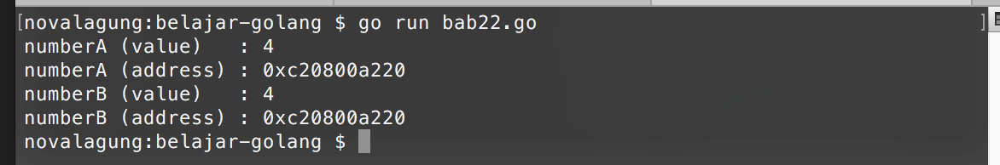
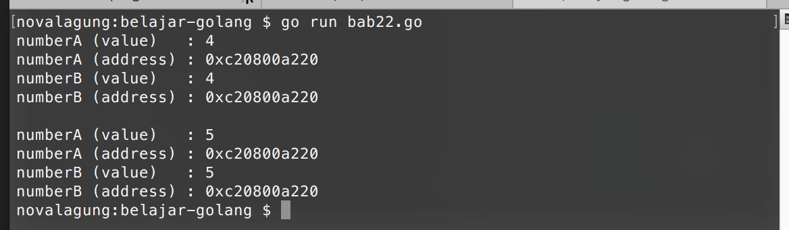
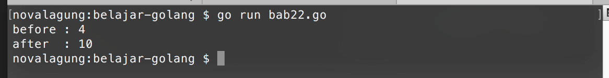

# 22. Pointer

Pointer adalah *reference* atau alamat memory. Variabel pointer berarti variabel yang berisi alamat memori suatu nilai. Sebagai contoh sebuah variabel bertipe integer memiliki nilai **4**, maka yang dimaksud pointer adalah **alamat memori dimana nilai 4 disimpan**, bukan nilai 4 nya sendiri.

Variabel-variabel yang memiliki *reference* atau alamat pointer yang sama, saling berhubungan satu sama lain dan nilainya pasti sama. Ketika ada perubahan nilai, maka akan memberikan efek kepada variabel lain (yang referensi-nya sama) yaitu nilainya ikut berubah.

## 22.1. Penerapan Pointer

Variabel bertipe pointer ditandai dengan adanya tanda **asterisk** (`*`) tepat sebelum penulisan tipe data ketika deklarasi.

```go
var number *int
var name *string
```

Nilai default variabel pointer adalah `nil` (kosong). Variabel pointer tidak bisa menampung nilai yang bukan pointer, dan sebaliknya variabel biasa tidak bisa menampung nilai pointer.

Variabel biasa sebenarnya juga bisa diambil nilai pointernya, caranya dengan menambahkan tanda **ampersand** (`&`) tepat sebelum nama variabel. Metode ini disebut dengan **referencing**.

Dan sebaliknya, nilai asli variabel pointer juga bisa diambil, dengan cara menambahkan tanda **asterisk** (`*`) tepat sebelum nama variabel. Metode ini disebut dengan **dereferencing**.

OK, langsung saja kita praktekan. Berikut adalah contoh penerapan pointer.

```go
var numberA int = 4
var numberB *int = &numberA

fmt.Println("numberA (value)   :", numberA)  // 4
fmt.Println("numberA (address) :", &numberA) // 0xc20800a220

fmt.Println("numberB (value)   :", *numberB) // 4
fmt.Println("numberB (address) :", numberB)  // 0xc20800a220
```

Variabel `numberB` dideklarasikan bertipe pointer `int` dengan nilai awal adalah referensi variabel `numberA` (bisa dilihat pada kode `&numberA`). Dengan ini, variabel `numberA` dan `numberB` menampung data dengan referensi alamat memori yang sama.



Variabel pointer jika di-print akan menghasilkan string alamat memori (dalam notasi heksadesimal), contohnya seperti `numberB` yang diprint menghasilkan `0xc20800a220`.

Nilai asli sebuah variabel pointer bisa didapatkan dengan cara di-dereference terlebih dahulu (bisa dilihat pada kode `*numberB`).

## 22.2. Efek Perubahan Nilai Pointer

Ketika salah satu variabel pointer di ubah nilainya, sedang ada variabel lain yang memiliki referensi memori yang sama, maka nilai variabel lain tersebut juga akan berubah.

```go
var numberA int = 4
var numberB *int = &numberA

fmt.Println("numberA (value)   :", numberA)
fmt.Println("numberA (address) :", &numberA)
fmt.Println("numberB (value)   :", *numberB)
fmt.Println("numberB (address) :", numberB)

fmt.Println("")

numberA = 5

fmt.Println("numberA (value)   :", numberA)
fmt.Println("numberA (address) :", &numberA)
fmt.Println("numberB (value)   :", *numberB)
fmt.Println("numberB (address) :", numberB)
```

Variabel `numberA` dan `numberB` memiliki referensi memori yang sama. Perubahan pada salah satu nilai variabel tersebut akan memberikan efek pada variabel lainnya. Pada contoh di atas, `numberA` nilainya di ubah menjadi `5`. membuat nilai asli variabel `numberB` ikut berubah menjadi `5`.



## 22.3. Parameter Pointer

Parameter bisa juga didesain sebagai pointer. Cara penerapannya kurang lebih sama, dengan cara mendeklarasikan parameter sebagai pointer.

```go
package main

import "fmt"

func main() {
    var number = 4
    fmt.Println("before :", number) // 4

    change(&number, 10)
    fmt.Println("after  :", number) // 10
}

func change(original *int, value int) {
    *original = value
}
```

Fungsi `change()` memiliki 2 parameter, yaitu `original` yang tipenya adalah pointer `int`, dan `value` yang bertipe `int`. Di dalam fungsi tersebut nilai asli parameter pointer `original` diubah.

Fungsi `change()` kemudian diimplementasikan di `main`. Variabel `number` yang nilai awalnya adalah `4` diambil referensi-nya lalu digunakan sebagai parameter pada pemanggilan fungsi `change()`.

Nilai variabel `number` berubah menjadi `10` karena perubahan yang terjadi di dalam fungsi `change` adalah pada variabel pointer.


