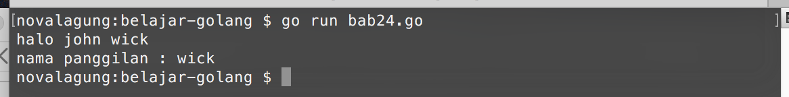

# Method

**Method** adalah fungsi yang hanya bisa di akses lewat variabel objek. Method merupakan bagian dari `struct`. 

Keunggulan method dibanding fungsi biasa adalah memiliki akses ke property struct hingga level *private* (level akses nantinya akan dibahas lebih detail pada bab selanjutnya). Dan juga, dengan menggunakan method sebuah proses bisa di-enkapsulasi dengan baik.

## Penerapan Method

Cara menerapkan method sedikit berbeda dibanding penggunaan fungsi. Ketika deklarasi, ditentukan juga siapa pemilik method tersebut. Contohnya bisa dilihat pada kode berikut:

```go
package main

import "fmt"
import "strings"

type student struct {
    name  string
    grade int
}

func (s student) sayHello() {
    fmt.Println("halo", s.name)
}

func (s student) getNameAt(i int) string {
    return strings.Split(s.name, " ")[i-1]
}
```

Cara deklarasi method sama seperti fungsi, hanya saja perlu ditambahkan deklarasi variabel objek di sela-sela keyword `func` dan nama fungsi. Struct yang digunakan akan menjadi pemilik method.

`func (s student) sayHello()` maksudnya adalah fungsi `sayHello` dideklarasikan sebagai method milik struct `student`. Pada contoh di atas struct `student` memiliki dua buah method, yaitu `sayHello()` dan `getNameAt()`.

Contoh pemanfaatan method bisa dilihat pada kode berikut.

```go
func main() {
    var s1 = student{"john wick", 21}
    s1.sayHello()

    var name = s1.getNameAt(2)
    fmt.Println("nama panggilan :", name)
}
```

Output:



Cara mengakses method sama seperti pengaksesan properti berupa variabel. Tinggal panggil saja methodnya.

```go
s1.sayHello()
var name = s1.getNameAt(2)
```

Method memiliki sifat yang sama persis dengan fungsi biasa. Seperti bisa berparameter, memiliki nilai balik, dan lainnya. Dari segi sintaks, pembedanya hanya ketika pengaksesan dan deklarasi. Bisa dilihat di kode berikut, sekilas perbandingan penulisan fungsi dan method.

```go
func sayHello() {
func (s student) sayHello() {

func getNameAt(i int) string {
func (s student) getNameAt(i int) string {
```

## Method Pointer

Method pointer adalah method yang variabel objeknya dideklarasikan dalam bentuk pointer. Kelebihan method jenis ini adalah manipulasi data pointer pada property milik variabel tersebut bisa dilakukan.

Pemanggilan method pointer sama seperti method biasa. Contohnya bisa dilihat di kode berikut.

```go
func (s *student) sayHello() {
    fmt.Println("halo", s.name)
}

func main() {
    var s1 = student{"john wick", 21}
    s1.sayHello()
}
```

Method pointer tetap bisa diakses lewat variabel objek biasa (bukan pointer) dengan cara yang nya masih sama. Contoh:

```go
// pengaksesan method dari variabel objek biasa
var s1 = student{"john wick", 21}
s1.sayHello()

// pengaksesan method dari variabel objek pointer
var s2 = &student{"ethan hunt", 22}
s2.sayHello()
```

## 

Berikut adalah penjelasan tambahan mengenai fungsi split.

## Penggunaan Fungsi `strings.Split()`

Di bab ini ada fungsi baru yang kita gunakan: `strings.Split()`. Fungsi ini digunakan untuk memisah string menggunakan pemisah tertentu. Hasilnya adalah array berisikan kumpulan substring yang telah dipisah.

```go
strings.Split("ethan hunt", " ")
// ["ethan", "hunt"]
```

Pada contoh di atas, string `"ethan hunt"` dipisah menggunakan separator spasi `" "`. Maka hasilnya terbentuk array berisikan 2 data, `"ethan"` dan `"hunt"`.

## Apakah `fmt.Println()` & `strings.Split()` Juga Merupakan Method ?

Setelah tahu apa itu method dan bagaimana penggunaannya, mungkin akan muncul di benak kita bahwa kode seperti `fmt.Println()`, `strings.Split()` dan lainnya-yang-berada-pada-package-lain juga merupakan fungsi.

Tapi sayangnya **bukan**. `fmt` disitu bukanlah variabel objek, dan `Println()` bukan merupakan method-nya.

`fmt` adalah nama **package** yang di-import (bisa dilihat pada kode `import "fmt"`). Sedangkan `Println()` adalah **nama fungsi**. Untuk mengakses fungsi yang berada pada package lain, harus dituliskan nama package-nya. Hal ini berlaku juga di dalam package `main`. Jika ada fungsi dalam package main yang diakses dari package lain yang berbeda, maka penulisannya `main.NamaFungsi()`.

Lebih detailnya akan dibahas di bab selanjutnya.
