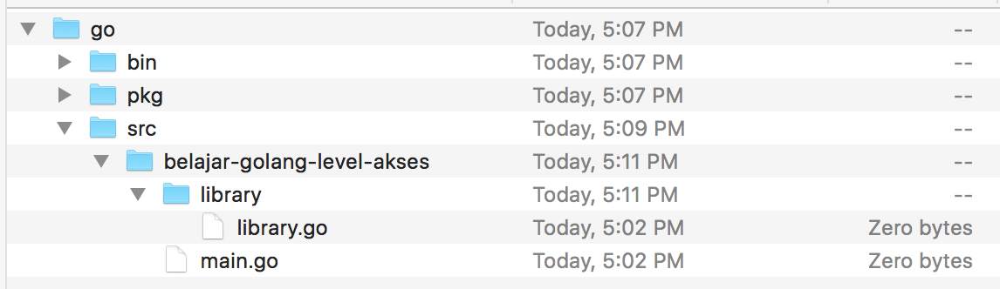
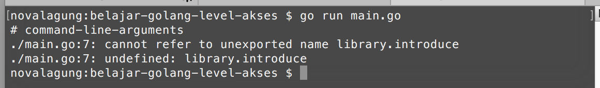
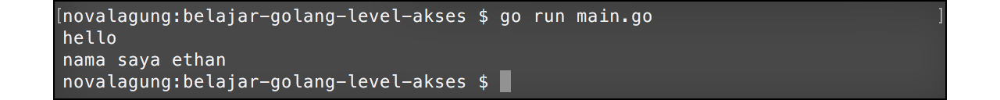
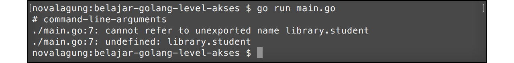
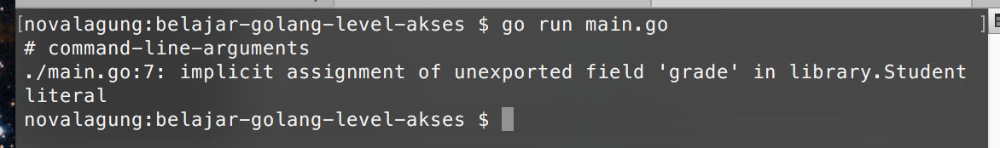
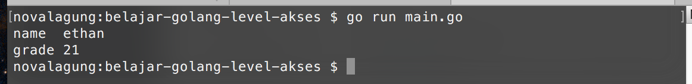
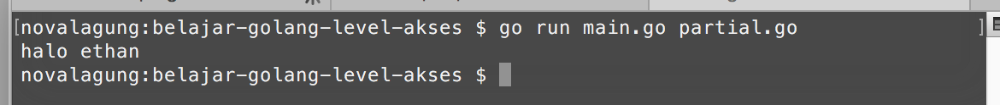

# 25. Property Public Dan Private

Bab ini membahas mengenai *modifier* public dan private dalam Golang. Kapan sebuah struct, fungsi, atau method bisa diakses dari package lain dan kapan tidak.

## 25.1. Package Public & Private

Pengembangan aplikasi dalam *real development* pasti membutuhkan banyak sekali file program. Tidak mungkin dalam satu project semua file memiliki nama package `main`, biasanya akan dipisah sebagai package berbeda sesuai bagiannya.

Project folder selain berisikan file-file `.go` juga bisa berisikan folder. Di bahasa Golang, setiap satu folder atau subfolder adalah satu package, file-file yang ada didalamnya harus memiliki nama package yang berbeda dengan file di folder lain.

Dalam sebuah package, biasanya kita menulis sangat banyak komponen, entah itu fungsi, struct, variabel, atau lainnya. Komponen tersebut bisa leluasa digunakan dalam package yang sama. Contoh sederhananya seperti program yang telah kita praktekan di bab sebelum-sebelumnya, dalam package `main` ada banyak yang di-define: fungsi, variabel, closure, struct, dan lainnya; kesemuanya bisa langsung dimanfaatkan.

Jika dalam satu program terdapat lebih dari 1 package, atau ada package lain selain `main`, tidak bisa komponen dalam package lain tersebut diakses secara bebas dari `main`, karena tiap komponen memiliki hak akses.

Ada 2 jenis hak akses:

 - Akses Public, menandakan komponen tersebut diperbolehkan untuk diakses dari package lain yang berbeda
 - Akses Private, berarti komponen hanya bisa diakses dalam package yang sama, bisa dalam satu file saja atau dalam beberapa file yang masih 1 folder.

Penentuan hak akses yang tepat untuk tiap komponen sangatlah penting.

Di Golang cara menentukan level akses atau modifier sangat mudah, penandanya adalah **character case** karakter pertama nama fungsi, struct, variabel, atau lainnya. Ketika namanya diawali dengan huruf kapital menandakan bahwa modifier-nya public. Dan sebaliknya, jika diawali huruf kecil, berarti private.

## 25.2. Penggunaan Package, Import, Dan Modifier Public & Private

Agar lebih mudah dipahami, maka langsung saja kita praktekan.

Pertama buat folder proyek baru bernama `belajar-golang-level-akses` di dalam folder `$GOPATH/src`, didalamnya buat file baru bernama `main.go`, set nama package file tersebut sebagai **main**.

Selanjutnya buat folder baru bernama `library` di dalam folder baru yang sudah dibuat tadi. Didalamnya buat file baru `library.go`, set nama package-nya **library**.



Buka file `library.go` lalu isi dengan kode berikut.

```go
package library

import "fmt"

func SayHello() {
    fmt.Println("hello")
}

func introduce(name string) {
    fmt.Println("nama saya", name)
}
```

File `library.go` yang telah dibuat ditentukan nama package-nya adalah `library` (sesuai dengan nama folder), berisi dua buah fungsi, `SayHello()` dan `introduce()`.

 - Fungsi `SayHello()`, level aksesnya adalah publik, ditandai dengan nama fungsi diawali huruf besar.
 - Fungsi `introduce()` dengan level akses private, ditandai oleh huruf kecil di awal nama fungsi.

Selanjutnya kita lakukan tes apakah memang fungsi yang ber-modifier private dalam package `library` tidak bisa diakses dari package lain.

Buka file `main.go`, lalu tulis kode berikut.

```go
package main

import "belajar-golang-level-akses/library"

func main() {
    library.SayHello()
    library.introduce("ethan")
}
```

Bisa dilihat bahwa package `library` yang telah dibuat tadi, di-import ke dalam package `main`.

Folder utama atau root folder dalam project yang sedang digarap adalah `belajar-golang-level-akses`, sehingga untuk import package lain yang merupakan subfolder, harus dituliskan lengkap path folder nya, seperti `"belajar-golang-level-akses/library"`.

Penanda root folder adalah, file di dalam folder tersebut package-nya `main`, dan file tersebut dijalankan menggunakan `go run`.

Perhatikan kode berikut.

```go
library.SayHello()
library.introduce("ethan")
```

Cara pemanggilan fungsi yang berada dalam package lain adalah dengan menuliskan nama package target diikut dengan nama fungsi menggunakan *dot notation* atau tanda titik, seperti `library.SayHello()` atau `library.introduce("ethan")`

OK, sekarang coba jalankan kode yang sudah disiapkan di atas, hasilnya error.



Error di atas disebabkan karena fungsi `introduce()` yang berada dalam package `library` memiliki level akses **private**, fungsi ini tidak bisa diakses dari package lain (pada kasus ini `main`). Agar bisa diakses, solusinya bisa dengan menjadikannya public, atau diubah cara pemanggilannya. Disini kita menggunakan cara ke-2.

Tambahkan parameter `name` pada fungsi `SayHello()`, lalu panggil fungsi `introduce()` dengan menyisipkan parameter `name` dari dalam fungsi `SayHello()`.

```go
func SayHello(name string) {
    fmt.Println("hello")
    introduce(name)
}
```

Di `main`, cukup panggil fungsi `SayHello()` saja, sisipkan sebuah string sebagai parameter.

```go
func main() {
    library.SayHello("ethan")
}
```

Coba jalankan lagi.



## 26.3. Penggunaan Public & Private Pada Struct Dan Propertinya

Level akses private dan public juga bisa diterapkan di fungsi, struct, method, maupun property variabel. Cara penggunaannya sama seperti pada pembahasan sebelumnya, yaitu dengan menentukan **character case** huruf pertama nama komponen, apakah huruf besar atau kecil.

Belajar tentang level akses di Golang akan lebih cepat jika langsung praktek. Oleh karena itu langsung saja. Hapus isi file `library.go`, buat struct baru dengan nama `student` didalamnya.

```go
package library

type student struct {
    Name  string
    grade int
}
```

Buat contoh sederhana penerapan struct di atas pada file `main.go`.

```go
package main

import "belajar-golang-level-akses/library"
import "fmt"

func main() {
    var s1 = library.student{"ethan", 21}
    fmt.Println("name ", s1.Name)
    fmt.Println("grade", s1.grade)
}
```

Setelah itu jalankan program.



Error muncul lagi, kali ini penyebabnya adalah karena struct `student` masih di set sebagai private. Ganti menjadi public (dengan cara mengubah huruf awalnya menjadi huruf besar) lalu jalankan.

```go
// pada library/library.go
type Student struct {
    Name  string
    grade int
}

// pada main.go
var s1 = library.student{"ethan", 21}
fmt.Println("name ", s1.Name)
fmt.Println("grade", s1.grade)
```

Output:



Error masih tetap muncul, tapi kali ini berbeda. Error yang baru ini disebabkan karena salah satu properti dari struct `Student` bermodifier private. Properti yg dimaksud adalah `grade`. Ubah menjadi public, lalu jalankan lagi.

```go
// pada library/library.go
type Student struct {
    Name  string
    Grade int
}

// pada main.go
var s1 = library.student{"ethan", 21}
fmt.Println("name ", s1.Name)
fmt.Println("grade", s1.Grade)
```

Dari contoh program di atas, bisa disimpulkan bahwa untuk menggunakan `struct` yang berada di package lain, selain nama stuct-nya harus bermodifier public, properti yang diakses juga harus public.



## 26.4. Import Dengan Prefix Tanda Titik

Seperti yang kita tahu, untuk mengakses fungsi/struct/variabel yg berada di package lain, nama package nya perlu ditulis, contohnya seperti pada penggunaan penggunaan `library.Student` dan `fmt.Println()`.

Di Golang, komponen yang berada di package lain yang di-import bisa dijadikan se-level dengan komponen package peng-import, caranya dengan menambahkan tanda titik (`.`) setelah penulisan keyword `import`. Maksud dari se-level disini adalah, semua properti di package lain yg di-import bisa diakses tanpa perlu menuliskan nama package, seperti ketika mengakses sesuatu dari file yang sama.

```go
import (
    . "belajar-golang-level-akses/library"
    "fmt"
)

func main() {
    var s1 = Student{"ethan", 21}
    fmt.Println("name ", s1.Name)
    fmt.Println("grade", s1.Grade)
}
```

Pada kode di atas package `library` di-import menggunakan tanda titik. Dengan itu, pemanggilan struct `Student` tidak perlu dengan menuliskan nama package nya.

## 26.5. Pemanfaatan Alias Ketika Import Package

Fungsi yang berada di package lain bisa diakses dengan cara menuliskan nama-package diikuti nama fungsi-nya, contohnya seperti `fmt.Println()`. Package yang sudah di-import tersebut bisa diubah namanya dengan cara menggunakan alias pada saat import. Contohnya bisa dilihat pada kode berikut.

```go
import (
    f "fmt"
)

func main() {
    f.Println("Hello World!")
}
```

Pada kode di-atas, package `fmt` di tentukan aliasnya adalah `f`, untuk mengakses `Println()` cukup dengan `f.Println()`.

## 26.6. Mengakses Properti Dalam File Yang Package-nya Sama

Jika properti yang ingin di akses masih dalam satu package tapi berbeda file, cara mengaksesnya bisa langsung dengan memanggil namanya. Hanya saja ketika eksekusi, file-file lain yang yang nama package-nya sama juga ikut dipanggil.

Langsung saja kita praktekan, buat file baru dalam `belajar-golang-level-akses` dengan nama `partial.go`.


Tulis kode berikut pada file `partial.go`. File ini kita set package-nya **main** (sama dengan nama package file `main.go`).

```go
package main

import "fmt"

func sayHello(name string) {
    fmt.Println("halo", name)
}
```

Hapus semua isi file `main.go`, lalu silakan tulis kode berikut.

```go
package main

func main() {
    sayHello("ethan")
}
```

Sekarang terdapat 2 file berbeda (`main.go` dan `partial.go`) dengan package adalah sama, `main`. Pada saat **go build** atau **go run**, semua file dengan nama package `main` harus dituliskan sebagai argumen command.

```
$ go run main.go partial.go
```

Fungsi `sayHello` pada file `partial.go` bisa dikenali meski level aksesnya adalah private. Hal ini karena kedua file tersebut (`main.go` dan `partial.go`) memiliki package yang sama.

> Cara lain untuk menjalankan program bisa dengan perintah `go run *.go`, dengan cara ini tidak perlu menuliskan nama file nya satu per satu.



## 26.7. Fungsi `init()`

Selain fungsi `main()`, terdapat juga fungsi spesial, yaitu `init()`. Fungsi ini otomatis dipanggil pertama kali ketika package-dimana-fungsi-berada di-import.

Langsung saja kita praktekkan. Buka file `library.go`, hapus isinya lalu isi dengan kode berikut.

```go
package library

import "fmt"

var Student = struct {
    Name  string
    Grade int
}{}

func init() {
    Student.Name = "John Wick"
    Student.Grade = 2

    fmt.Println("--> library/library.go imported")
}
```

Pada package tersebut, variabel `Student` dibuat dengan isi anonymous struct. Dalam fungsi init, nilai `Name` dan `Grade` variabel di-set.

Selanjutnya buka file `main.go`, isi dengan kode berikut.

```go
package main

import "belajar-golang-level-akses/library"
import "fmt"

func main() {
    fmt.Printf("Name  : %s\n", library.Student.Name)
    fmt.Printf("Grade : %d\n", library.Student.Grade)
}
```

Package `library` di-import, dan variabel `Student` dikonsumsi. Pada saat import package, fungsi `init()` yang berada didalamnya langsung dieksekusi.

Property variabel objek `Student` akan diisi dan sebuah pesan ditampilkan ke console.

Dalam sebuah package diperbolehkan ada banyak fungsi `init()` (urutan eksekusinya adalah sesuai file mana yg terlebih dahulu digunakan). Fungsi ini dipanggil sebelum fungsi `main()`, pada saat eksekusi program.


