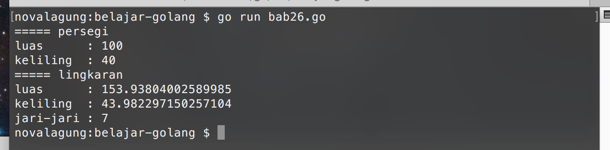
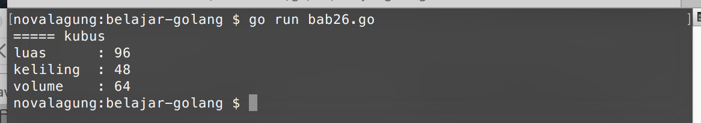

# 26. Interface

Interface adalah kumpulan definisi method yang tidak memiliki isi (hanya definisi saja), dan dibungkus dengan nama tertentu.

Interface merupakan tipe data. Nilai objek bertipe interface default-nya adalah `nil`. Interface mulai bisa digunakan jika sudah ada isinya, yaitu objek konkret yang memiliki definisi method minimal sama dengan yang ada di interface-nya.

## 26.1. Penerapan Interface

Yang pertama perlu dilakukan untuk menerapkan interface adalah menyiapkan interface beserta definisi method nya. Keyword `type` dan `interface` digunakan untuk pendefinisian interface.

```go
package main

import "fmt"
import "math"

type hitung interface {
    luas() float64
    keliling() float64
}
```

Pada kode di atas, interface `hitung` memiliki 2 definisi method, `luas()` dan `keliling()`. Interface ini nantinya digunakan sebagai tipe data pada variabel, dimana variabel tersebut akan menampung menampung objek bangun datar hasil dari struct yang akan kita buat.

Dengan memanfaatkan interface `hitung`, perhitungan luas dan keliling bangun datar bisa dilakukan, tanpa perlu tahu jenis bangun datarnya sendiri itu apa.

Siapkan struct bangun datar `lingkaran`, struct ini memiliki method yang beberapa diantaranya terdefinisi di interface `hitung`.

```go
type lingkaran struct {
    diameter float64
}

func (l lingkaran) jariJari() float64 {
    return l.diameter / 2
}

func (l lingkaran) luas() float64 {
    return math.Pi * math.Pow(l.jariJari(), 2)
}

func (l lingkaran) keliling() float64 {
    return math.Pi * l.diameter
}
```

Struct `lingkaran` di atas memiliki tiga method, `jariJari()`, `luas()`, dan `keliling()`.  

Selanjutnya, siapkan struct bangun datar `persegi`.

```go
type persegi struct {
    sisi float64
}

func (p persegi) luas() float64 {
    return math.Pow(p.sisi, 2)
}

func (p persegi) keliling() float64 {
    return p.sisi * 4
}
```

Perbedaan struct `persegi` dengan `lingkaran` terletak pada method `jariJari()`. Struct `persegi` tidak memiliki method tersebut. Tetapi meski demikian, variabel objek hasil cetakan 2 struct ini akan tetap bisa ditampung oleh variabel cetakan interface `hitung`, karena dua method yang ter-definisi di interface tersebut juga ada pada struct `persegi` dan `lingkaran`, yaitu `luas()` dan `keliling()`.

Buat implementasi perhitungan di `main`.

```go
func main() {
    var bangunDatar hitung

    bangunDatar = persegi{10.0}
    fmt.Println("===== persegi")
    fmt.Println("luas      :", bangunDatar.luas())
    fmt.Println("keliling  :", bangunDatar.keliling())

    bangunDatar = lingkaran{14.0}
    fmt.Println("===== lingkaran")
    fmt.Println("luas      :", bangunDatar.luas())
    fmt.Println("keliling  :", bangunDatar.keliling())
    fmt.Println("jari-jari :", bangunDatar.(lingkaran).jariJari())
}
```

Perhatikan kode di atas. Variabel objek `bangunDatar` bertipe interface `hitung`. Variabel tersebut digunakan untuk menampung objek konkrit buatan struct `lingkaran` dan `persegi`.

Dari variabel tersebut, method `luas()` dan `keliling()` diakses. Secara otomatis Golang akan mengarahkan pemanggilan method pada interface ke method asli milik struct yang bersangkutan.



Method `jariJari()` pada struct `lingkaran` tidak akan bisa diakses karena tidak terdefinisi dalam interface `hitung`. Pengaksesannya dengan paksa akan menyebabkan error.

Untuk mengakses method yang tidak ter-definisi di interface, variabel-nya harus di-casting terlebih dahulu ke tipe asli variabel konkritnya (pada kasus ini tipenya `lingkaran`), setelahnya method akan bisa diakses.

Cara casting objek interface sedikit unik, yaitu dengan menuliskan nama tipe tujuan dalam kurung, ditempatkan setelah nama interface dengan menggunakan notasi titik (seperti cara mengakses property, hanya saja ada tanda kurung nya). Contohnya bisa dilihat di kode berikut. Statement `bangunDatar.(lingkaran)` adalah contoh casting pada objek interface.

```go
var bangunDatar hitung = lingkaran{14.0}
var bangunLingkaran lingkaran = bangunDatar.(lingkaran)

bangunLingkaran.jariJari()
```

Perlu diketahui juga, jika ada interface yang menampung objek konkrit dimana struct-nya tidak memiliki salah satu method yang terdefinisi di interface, error juga akan muncul. Intinya kembali ke aturan awal, variabel interface hanya bisa menampung objek yang minimal memiliki semua method yang terdefinisi di interface-nya.

## 26.2. Embedded Interface

Interface bisa di-embed ke interface lain, sama seperti struct. Cara penerapannya juga sama, cukup dengan menuliskan nama interface yang ingin di-embed ke dalam interface tujuan.

Pada contoh berikut, disiapkan interface bernama `hitung2d` dan `hitung3d`. Kedua interface tersebut kemudian di-embed ke interface baru bernama `hitung`.

```go
package main

import "fmt"
import "math"

type hitung2d interface {
    luas() float64
    keliling() float64
}

type hitung3d interface {
    volume() float64
}

type hitung interface {
    hitung2d
    hitung3d
}
```

Interface `hitung2d` berisikan method untuk kalkulasi luas dan keliling, sedang `hitung3d` berisikan method untuk mencari volume bidang. Kedua interface tersebut diturunkan di interface `hitung`, menjadikannya memiliki kemampuan untuk menghitung luas, keliling, dan volume.

Next, siapkan struct baru bernama `kubus` yang memiliki method `luas()`, `keliling()`, dan `volume()`.

```go
type kubus struct {
    sisi float64
}

func (k *kubus) volume() float64 {
    return math.Pow(k.sisi, 3)
}

func (k *kubus) luas() float64 {
    return math.Pow(k.sisi, 2) * 6
}

func (k *kubus) keliling() float64 {
    return k.sisi * 12
}
```

Objek hasil cetakan struct `kubus` di atas, nantinya akan ditampung oleh objek cetakan interface `hitung` yang isinya merupakan gabungan interface `hitung2d` dan `hitung3d`.

Terakhhir, buat implementasi-nya di main.

```go
func main() {
    var bangunRuang hitung = &kubus{4}

    fmt.Println("===== kubus")
    fmt.Println("luas      :", bangunRuang.luas())
    fmt.Println("keliling  :", bangunRuang.keliling())
    fmt.Println("volume    :", bangunRuang.volume())
}
```

Bisa dilihat di kode di atas, lewat interface `hitung`, method `luas`, `keliling`, dan `volume` bisa di akses.

Pada bab 24 dijelaskan bahwa method pointer bisa diakses lewat variabel objek biasa dan variabel objek pointer. Variabel objek yang dicetak menggunakan struct yang memiliki method pointer, jika ditampung kedalam variabel interface, harus diambil referensi-nya terlebih dahulu. Contohnya bisa dilihat pada kode di atas `var bangunRuang hitung = &kubus{4}`.


