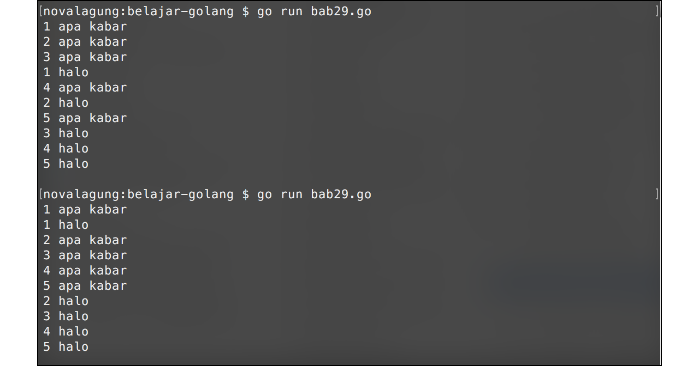

# Goroutine

Goroutine bukanlah *thread*. Sebuah *native thread* bisa berisikan sangat banyak goroutine. Mungkin lebih pas kalau goroutine disebut sebagai *mini thread*.

Goroutine sangat ringan, hanya dibutuhkan sekitar **2kB** memori saja untuk satu buah goroutine.

Ekseksui goroutine bersifat *asynchronous*, menjadikannya tidak saling tunggu dengan goroutine lain.

Sebenarnya, fungsi `main()` merupakan gouroutine juga (goroutine utama). Ketika ada eksekusi goroutine baru dari dalam main, memungkinkan waktu selesainya lebih lama dibanding main itu (karena keduanya goroutine).

Di bab ini, kita akan belajar tentang penggunaannya.

## Penerapan Goroutine

Statement yang akan dieksekusi sebagai goroutine harus dibungkus dalam sebuah fungsi, bisa berupa closure ataupun fungsi biasa. Digunakan keyword `go` pada saat pemanggilan fungsi tersebut, agar dideteksi sebagai goroutine.

Berikut merupakan contoh implementasi sederhana tentang goroutine. Program di bawah ini akan menampilkan 10 baris teks, 5 dieksekusi dengan cara biasa, dan 5 lainnya dieksekusi sebagai goroutine baru.

```go
package main

import "fmt"
import "runtime"

func print(till int, message string) {
    for i := 0; i < till; i++ {
        fmt.Println((i + 1), message)
    }
}

func main() {
    runtime.GOMAXPROCS(2)

    go print(5, "halo")
    print(5, "apa kabar")

    var input string
    fmt.Scanln(&input)
}
```

Pada kode di atas, `runtime.GOMAXPROCS(n)` digunakan untuk menentukan jumlah prosesor yang aktif.

Pembuatan goroutine baru ditandai dengan keyword `go`. Contohnya pada statement `go print(5, "halo")`, di situ fungsi `print` dieksekusi sebagai goroutine baru.

Fungsi `fmt.Scanln()` mengakibatkan proses eksekusi aplikasi berhenti di baris itu (**blocking**), hingga user menekan enter. Hal ini perlu dilakukan karena ada kemungkinan waktu selesainya goroutine yang kita buat lebih lama dibanding waktu selesainya fungsi main. Karena jika itu terjadi, goroutine yang belum selesai akan secara paksa dihentikan prosesnya karena fungsi `main` selaku goroutine utama sudah selesai.



Bisa dilihat di output, tulisan `"halo"` dan `"apa kabar"` bermunculan selang-seling. Ini disebabkan karena statement `print(5, "halo")` dijalankan sebagai goroutine baru, menjadikannya tidak saling tunggu dengan `print(5, "apa kabar")` yang dieksekusi di goroutine utama (`main()`). 

Pada gambar di atas, program dieksekusi 2 kali. Hasil eksekusi pertama berbeda dengan kedua, penyebabnya adalah karena kita menggunakan 2 prosesor. Goroutine mana yang dieksekusi terlebih dahulu tergantung kedua prosesor tersebut.

Berikut adalah penjelasan tambahan tentang beberapa fungsi yang baru kita pelajari di atas.

## Penggunaan Fungsi `runtime.GOMAXPROCS()`

Fungsi ini digunakan untuk menentukan jumlah prosesor yang digunakan dalam eksekusi program. Semakin banyak akan semakin cepat. 

Jumlah prosesor yang diinputkan di fungsi ini akan disesuaikan dengan jumlah asli *logical processor* yang ada di komputer. Jika angka yg diinputkan adalah lebih, maka dianggap menggunakan semua prosesor yang ada.

## Penggunaan Fungsi `fmt.Scanln()`

Fungsi ini akan meng-capture semua karakter sebelum user menekan tombol enter.

Ketika tombol enter ditekan oleh user, semua inputan yang sebelumnya diisikan user akan disimpan pada variabel. Namun perlu diketahui, bahwa inputan-inputan tersebut tidak bisa ditampung hanya dalam sebuah variabel.

```go
fmt.Scanln(a ...interface{})
```

Kode di atas merupakan skema fungsi `fmt.Scanln()`. Fungsi tersebut bisa menampung parameter bertipe `interface{}` berjumlah tak terbatas. Tiap parameter akan berisikan karakter yang sudah dipisah dengan tanda spasi. Contoh:

```go
var s1, s2, s3 string
fmt.Scanln(&s1, &s2, &s3)

// user inputs: "trafalgar d law"

fmt.Println(s1) // trafalgar
fmt.Println(s2) // d
fmt.Println(s3) // law
```
