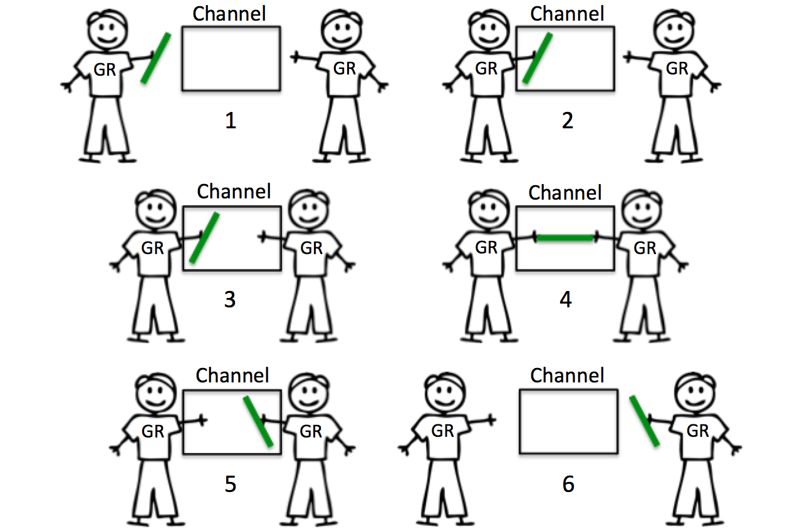
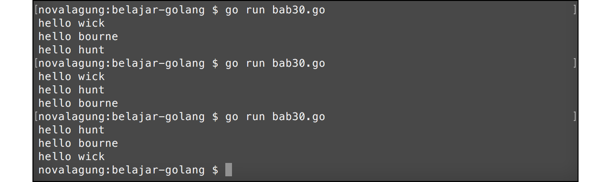
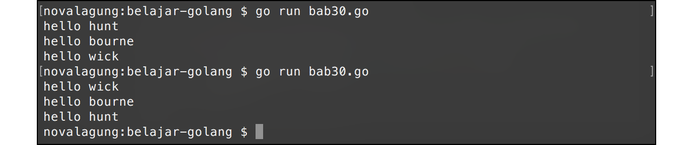

# Channel

**Channel** digunakan untuk menghubungkan gorutine satu dengan goroutine lainnya. Mekanismenya adalah dengan cara serah-terima data lewat channel tersebut. Goroutine pengirim dan penerima harus berada pada channel yang berbeda (konsep ini disebut **buffered channel**). Pengiriman dan penerimaan data pada channel bersifat **blocking** atau **synchronous**. 



Pada bab ini kita akan belajar mengenai pemanfaatan channel.

## Penerapan Channel

Channel merupakan sebuah variabel, dibuat dengan menggunakan keyword `make` dan `chan`. Variabel channel memiliki tugas menjadi pengirim dan penerima data.

Program berikut adalah contoh implementasi channel. 3 buah goroutine baru dieksekusi, yang di masing-masing goroutine terdapat proses pengiriman data lewat channel. Data tersebut akan diterima 3 kali di goroutine utama (`main`).

```go
func main() {
    runtime.GOMAXPROCS(2)

    var messages = make(chan string)

    var sayHelloTo = func(who string) {
        var data = fmt.Sprintf("hello %s", who)
        messages <- data
    }

    go sayHelloTo("john wick")
    go sayHelloTo("ethan hunt")
    go sayHelloTo("jason bourne")

    var message1 = <-messages
    fmt.Println(message1)

    var message2 = <-messages
    fmt.Println(message2)

    var message3 = <-messages
    fmt.Println(message3)
}
```

Pada kode di atas, variabel `messages` dideklarasikan bertipe `channel string`. Cara pembuatan channel yaitu dengan menuliskan keyword `make` dengan isi keyword `chan` diikuti dengan tipe data channel yang diinginkan.

```go
var messages = make(chan string)
```

Selain itu disiapkan juga closure `sayHelloTo` yang menghasilkan data string. Data tersebut kemudian dikirim lewat channel `messages`. Tanda `<-` jika dituliskan di sebelah kiri nama variabel, berarti sedang berlangsung proses pengiriman data dari variabel yang berada di kanan lewat channel yang berada di kiri (pada konteks ini, variabel `data` dikirim lewat channel `messages`).

```go
var sayHelloTo = func(who string) {
    var data = fmt.Sprintf("hello %s", who)
    messages <- data
}
```

Fungsi `sayHelloTo` dieksekusi tiga kali sebagai goroutine berbeda. Menjadikan tiga proses ini berjalan secara **asynchronous** atau tidak saling tunggu.

```go
go sayHelloTo("john wick")
go sayHelloTo("ethan hunt")
go sayHelloTo("jason bourne")
```

Dari ketiga fungsi tersebut, goroutine yang paling awal mengirim data, akan diterima datanya oleh variabel `message1`. Tanda `<-` jika dituliskan di sebelah kanan channel, menandakan proses penerimaan data dari channel yang di kanan, untuk disimpan ke variabel yang di kiri.

```go
var message1 = <-messages
fmt.Println(message1)
```

Penerimaan channel bersifat blocking. Artinya statement `var message1 = <-messages` hingga setelahnya tidak akan dieksekusi sebelum ada data yang dikirim lewat channel.

Ketiga goroutine tersebut datanya akan diterima secara berurutan oleh `message1`, `message2`, `message3`; untuk kemudian ditampilkan.



Dari screenshot output di atas bisa dilihat bahwa text yang dikembalikan oleh `sayHelloTo` tidak selalu berurutan, meskipun penerimaan datanya adalah berurutan. Hal ini dikarenakan, pengiriman data adalah dari 3 goroutine yang berbeda, yang kita tidak tau mana yang dieksekusi terlebih dahulu. Goroutine yang dieksekusi lebih awal, datanya akan diterima lebih awal.

Karena pengiriman dan penerimaan data lewat channel bersifat **blocking**, tidak perlu memanfaatkan sifat blocking dari fungsi `fmt.Scanln()` untuk mengantisipasi goroutine utama selesai lebih dulu.

## Channel Sebagai Tipe Data Parameter

Variabel channel bisa di-passing ke fungsi lain sebagai parameter. Caranya dengan menambahkan keyword `chan` ketika deklarasinya.

Langsung saja kita praktekan. Siapkan fungsi `printMessage` dengan parameter adalah channel. Lalu ambil data yang dikirimkan lewat channel tersebut untuk ditampilkan. 

```go
func printMessage(what chan string) {
    fmt.Println(<-what)
}
```

Setelah itu ubah implementasi di fungsi `main`.

```go
func main() {
    runtime.GOMAXPROCS(2)

    var messages = make(chan string)

    for _, each := range []string{"wick", "hunt", "bourne"} {
        go func(who string) {
            var data = fmt.Sprintf("hello %s", who)
            messages <- data
        }(each)
    }

    for i := 0; i < 3; i++ {
        printMessage(messages)
    }
}
```

Parameter `what` fungsi `printMessage` bertipe channel string, bisa dilihat dari kode `chan string` pada cara deklarasinya. Operasi serah-terima data akan bisa dilakukan pada variabel tersebut, dan akan berdampak juga pada variabel `messages` di fungsi `main`.

Passing data bertipe channel lewat parameter secara implisit adalah **pass by reference**, yang di-passing adalah pointer-nya. Output program di atas adalah sama dengan program sebelumnya.



## 

Berikut merupakan penjelasan tambahan kode di atas.

## Iterasi Data Array Langsung Pada Saat Inisialisasi

Data array yang baru di-inisialisasi bisa langsung di-iterasi, caranya mudah dengan menuliskanya langsung setelah keyword `range`.

```go
for _, each := range []string{"wick", "hunt", "bourne"} {
    // ...
}
```

## Eksekusi Goroutine Pada IIFE

Eksekusi goroutine tidak harus pada fungsi atau closure yang sudah terdefinisi. Sebuah IIFE juga bisa dijalankan sebagai goroutine baru. Caranya dengan langsung menambahkan keyword `go` pada waktu deklarasi-eksekusi IIFE-nya.

```go
go func(who string) {
    var data = fmt.Sprintf("hello %s", who)
    messages <- data
}(each)
```
