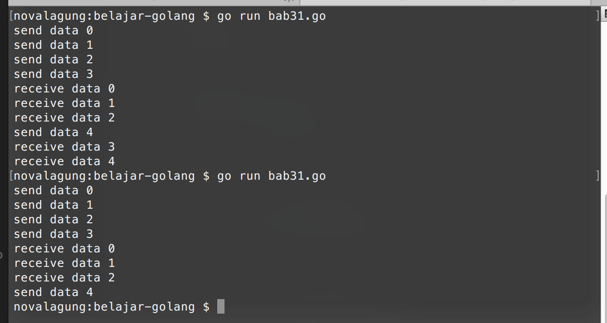

# Buffered Channel

Channel secara default adalah **un-buffered**, tidak di-buffer di memori. Ketika ada goroutine yang mengirimkan data lewat channel, harus ada goroutine lain yang bertugas menerima data dari channel yang sama, dengan proses serah-terima yang bersifat blocking. Maksudnya, baris kode di bagian pengiriman dan penerimaan data, tidak akan akan diproses sebelum proses serah-terima-nya selesai.

Buffered channel sedikit berbeda. Pada channel jenis ini, ditentukan jumlah buffer-nya. Angka tersebut akan menjadi penentu kapan kita bisa mengirimkan data. Selama jumlah data yang dikirim tidak melebihi jumlah buffer, maka pengiriman akan berjalan **asynchronous** (tidak blocking).

Ketika jumlah data yang dikirim sudah melewati batas buffer, maka pengiriman data hanya bisa dilakukan ketika salah satu data sudah diambil dari channel, sehingga ada slot channel yang kosong. Dengan proses penerimaan-nya sendiri bersifat blocking.


## Penerapan Buffered Channel

Penerapan buffered channel pada dasarnya mirip seperti channel biasa. Perbedannya pada channel jenis ini perlu disiapkan jumlah buffer-nya.

Berikut adalah contoh penerapan buffered channel. Program dibawah ini merupakan pembuktian bahwa pengiriman data lewat buffered channel adalah asynchronous selama jumlah data yang sedang di-buffer oleh channel tidak melebihi kapasitas buffernya.

```go
func main() {
    runtime.GOMAXPROCS(2)

    messages := make(chan int, 2)

    go func() {
        for {
            i := <-messages
            fmt.Println("receive data", i)
        }
    }()

    for i := 0; i < 5; i++ {
        fmt.Println("send data", i)
        messages <- i
    }
}
```

Pada kode di atas, parameter kedua fungsi `make` adalah representasi jumlah buffer-nya. Perlu diperhatikan bahwa nilai buffered channel dimulai dari `0`. Ketika nilainya adalah **2**, brarti jumlah buffer maksimal ada **3** (0, 1, dan 2).

Pada contoh di atas, terdapat juga sebuah goroutine yang berisikan proses penerimaan data dari channel message, yang selanjutnya akan ditampilkan.

Setelah goroutine untuk penerimaan data dieksekusi, data dikirimkan lewat perulangan `for`. Sejumlah 5 data akan dikirim lewat channel `message` secara sekuensial.



Bisa dilihat hasilnya pada output di atas. Pengiriman data ke-4, diikuti dengan penerimaan data, dan kedua proses tersebut berjalan secara blocking.

Pengiriman data ke 0, 1, 2 dan 3 akan berjalan secara asynchronous, hal ini karena channel ditentukan nilai buffer-nya sebanyak 3 (ingat, dimulai dari 0). Pengiriman selanjutnya (ke-4 dan ke-5) hanya akan terjadi jika ada salah satu data dari 4 data yang sebelumnya telah dikirimkan, sudah diterima (dengan serah terima data yang bersifat blocking). Setelahnya, sesudah slot channel ada yang kosong, serah-terima akan kembali asynchronous.
