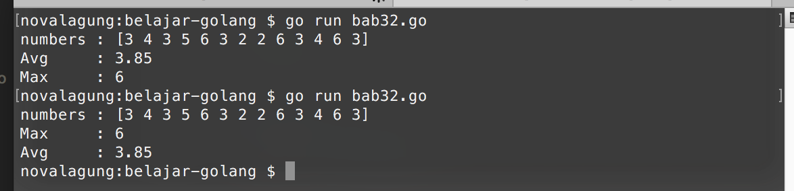

# Channel - Select

Adanya channel memang sangat membantu pengontrolan goroutine, jumlah goroutine yang banyak bukan lagi masalah. 

Ada kalanya dimana kita butuh tak hanya satu channel saja untuk manage goroutine yang juga banyak, dibutuhkan beberapa atau mungkin banyak channel.

Disinilah kegunaan dari `select`. Select memudahkan pengontrolan komunikasi data lewat channel. Cara penggunaannya sama seperti seleksi kondisi `switch`.

## Penerapan Keyword `select`

Program pencarian rata-rata dan nilai tertinggi berikut merupakan contoh sederhana penerapan select dalam channel. Akan ada 2 buah goroutine yang masing-masing di-handle oleh sebuah channel. Setiap kali goroutine selesai dieksekusi, akan dikirimkan datanya ke channel yang bersangkutan. Lalu dengan menggunakan select, akan dikontrol penerimaan datanya.

Pertama, kita siapkan terlebih dahulu 2 fungsi yang akan dieksekusi sebagai goroutine baru. Fungsi pertama digunakan untuk mencari rata-rata, dan fungsi kedua untuk penentuan nilai tertinggi dari sebuah slice.

```go
package main

import "fmt"
import "runtime"

func getAverage(numbers []int, ch chan float64) {
    var sum = 0
    for _, e := range numbers {
        sum += e
    }
    ch <- float64(sum) / float64(len(numbers))
}

func getMax(numbers []int, ch chan int) {
    var max = numbers[0]
    for _, e := range numbers {
        if max < e {
            max = e
        }
    }
    ch <- max
}
```

Kedua fungsi di atas akan dieksekusi di dalam `main` sebagai goroutine baru. Di akhir masing-masing fungsi akan dikirimkan data hasil komputasi ke channel yang sudah ditentukan (`ch1` menampung data rata-rata, `ch2` untuk data nilai tertinggi).

Setelah itu, buat implementasinya pada fungsi `main`.

```go
func main() {
    runtime.GOMAXPROCS(2)

    var numbers = []int{3, 4, 3, 5, 6, 3, 2, 2, 6, 3, 4, 6, 3}
    fmt.Println("numbers :", numbers)

    var ch1 = make(chan float64)
    go getAverage(numbers, ch1)

    var ch2 = make(chan int)
    go getMax(numbers, ch2)

    for i := 0; i < 2; i++ {
        select {
        case avg := <-ch1:
            fmt.Printf("Avg \t: %.2f \n", avg)
        case max := <-ch2:
            fmt.Printf("Max \t: %d \n", max)
        }
    }
}
```

Pada kode di atas, transaksi pengiriman data pada channel `ch1` dan `ch2` dikontrol menggunakan `select`. Terdapat 2 buah `case` kondisi penerimaan data dari kedua channel tersebut.

 - Kondisi `case avg := <-ch1` akan terpenuhi ketika ada penerimaan data dari channel `ch1`, yang kemudian akan ditampung oleh variabel `avg`. 
 - Kondisi `case max := <-ch2` akan terpenuhi ketika ada penerimaan data dari channel `ch2`, yang kemudian akan ditampung oleh variabel `max`. 

Karena ada 2 buah channel, maka perlu disiapkan perulangan 2 kali sebelum penggunaan keyword `select`.



Cukup mudah bukan?
