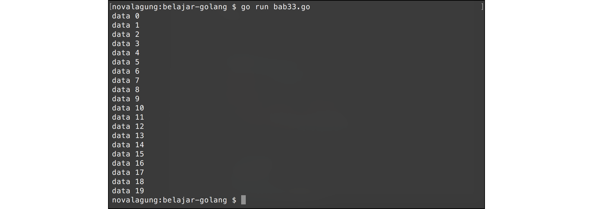

# A.33. Channel - Range dan Close

Proses retrieving data dari banyak channel bisa lebih mudah dilakukan dengan memanfaatkan kombinasi keyword `for` - `range`.

`for` - `range` jika diterapkan pada channel berfungsi untuk handle penerimaan data. Setiap kali ada pengiriman data via channel, maka akan men-trigger perulangan `for` - `range`. Perulangan akan berlangsung terus-menerus seiring pengiriman data ke channel yang dipergunakan. Dan perulangan hanya akan berhenti jika channel yang digunakan tersebut di **close** atau di-non-aktifkan. Fungsi `close` digunakan utuk me-non-aktifkan channel.

Channel yang sudah di-close tidak bisa digunakan lagi baik untuk menerima data ataupun untuk mengirim data, itulah mengapa perulangan `for` - `range` juga berhenti.

## A.33.1. Penerapan `for` - `range` - `close` Pada Channel

Berikut adalah contoh program menggunakan `for` - `range` untuk menerima data dari channel.

Ok, pertama siapkan fungsi `sendMessage()` yang tugasnya mengirim data via channel. Didalam fungsi ini dijalankan perulangan sebanyak 20 kali, ditiap perulangannya data dikirim ke channel. Channel di-close setelah semua data selesai dikirim.

```go
func sendMessage(ch chan<- string) {
    for i := 0; i < 20; i++ {
        ch <- fmt.Sprintf("data %d", i)
    }
    close(ch)
}
```

Siapkan juga fungsi `printMessage()` untuk handle penerimaan data. Didalam fungsi tersebut, channel di-looping menggunakan `for` - `range`. Di tiap looping, data yang diterima dari channel ditampilkan.

```go
func printMessage(ch <-chan string) {
    for message := range ch {
        fmt.Println(message)
    }
}
```

Buat channel baru dalam fungsi `main()`, jalankan `sendMessage()` sebagai goroutine (dengan ini 20 data yang berada dalam fungsi tersebut dikirimkan via goroutine baru). Tak lupa jalankan juga fungsi `printMessage()`.

```go
func main() {
    runtime.GOMAXPROCS(2)

    var messages = make(chan string)
    go sendMessage(messages)
    printMessage(messages)
}
```

Setelah 20 data sukses dikirim dan diterima, channel `ch` di-non-aktifkan (`close(ch)`). Membuat perulangan data channel dalam `printMessage()` juga akan berhenti.



---

Berikut adalah penjelasan tambahan mengenai channel.

## A.33.1.1. Channel Direction

Ada yang unik dengan fitur parameter channel yang disediakan oleh Go. Level akses channel bisa ditentukan, apakah hanya sebagai penerima, pengirim, atau penerima sekaligus pengirim. Konsep ini disebut dengan **channel direction**.

Cara pemberian level akses adalah dengan menambahkan tanda `<-` sebelum atau setelah keyword `chan`. Untuk lebih jelasnya bisa dilihat di list berikut.

| Sintaks | Penjelasan |
| :------- | :--------- |
| `ch chan string` | Parameter `ch` bisa digunakan untuk **mengirim** dan **menerima** data |
| `ch chan<- string` | Parameter `ch` hanya bisa digunakan untuk **mengirim** data |
| `ch <-chan string` | Parameter `ch` hanya bisa digunakan untuk **menerima** data |

Pada kode di atas bisa dilihat bahwa secara default channel akan memiliki kemampuan untuk mengirim dan menerima data. Untuk mengubah channel tersebut agar hanya bisa mengirim atau menerima saja, dengan memanfaatkan simbol `<-`.

Sebagai contoh fungsi `sendMessage(ch chan<- string)` yang parameter `ch` dideklarasikan dengan level akses untuk pengiriman data saja. Channel tersebut hanya bisa digunakan untuk mengirim, contohnya: `ch <- fmt.Sprintf("data %d", i)`.

Dan sebaliknya pada fungsi `printMessage(ch <-chan string)`, channel `ch` hanya bisa digunakan untuk menerima data saja.

---

Source code praktek pada bab ini tersedia di [Github](https://github.com/novalagung/dasarpemrogramangolang/tree/master/chapter-A.33-channel-range-close)
