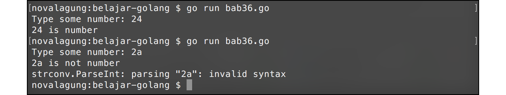
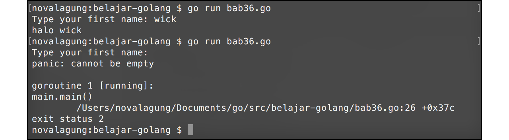

# A.36. Error, Panic, dan Recover

Error merupakan topik yang sangat penting dalam pemrograman Go. Di bagian ini kita akan belajar mengenai pemanfaatan error dan cara membuat custom error sendiri. Selain itu, kita juga akan belajar tentang penggunaan **panic** untuk memunculkan panic error, dan **recover** untuk mengatasinya.

## A.36.1. Pemanfaatan Error

`error` merupakan sebuah tipe. Error memiliki memiliki 1 buah property berupa method `Error()`, method ini mengembalikan detail pesan error dalam string. Error termasuk tipe yang isinya bisa `nil`.

Di Go, banyak sekali fungsi yang mengembalikan nilai balik lebih dari satu. Biasanya, salah satu kembalian adalah bertipe `error`. Contohnya seperti pada fungsi `strconv.Atoi()`. Fungsi tersebut digunakan untuk konversi data string menjadi numerik. Fungsi ini mengembalikan 2 nilai balik. Nilai balik pertama adalah hasil konversi, dan nilai balik kedua adalah `error`. Ketika konversi berjalan mulus, nilai balik kedua akan bernilai `nil`. Sedangkan ketika konversi gagal, penyebabnya bisa langsung diketahui dari error yang dikembalikan.

Dibawah ini merupakan contoh program sederhana untuk deteksi inputan dari user, apakah numerik atau bukan. Dari sini kita akan belajar mengenai pemanfaatan error.

```go
package main

import (
    "fmt"
    "strconv"
)

func main() {
    var input string
    fmt.Print("Type some number: ")
    fmt.Scanln(&input)

    var number int
    var err error
    number, err = strconv.Atoi(input)

    if err == nil {
        fmt.Println(number, "is number")
    } else {
        fmt.Println(input, "is not number")
        fmt.Println(err.Error())
    }
}
```

Jalankan program, maka muncul tulisan `"Type some number: "`. Ketik angka bebas, jika sudah maka enter.

Statement `fmt.Scanln(&input)` dipergunakan untuk men-capture inputan yang diketik oleh user sebelum dia menekan enter, lalu menyimpannya sebagai string ke variabel `input`.

Selanjutnya variabel tersebut dikonversi ke tipe numerik menggunakan `strconv.Atoi()`. Fungsi tersebut mengembalikan 2 data, ditampung oleh `number` dan `err`.

Data pertama (`number`) berisi hasil konversi. Dan data kedua `err`, berisi informasi errornya (jika memang terjadi error ketika proses konversi).

Setelah itu dilakukan pengecekkan, ketika tidak ada error, `number` ditampilkan. Dan jika ada error, `input` ditampilkan beserta pesan errornya.

Pesan error bisa didapat dari method `Error()` milik tipe `error`.



## A.36.2. Membuat Custom Error

Selain memanfaatkan error hasil kembalian suatu fungsi internal yang tersedia, kita juga bisa membuat objek error sendiri dengan menggunakan fungsi `errors.New()` (harus import package `errors` terlebih dahulu).

Pada contoh berikut ditunjukan bagaimana cara membuat custom error. Pertama siapkan fungsi dengan nama `validate()`, yang nantinya digunakan untuk pengecekan input, apakah inputan kosong atau tidak. Ketika kosong, maka error baru akan dibuat.

```go
package main

import (
    "errors"
    "fmt"
    "strings"
)

func validate(input string) (bool, error) {
    if strings.TrimSpace(input) == "" {
        return false, errors.New("cannot be empty")
    }
    return true, nil
}
```

Selanjutnya di fungsi main, buat proses sederhana untuk capture inputan user. Manfaatkan fungsi `validate()` untuk mengecek inputannya.

```go
func main() {
    var name string
    fmt.Print("Type your name: ")
    fmt.Scanln(&name)

    if valid, err := validate(name); valid {
        fmt.Println("halo", name)
    } else {
        fmt.Println(err.Error())
    }
}
```

Fungsi `validate()` mengembalikan 2 data. Data pertama adalah nilai `bool` yang menandakan inputan apakah valid atau tidak. Data ke-2 adalah pesan error-nya (jika inputan tidak valid).

Fungsi `strings.TrimSpace()` digunakan untuk menghilangkan karakter spasi sebelum dan sesudah string. Ini dibutuhkan karena user bisa saja menginputkan spasi lalu enter.

Ketika inputan tidak valid, maka error baru dibuat dengan memanfaatkan fungsi `errors.New()`. Selain itu objek error juga bisa dibuat lewat fungsi `fmt.Errorf()`.


## A.36.3. Penggunaan `panic`

Panic digunakan untuk menampilkan *stack trace* error sekaligus menghentikan flow goroutine (karena `main()` juga merupakan goroutine, maka behaviour yang sama juga berlaku). Setelah ada panic, proses akan terhenti, apapun setelah tidak di-eksekusi kecuali proses yang sudah di-defer sebelumnya (akan muncul sebelum panic error).

Panic menampilkan pesan error di console, sama seperti `fmt.Println()`. Informasi error yang ditampilkan adalah stack trace error, jadi sangat mendetail dan heboh.

Kembali ke koding, pada program yang telah kita buat tadi, ubah `fmt.Println()` yang berada di dalam blok kondisi `else` pada fungsi main menjadi `panic()`, lalu tambahkan `fmt.Println()` setelahnya.

```go
func main() {
    var name string
    fmt.Print("Type your name: ")
    fmt.Scanln(&name)

    if valid, err := validate(name); valid {
        fmt.Println("halo", name)
    } else {
        fmt.Println(err.Error())
        fmt.Println("end")
    }
}
```

Jalankan program lalu langsung tekan enter, maka panic error muncul dan baris kode setelahnya tidak dijalankan.



## A.36.4. Penggunaan `recover`

Recover berguna untuk meng-handle panic error. Pada saat panic error muncul, recover men-take-over goroutine yang sedang panic (pesan panic tidak akan muncul).

Ok, mari kita modif sedikit fungsi di-atas untuk mempraktekkan bagaimana cara penggunaan recover. Tambahkan fungsi `catch()`, dalam fungsi ini terdapat statement `recover()` yang dia akan mengembalikan pesan panic error yang seharusnya muncul.

Untuk menggunakan recover, fungsi/closure/IIFE dimana `recover()` berada harus dieksekusi dengan cara di-defer.

```go
func catch() {
    if r := recover(); r != nil {
        fmt.Println("Error occured", r)
    } else {
        fmt.Println("Application running perfectly")
    }
}

func main() {
	defer catch()

	var name string
	fmt.Print("Type your name: ")
	fmt.Scanln(&name)

	if valid, err := validate(name); valid {
		fmt.Println("halo", name)
	} else {
		panic(err.Error())
		fmt.Println("end")
	}
}
```

Output:


## A.36.5. Pemanfaatan `recover` pada IIFE

Contoh penerapan recover pada IIFE:

```go
func main() {
    defer func() {
        if r := recover(); r != nil {
            fmt.Println("Panic occured", r)
        } else {
            fmt.Println("Application running perfectly")
        }
    }()

    panic("some error happen")
}
```

Dalam real-world development, ada kalanya recover dibutuhkan tidak dalam blok fungsi terluar, tetapi dalam blok fungsi yg lebih spesifik.

Silakan perhatikan contoh kode recover perulangan berikut. Umumnya, jika terjadi panic error, maka proses proses dalam scope blok fungsi akan terjenti, mengakibatkan perulangan juga akan terhenti secara paksa. Pada contoh berikut kita coba terapkan cara handle panic error tanpa menghentikan perulangan itu sendiri.

```go
func main() {
    data := []string{"superman", "aquaman", "wonder woman"}

    for _, each := range data {

		func() {
            
            // recover untuk IIFE dalam perulangan
			defer func() {
				if r := recover(); r != nil {
					fmt.Println("Panic occured on looping", each, "| message:", r)
				} else {
					fmt.Println("Application running perfectly")
				}
			}()

			panic("some error happen")
        }()
        
	}
}
```

Pada kode di atas, bisa dilihat di dalam perulangan terdapat sebuah IIFE untuk recover panic dan juga ada kode untuk men-trigger panic error secara paksa. Ketika panic error terjadi, maka idealnya perulangan terhenti, tetapi pada contoh di atas tidak, dikarenakan operasi dalam perulangan sudah di bungkus dalam IIFE dan seperti yang kita tau sifat panic error adalah menghentikan proses secara paksa dalam scope blok fungsi.

---

<div class="source-code-link">
    <div class="source-code-link-message">Source code praktek pada bab ini tersedia di Github</div>
    <a href="https://github.com/novalagung/dasarpemrogramangolang-example/tree/master/chapter-A.36-error-panic-recover">https://github.com/novalagung/dasarpemrogramangolang-example/.../chapter-A.36...</a>
</div>
