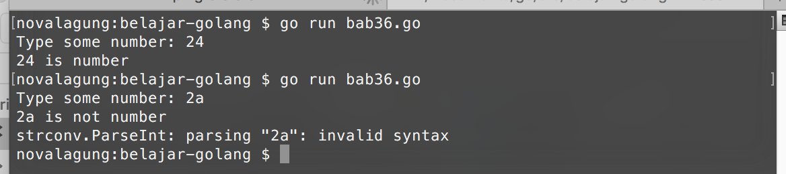
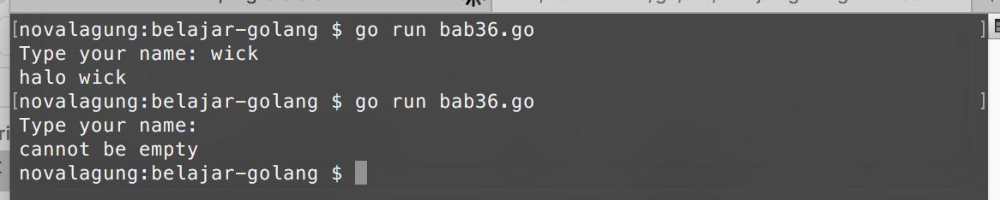

# Error & Panic

Error merupakan topik yang penting dalam pemrograman golang. Di bagian ini kita akan belajar mengenai pemanfaatan error dan cara membuat custom error sendiri.

Kita juga akan belajar tentang penggunaan **panic** untuk menampilkan pesan error.

## Pemanfaatan Error

`error` merupakan sebuah tipe. Error memiliki beberapa property yang menampung informasi yang berhubungan dengan error yang bersangkutan.

Di golang, banyak sekali fungsi yang mengembalikan nilai balik lebih dari satu. Biasanya, salah satu kembalian adalah bertipe `error`. Contohnya seperti pada fungsi `strconv.Atoi()`. 

`strconv.Atoi()` berguna untuk mengkonversi data string menjadi numerik. Fungsi ini mengembalikan 2 nilai balik. Nilai balik pertama adalah hasil konversi, dan nilai balik kedua adalah `error`.

Ketika konversi berjalan mulus, nilai balik kedua akan bernilai `nil`. Sedangkan ketika konversi gagal, kita bisa langsung tau penyebab error muncul dengan memanfaatkan nilai balik kedua.

Berikut merupakan contoh program sederhana untuk deteksi inputan dari user, apakah numerik atau bukan.

```go
package main

import (
    "fmt"
    "strconv"
)

func main() {
    var input string
    fmt.Print("Type some number: ")
    fmt.Scanln(&input)

    var number int
    var err error
    number, err = strconv.Atoi(input)

    if err == nil {
        fmt.Println(number, "is number")
    } else {
        fmt.Println(input, "is not number")
        fmt.Println(err.Error())
    }
}
```

Ketika program dijalankan, akan muncul tulisan `"Type some number: "`. Ketik sebuah angka lalu enter.

`fmt.Scanln(&input)` akan mengambil inputan yang diketik user sebelum dia menekan enter, lalu menyimpannya sebagai string ke variabel `input`.

Selanjutnya variabel tersebut dikonversi ke tipe numerik menggunakan `strconv.Atoi()`. Fungsi tersebut mengembalikan 2 data, yang kemudian akan ditampung oleh `number` dan `err`.

Data pertama (`number`) akan berisi hasil konversi. Dan data kedua `err`, akan berisi informasi errornya (jika memang terjadi error ketika proses konversi).

Setelah itu dilakukan pengecekkan, ketika tidak ada error, `number` ditampilkan. Dan jika ada error, `input` ditampilkan beserta pesan errornya.

Pesan error bisa didapat dari method `Error()` milik tipe `error`.



## Membuat Custom Error

Selain memanfaatkan error hasil kembalian fungsi, kita juga bisa membuat error sendiri dengan menggunakan fungsi `errors.New` (untuk menggunakannya harus import package `errors` terlebih dahulu).

Berikut merupakan contoh pembuatan custom error. Pertama siapkan fungsi dengan nama `validate()`, yang nantinya digunakan untuk pengecekan input, apakah inputan kosong atau tidak. Ketika kosong, maka error baru akan dibuat.

```go
package main

import (
    "errors"
    "fmt"
    "strings"
)

func validate(input string) (bool, error) {
    if strings.TrimSpace(input) == "" {
        return false, errors.New("cannot be empty")
    }
    return true, nil
}
```

Selanjutnya di fungsi main, buat program sederhana untuk capture inputan user. Manfaatkan fungsi `validate()` untuk mengecek inputannya.

```go
func main() {
    var name string
    fmt.Print("Type your name: ")
    fmt.Scanln(&name)

    if valid, err := validate(name); valid {
        fmt.Println("halo", name)
    } else {
        fmt.Println(err.Error())
    }
}
```

Fungsi `validate()` mengembalikan 2 data. Data pertama adalah nilai `bool` yang menandakan inputan apakah valid atau tidak. Data ke-2 adalah pesan error-nya (jika inputan tidak valid).

Fungsi `strings.TrimSpace()` digunakan untuk menghilangkan karakter spasi sebelum dan sesudah string. Ini dibutuhkan karena user bisa saja menginputkan spasi lalu enter.

Ketika inputan tidak valid, maka error baru dibuat dengan memanfaatkan fungsi `errors.New()`.



## Penggunaan Keyword `panic`

Panic digunakan untuk menampilkan *trace* error. Hasil keluarannya sama seperti `fmt.Println()` hanya saja informasi yang ditampilkan lebih detail.

Pada program yang telah kita buat tadi, ubah `fmt.Println()` yang berada di dalam blok kondisi `else` pada fungsi main menjadi `panic()`.

```go
if valid, err := validate(name); valid {
    fmt.Println("halo", name)
} else {
    panic(err.Error())
}
```

Ketika user menginputkan string kosong, maka error akan dimunculkan menggunakan fungsi `panic`.


