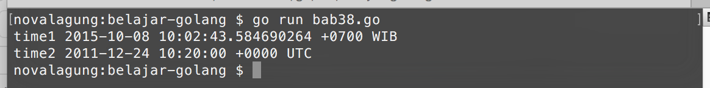
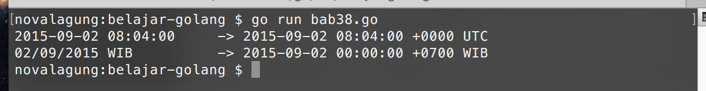
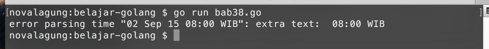

# Time, Parsing Time, & Format Time

Pada bab ini kita akan belajar tentang pemanfaatan time, property-property yang disediakan, dan juga **format** & **parsing** data `string` ke `time.Time` dan sebaliknya. 

Golang menyediakan package `time` yang berisikan banyak sekali komponen yang bisa digunakan untuk keperluan pemanfaatan waktu.

Time disini maksudnya adalah gabungan **date** dan **time**, bukan hanya waktu saja.

## Penggunaan `time.Time`

`time.Time` adalah tipe data untuk objek waktu. Ada 2 cara yang bisa digunakan untuk membuat data bertipe ini.

 - Dengan menjadikan waktu sekarang sebagai time
 - Membuat time dengan data ditentukan sendiri

```go
var time1 = time.Now()
fmt.Printf("time1 %v\n", time1)
// time1 2015-09-01 17:59:31.73600891 +0700 WIB

var time2 = time.Date(2011, 12, 24, 10, 20, 0, 0, time.UTC)
fmt.Printf("time2 %v\n", time2)
// time2 2011-12-24 10:20:00 +0000 UTC
```

Fungsi `time.Now()` mengembalikan objek `time.Time` dengan data adalah waktu sekarang. Bisa dilihat ketika di tampilkan informasi yang muncul adalah sesuai dengan tanggal program tersebut dieksekusi.



Sedangkan `time.Date()` digunakan untuk membuat objek `time.Time` baru dengan informasi waktu yang bisa kita tentukan sendiri. Fungsi ini memiliki 8 buah parameter **mandatory** dengan skema bisa dilihat di kode berikut:

```go
time.Date(tahun, bulan, tanggal, jam, menit, detik, nanodetik, timezone)
```

Objek cetakan fungsi `time.Now()`, informasi timezone-nya adalah relatif terhadap lokasi kita. Karena kebetulan penulis berlokasi di jawa timur, maka akan terdeteksi masuk dalam **GMT+7** atau **WIB**. Berbeda dengan variabel `time2` yang lokasinya sudah kita tentukan secara eksplisit yaitu **UTC**.

Selain menggunakan `time.UTC` untuk penentuan lokasi, tersedia juga `time.Local` yang nilainya adalah relatif terhadap waktu kita.

## Property **time.Time**

```go
var now = time.Now()
fmt.Println("year:", now.Year(), "month:", now.Month())
// year: 2015 month: 8
```

Kode di atas adalah contoh penggunaan beberapa method milik objek bertipe `time.Time`. Method `Year()` mengembalikan informasi tahun, dan `Month()` mengembalikan informasi angka bulan.

Selain kedua method di atas, ada banyak lagi yang bisa dimanfaatkan. Tabel berikut merupakan list method yang berhubungan dengan *date*, *time*, dan *location* yang tersedia pada tipe `time.Time`. 

| Method | Return Type | Penjelasan |
| :------------ | :--------- | :------- |
| `now.Year()` | `int` | Tahun |
| `now.YearDay()` | `int` | Hari ke-? di mulai awal tahun |
| `now.Month()` | `int` | Bulan |
| `now.Weekday()` | `string` | Nama hari. Bisa menggunakan `now.Weekday().String()` untuk mengambil bentuk string-nya |
| `now.ISOWeek()` | (`int`, `int`) | Tahun dan minggu ke-? mulai awal tahun |
| `now.Day()` | `int` | Tanggal |
| `now.Hour()` | `int` | Jam |
| `now.Minute()` | `int` | Menit |
| `now.Second()` | `int` | Detik |
| `now.Nanosecond()` | `int` | Nano detik |
| `now.Local()` | `time.Time` | Waktu dalam timezone lokal |
| `now.Location()` | `*time.Location` | Mengambil informasi lokasi, apakah *local* atau *utc*. Bisa menggunakan `now.Location().String()` untuk mengambil bentuk string-nya |
| `now.Zone()` | (`string`, `int`) | Mengembalikan informasi *timezone offset* dalam string dan numerik. Sebagai contoh `WIB, 25200` |
| `now.IsZero()` | `bool` | Deteksi apakah nilai object `now` adalah `01 Januari tahun 1, 00:00:00 UTC`. Jika iya maka bernilai `true` |
| `now.UTC()` | `time.Time` | Waktu dalam timezone `UTC` |
| `now.Unix()` | `int64` | Waktu dalam format *unix time* |
| `now.UnixNano()` | `int64` | Waktu dalam format *unix time*. Infomasi nano detik juga dimasukkan |
| `now.String()` | `string` | Waktu dalam string |

## Parsing `time.Time`

Data `string` bisa dikonversi menjadi `time.Time` dengan memanfaatkan `time.Parse`. Fungsi ini membutuhkan 2 parameter:

 - Parameter ke-1 adalah layout format dari data waktu yang akan diparsing
 - Parameter ke-2 adalah data string yang ingin diparsing

Contoh penerapannya bisa dilihat di kode berikut:

```go
var layoutFormat, value string
var date time.Time

layoutFormat = "2006-01-02 15:04:05"
value = "2015-09-02 08:04:00"
date, _ = time.Parse(layoutFormat, value)
fmt.Println(value, "\t->", date.String())
// 2015-09-02 08:04:00 +0000 UTC

layoutFormat = "02/01/2006 MST"
value = "02/09/2015 WIB"
date, _ = time.Parse(layoutFormat, value)
fmt.Println(value, "\t\t->", date.String())
// 2015-09-02 00:00:00 +0700 WIB
```



Layout format time di golang berbeda dibanding bahasa lain. Umumnya layout format yang digunakan adalah seperti `"DD/MM/YYYY"` dll, di Golang tidak.

Golang memiliki standar layout format yang cukup unik, contohnya seperti pada kode di atas `"2006-01-02 15:04:05"`. Golang menggunakan `2006` untuk parsing tahun, bukan `YYYY`; `01` untuk parsing bulan; `02` untuk parsing hari; dan seterusnya. Detailnya bisa dilihat di tabel berikut.

| Layout&nbsp;Format | Penjelasan | Contoh&nbsp;Data |
| :-------------- | :---------- | :----- |
| `2006` | Tahun 4 digit | `2015` |
| `006` | Tahun 3 digit | `015` |
| `06` | Tahun 2 digit | `15` |
| `01` | Bulan 2 digit | `05` |
| `1` | Bulan 1 digit jika dibawah bulan 10, selainnya 2 digit | `5`,&nbsp;`12` |
| `January` | Nama bulan dalam bahasa inggris | `September`,&nbsp;`August` |
| `Jan` | Nama bulan dalam bahasa inggris, 3 huruf | `Sep`,&nbsp;`Aug` |
| `02` | Tanggal 2 digit | `02` |
| `2` | Tanggal 1 digit jika dibawah bulan 10, selainnya 2 digit | `8`,&nbsp;`31` |
| `Monday` | Nama hari dalam bahasa inggris | `Saturday`,&nbsp;`Friday` |
| `Mon` | Nama hari dalam bahasa inggris, 3 huruf | `Sat`,&nbsp;`Fri` |
| `15` | Jam dengan format **24 jam** | `18` |
| `03` | Jam dengan format **12 jam** 2 digit | `05`,&nbsp;`11` |
| `3` | Jam dengan format **12 jam** 1 digit jika dibawah jam 11, selainnya 2 digit | `5`,&nbsp;`11` |
| `PM` | AM/PM, biasa digunakan dengan format jam **12 jam** | `PM`,&nbsp;`AM` |
| `04` | Menit 2 digit | `08` |
| `4` | Menit 1 digit jika dibawah menit 10, selainnya 2 digit | `8`,&nbsp;`24` |
| `05` | Detik 2 digit | `06` |
| `5` | Detik 1 digit jika dibawah detik 10, selainnya 2 digit | `6`,&nbsp;`36` |
| `999999` | Nano detik | `124006` |
| `MST` | Lokasi timezone | `UTC`,&nbsp;`WIB`,&nbsp;`EST` |
| `Z0700` | Offset timezone  | `Z`,&nbsp;`+0700`,&nbsp;`-0200` |

## Predefined Layout Format Untuk Keperluan Parsing Time

Golang juga menyediakan beberapa predefined layout format umum yang bisa dimanfaatkan. Jadi tidak perlu menuliskan kombinasi komponen-komponen layout format.

Salah satu predefined layout yang bisa digunakan adalah `time.RFC822`. Format ini sama dengan `02 Jan 06 15:04 MST`. Berikut adalah contoh penerapannya.

```go
var date, _ = time.Parse(time.RFC822, "02 Sep 15 08:00 WIB")
fmt.Println(date.String())
// 2015-09-02 08:00:00 +0700 WIB
```

Ada beberapa layout format lain yang bisa dimanfaatkan. Berikut adalah list nya.

| Predefined Layout Format | Layout Format |
| :---------------- | :----- |
| `time.ANSIC` | Mon Jan _2 15:04:05 2006 |
| `time.UnixDate` | Mon Jan _2 15:04:05 MST 2006 |
| `time.RubyDate` | Mon Jan 02 15:04:05 -0700 2006 |
| `time.RFC822` | 02 Jan 06 15:04 MST |
| `time.RFC822Z` | 02 Jan 06 15:04 -0700 |
| `time.RFC850` | Monday, 02-Jan-06 15:04:05 MST |
| `time.RFC1123` | Mon, 02 Jan 2006 15:04:05 MST |
| `time.RFC1123Z` | Mon, 02 Jan 2006 15:04:05 -0700 |
| `time.RFC3339` | 2006-01-02T15:04:05Z07:00 |
| `time.RFC3339Nano` | 2006-01-02T15:04:05.999999999Z07:00 |
| `time.Kitchen` | 3:04PM |
| `time.Stamp` | Jan _2 15:04:05 |
| `time.StampMilli` | Jan _2 15:04:05.000 |
| `time.StampMicro` | Jan _2 15:04:05.000000 |
| `time.StampNano` | Jan _2 15:04:05.000000000 |

## Format `time.Time`

Setelah sebelumnya kita belajar tentang konversi `string` ke `time.Time`. Kali ini kita akan belajar sebaliknya, yaitu konversi `time.Time` ke `string`.

Method `Format()` digunakan untuk membentuk `string` menggunakan layout format tertentu. Layout format yang bisa digunakan adalah sama seperti pada parsing time. Contoh bisa dilihat pada kode berikut.

```go
var date, _ = time.Parse(time.RFC822, "02 Sep 15 08:00 WIB")

var dateS1 = date.Format("Monday 02, January 2006 15:04 MST")
fmt.Println("dateS1", dateS1)
// Wednesday 02, September 2015 08:00 WIB

var dateS2 = date.Format(time.RFC3339)
fmt.Println("dateS2", dateS2)
// 2015-09-02T08:00:00+07:00
```

Variabel `date` berisikan hasil parsing menggunakan predefined layout format `time.RFC822`. Variabel tersebut kemudian ditampilkan 2 kali dengan layout format berbeda.


## Handle Error Parsing `time.Time`

Ketika parsing `string` ke `time.Time`, sangat memungkinkan bisa terjadi error karena struktur data yang akan diparsing tidak sesuai layout format yang digunakan.

Untuk mendeteksi hal ini bisa memanfaatkan nilai kembalian ke-2 fungsi `time.Parse`. Berikut adalah contoh penerapannya.

```go
var date, err = time.Parse("06 Jan 15", "02 Sep 15 08:00 WIB")

if err != nil {
    fmt.Println("error", err.Error())
    return
}

fmt.Println(date)
```

Kode di atas menghasilkan error karena format tidak sesuai dengan skema data yang akan diparsing. Layout format yang harusnya digunakan adalah `06 Jan 15 03:04 MST`.


