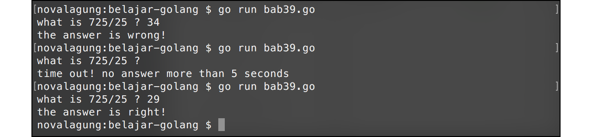

# 39. Timer

Ada beberapa fungsi dalam package `time` yang bisa dimanfaatkan untuk menunda atau mengatur jadwal eksekusi sebuah proses dalam jeda waktu tertentu.

## 39.1. Fungsi `time.Sleep()`

Fungsi ini digunakan untuk menghentikan program sejenak. `time.Sleep()` bersifat **blocking**, statement dibawahnya tidak akan dieksekusi sampai waktu pemberhentian usai. Contoh sederhana penerapan bisa dilihat pada kode berikut.

```go
package main

import "fmt"
import "time"

func main () {
    fmt.Println("start")
    time.Sleep(time.Second * 4)
    fmt.Println("after 4 seconds")
}
```

Hasilnya, tulisan `"start"` muncul, lalu 4 detik kemudian tulisan `"after 4 seconds"` muncul.

## 39.2. Fungsi `time.NewTimer()`

Fungsi ini sedikit berbeda dengan `time.Sleep()`. Fungsi `time.NewTimer()` mengembalikan objek bertipe `*time.Timer` yang memiliki property `C`. Cara kerja fungsi ini, setelah jeda waktu yang ditentukan sebuah data akan dikirimkan lewat channel `C`. Penggunaan fungsi ini harus diikuti dengan statement untuk penerimaan data dari channel `C`.

Untuk lebih jelasnya silakan perhatikan kode berikut.

```go
var timer = time.NewTimer(4 * time.Second)
fmt.Println("start")
<-timer.C
fmt.Println("finish")
```

Statement `var timer = time.NewTimer(4 * time.Second)` mengindikasikan bahwa nantinya akan ada data yang dikirimkan ke channel `timer.C` setelah 4 detik berlalu. Baris kode `<-timer.C` menandakan penerimaan data dari channel `timer.C`. Karena penerimaan channel sendiri sifatnya adalah blocking, maka statement `fmt.Println("finish")` baru akan dieksekusi setelah **4 detik**.

Hasil program di atas adalah tulisan `"start"` muncul, lalu setelah 4 detik tulisan `"expired"` muncul.

## 39.3. Fungsi `time.AfterFunc()`

Fungsi `time.AfterFunc()` memiliki 2 parameter. Parameter pertama adalah durasi timer, dan parameter kedua adalah *callback* nya. Callback tersebut akan dieksekusi jika waktu sudah memenuhi durasi timer.

```go
var ch = make(chan bool)

time.AfterFunc(4*time.Second, func() {
    fmt.Println("expired")
    ch <- true
})

fmt.Println("start")
<-ch
fmt.Println("finish")
```

Hasil dari kode di atas, tulisan `"start"` muncul kemudian setelah 4 detik berlalu, tulisan `"expired"` muncul.

Didalam callback terdapat proses transfer data lewat channel, menjadikan tulisan `"finish"` akan muncul tepat setelah tulisan `"expired"` muncul.

Beberapa hal yang perlu diketahui dalam menggunakan fungsi ini:

 - Jika tidak ada serah terima data lewat channel, maka eksekusi `time.AfterFunc()` adalah asynchronous dan tidak blocking.
 - Jika ada serah terima data lewat channel, maka fungsi akan tetap berjalan asynchronous dan tidak blocking hingga baris kode dimana penerimaan data channel dilakukan.

## 39.4. Fungsi `time.After()`

Kegunaan fungsi ini mirip seperti `time.Sleep()`. Perbedaannya adalah, fungsi `timer.After()` akan mengembalikan data channel, sehingga perlu menggunakan tanda `<-` dalam penerapannya.

```go
<-time.After(4 * time.Second)
fmt.Println("expired")
```

Tulisan `"expired"` akan muncul setelah 4 detik.

## 39.5. Kombinasi Timer & Goroutine

Berikut merupakan contoh penerapan timer dan goroutine. Program di bawah ini adalah program tanya-jawab sederhana. Sebuah pertanyaan muncul dan user harus menginputkan jawaban dalam waktu tidak lebih dari 5 detik. Jika 5 detik berlalu dan belum ada jawaban, maka akan muncul pesan **time out**.

OK langsung saja, mari kita buat programnya, pertama, import package yang diperlukan.

```go
package main

import "fmt"
import "os"
import "time"
```

Buat fungsi `timer()`, nantinya fungsi ini dieksekusi sebagai goroutine. Di dalam fungsi `timer()` terdapat blok kode jika waktu sudah mencapai `timeout`, maka sebuah data dikirimkan lewat channel `ch`.

```go
func timer(timeout int, ch chan<- bool) {
    time.AfterFunc(time.Duration(timeout)*time.Second, func() {
        ch <- true
    })
}
```

Siapkan juga fungsi `watcher()`. Fungsi ini juga akan dieksekusi sebagai goroutine. Tugasnya cukup sederhana, yaitu menerima data dari channel `ch` (jika ada penerimaan data, berarti sudah masuk waktu timeout), lalu menampilkan pesan bahwa waktu telah habis.

```go
func watcher(timeout int, ch <-chan bool) {
    <-ch
    fmt.Println("\ntime out! no answer more than", timeout, "seconds")
    os.Exit(0)
}
```

Terakhir, buat implementasi di fungsi `main`.

```go
func main() {
    var timeout = 5
    var ch = make(chan bool)

    go timer(timeout, ch)
    go watcher(timeout, ch)

    var input string
    fmt.Print("what is 725/25 ? ")
    fmt.Scan(&input)

    if input == "29" {
        fmt.Println("the answer is right!")
    } else {
        fmt.Println("the answer is wrong!")
    }
}
```

Ketika user tidak menginputkan apa-apa dalam kurun waktu 5 detik, maka akan muncul pesan timeout, lalu program dihentikan.


