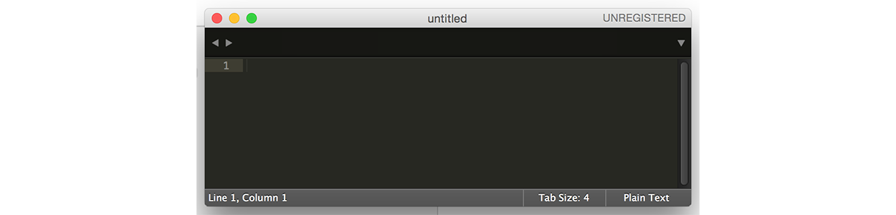
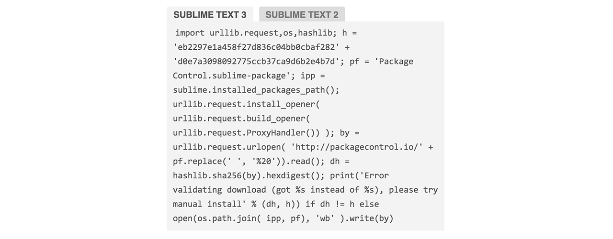
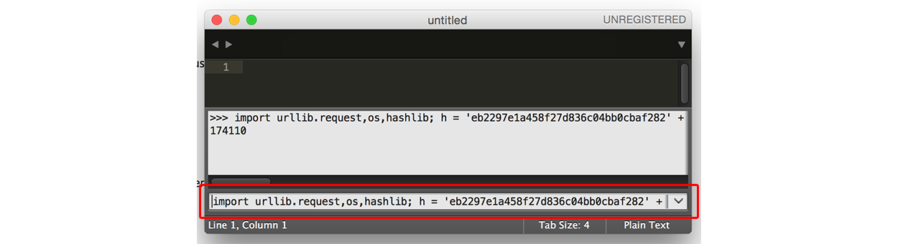

# Instalasi Editor

Proses pembuatan aplikasi menggunakan Golang akan lebih maksimal jika didukung oleh editor atau **IDE** yang pas. Ada cukup banyak pilihan bagus yang bisa dipertimbangkan, diantaranya: Brackets, Intellij, Netbeans, Atom, Brackets, Visual Studio Code, Sublime Text, dan lainnya.

Pada saat menulis buku ini, editor yang penulis gunakan adalah **Sublime Text 3**. Editor ini ringan, mudah didapat, dan memiliki cukup banyak plugin. Pembaca bisa memilih editor yang sama dengan yang digunakan di buku ini, atau editor lainnya, bebas.

Bagi yang memilih Sublime Text, penulis sarankan untuk meng-install plugin bernama **GoSublime**. Plugin ini menyediakan banyak sekali fitur yang sangat membantu proses pengembangan aplikasi menggunakan Golang. Diantaranya seperti *code completion*, *lint* (deteksi kesalahan di level sintaks), *code formatting* (perapian kode otomatis), dan lainnya.

Di bab ini akan dijelaskan bagaimana cara instalasi editor Sublime Text, Package Control, dan plugin GoSublime.

## Instalasi Editor Sublime Text

 1. Download **Sublime Text versi 3** di [http://www.sublimetext.com/3](http://www.sublimetext.com/3), pilih sesuai dengan sistem operasi yang digunakan.
 2. Jalankan installer.
 3. Setelah selesai, jalankan aplikasi.

## Instalasi Package Control

Package control merupakan aplikasi 3rd party untuk Sublime Text, digunakan untuk mempermudah instalasi plugin. Default-nya Sublime tidak menyediakan aplikasi ini, kita perlu meng-install-nya sendiri. Silakan ikuti petunjuk berikut untuk cara instalasinya.

 1. Buka situs [https://packagecontrol.io/installation](https://packagecontrol.io/installation), **copy** script yang ada di tab Sublime Text 3 (tab bagian kiri).

    

 2. Jalankan aplikasi Sublime Text, klik menu **View > Show Console**, lalu **paste** script yang sudah di-copy tadi, ke inputan kecil di bagian bawah editor. Tekan Enter.

    

 3. Tunggu hingga proses selesai. Perhatikan karakter sama dengan *(=)* di bagian kiri bawah editor yang bergerak-gerak. Jika karakter tersebut menghilang, menandakan bahwa proses instalasi selesai.

 4. Setelah selesai, tutup aplikasi, lalu buka kembali. Package Control sudah berhasil di-install.

## Instalasi Plugin GoSublime

Dengan memanfaatkan Package Control, instalasi plugin akan menjadi lebih mudah. Berikut merupakan langkah instalasi plugin GoSublime.

 1. Buka Sublime, tekan **ctrl+shift+p** (atau **cmd+shift+p** untuk pengguna Mac OS), akan muncul sebuah input dialog. Ketikan disana `install`, lalu enter.

    

 2. Akan muncul lagi input dialog lainnya, ketikkan `GoSublime`, lalu enter. Tunggu hingga proses selesai (acuan instalasi selesai adalah karakter sama dengan *(=)* di bagian kiri bawah editor yang sebelumnya bergerak-gerak).

    

 3. Setelah selesai, restart Sublime, plugin GoSublime sudah berhasil ter-install.
