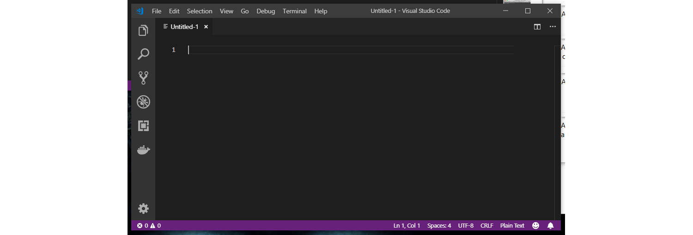
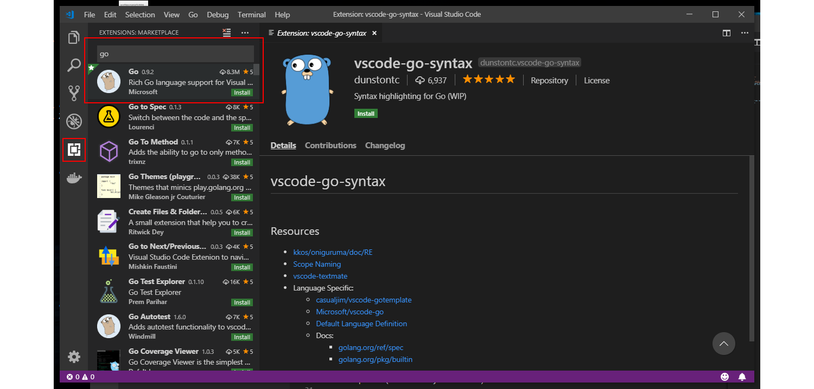

# A.4. Instalasi Editor

Proses pembuatan aplikasi menggunakan Go akan lebih maksimal jika didukung oleh editor atau **IDE** yang pas. Ada cukup banyak pilihan bagus yang bisa dipertimbangkan, diantaranya: Brackets, JetBrains GoLand, Netbeans, Atom, Brackets, Visual Studio Code, Sublime Text, dan lainnya.

Penulis sarankan untuk memilih editor yang paling nyaman digunakan, preferensi masing-masing pastinya berbeda. Penulis sendiri sempat menggunakan Sublime Text 3, tapi sekarang pindah ke **Visual Studio Code**. Editor ini sangat ringan, mudah didapat, dan memiliki ekstensi yang bagus untuk bahasa Go. Jika pembaca ingin menggunakan editor yang sama, maka silakan melanjutkan guide berikut.

Di bab ini akan dijelaskan bagaimana cara instalasi editor Visual Studio Code.

## A.4.1. Instalasi Editor Visual Studio Code

 1. Download Visual Studio Code di [https://code.visualstudio.com/Download](https://code.visualstudio.com/Download), pilih sesuai dengan sistem operasi yang digunakan.
 2. Jalankan installer.
 3. Setelah selesai, jalankan aplikasi.

## A.4.2. Instalasi Extensi Go

Dengan meng-instal Go Extension, maka programming menggunakan bahasa ini akan menjadi sangat nyaman lewat VS Code. Banyak benefit yang didapat dengan meng-install ekstensi ini, beberapa diantaranya adalah integrasi dengan kompiler Go, auto lint on save, testing with coverage, fasilitas debugging with breakpoints, dan lainnya.

&nbsp;

Cara instalasi ekstensi sendiri cukup mudah, klik `View -> Extension` atau klik ikon *Extension Marketplace* di sebelah kiri (silakan lihat gambar berikut, deretan button paling kiri yang dilingkari merah). Setelah itu ketikkan **Go** pada inputan search, silakan install ekstensi Go buatan Microsoft, biasanya muncul paling atas sendiri.

