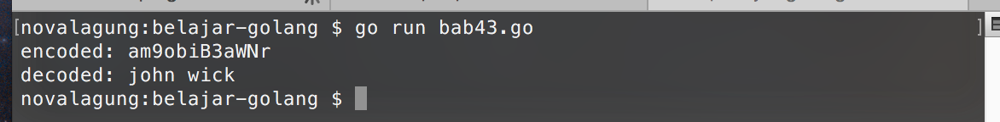

# Encode - Decode Base64

Golang memiliki package `encoding/base64`, yang berisikan fungsi-fungsi untuk kebutuhan **encode** dan **decode** data ke base64 dan sebaliknya. Data yang akan di-encode harus bertipe `[]byte`, perlu dilakukan casting untuk data-data yang belum sesuai tipenya.

Ada beberapa cara yang bisa digunakan untuk encode dan decode data, dan di bab ini kita akan mempelajarinya.

## Penerapan Fungsi `EncodeToString` & `DecodeString`

Fungsi `EncodeToString` dan `DecodeString` digunakan untuk encode dan decode data dari bentuk `string` ke `[]byte` atau sebaliknya. Berikut adalah contoh penerapannya.

```go
import "encoding/base64"
import "fmt"

func main() {
    var data = "john wick"

    var encodedString = base64.StdEncoding.EncodeToString([]byte(data))
    fmt.Println("encoded:", encodedString)

    var decodedByte, _ = base64.StdEncoding.DecodeString(encodedString)
    var decodedString = string(decodedByte)
    fmt.Println("decoded:", decodedString)
}
```

Variabel `data` yang bertipe `string`, harus di-casting terlebih dahulu kedalam bentuk `[]byte` sebelum di-encode menggunakan fungsi `base64.StdEncoding.EncodeToString()`. Hasil encode adalah berupa `string`.

Sedangkan pada fungsi decode `base64.StdEncoding.DecodeString()`, data `string` yang di-decode akan dikembalikan dalam bentuk `[]byte`. Ekspresi `string(decodedByte)` menjadikan data `[]byte` tadi berubah menjadi string.



## Penerapan Fungsi `Encode` & `Decode`

Kedua fungsi ini digunakan untuk decode dan encode data dari `[]byte` ke `[]byte`. Penggunaan cara ini cukup panjang karena variabel penyimpan hasil encode maupun decode harus disiapkan terlebih dahulu dengan ketentuan memiliki lebar elemen sesuai dengan hasil yang akan ditampung (yang nilainya bisa dicari menggunakan `EncodedLen` dan `DecodedLen`).

Lebih jelasnya silakan perhatikan contoh berikut.

```go
var data = "john wick"

var encoded = make([]byte, base64.StdEncoding.EncodedLen(len(data)))
base64.StdEncoding.Encode(encoded, []byte(data))
var encodedString = string(encoded)
fmt.Println(encodedString)

var decoded = make([]byte, base64.StdEncoding.DecodedLen(len(encoded)))
var _, err = base64.StdEncoding.Decode(decoded, encoded)
if err != nil {
    fmt.Println(err.Error())
}
var decodedString = string(decoded)
fmt.Println(decodedString)
```

Fungsi `base64.StdEncoding.EncodedLen(len(data))` menghasilkan informasi lebar data-ketika-sudah-di-encode. Nilai tersebut kemudian ditentukan sebagai lebar alokasi tipe `[]byte` pada variabel `encoded` yang nantinya digunakan untuk menampung hasil encoding.

Fungsi `base64.StdEncoding.DecodedLen()` memiliki kegunaan sama dengan `EncodedLen`, hanya saja digunakan untuk keperluan decoding.

Dibanding 2 fungsi sebelumnya, fungsi `Encode` dan `Decode` memiliki beberapa perbedaan. Selain lebar data penampung encode/decode harus dicari terlebih dahulu, terdapat perbedaan lainnya, yaitu pada fungsi ini hasil encode/decode tidak didapat dari nilai kembalian, melainkan dari parameter. Variabel yang digunakan untuk menampung hasil, disisipkan pada parameter fungsi tersebut.

Pada pemanggilan fungsi encode/decode, variabel `encoded` dan `decoded` tidak disisipkan nilai pointer-nya, cukup di-pass dengan cara biasa, karena tipe datanya sudah dalam bentuk `[]byte`.

## Encode & Decode Data URL

Khusus untuk data string yang bentuknya URL, akan lebih efektif menggunakan `URLEncoding` dibanding `StdEncoding`.

Cara penerapannya kurang lebih sama, bisa menggunakan metode pertama maupun metode kedua yang sudah dibahas di atas. Cukup ganti `StdEncoding` menjadi `URLEncoding`.

```go
var data = "http://google.com/"

var encodedString = base64.URLEncoding.EncodeToString([]byte(data))
fmt.Println(encodedString)

var decodedByte, _ = base64.URLEncoding.DecodeString(encodedString)
var decodedString = string(decodedByte)
fmt.Println(decodedString)
```
