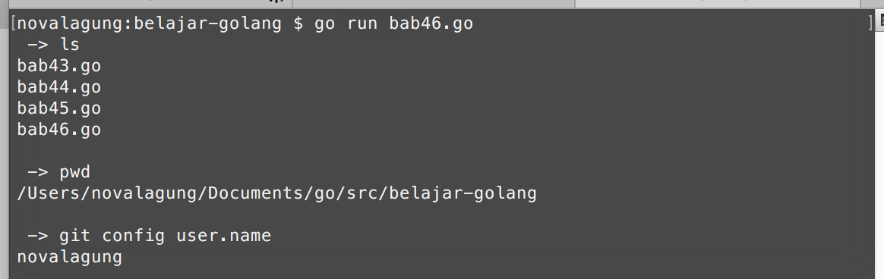

# Exec

**Exec** digunakan untuk mengeksekusi sebuah perintah command line lewat kode program.

Command yang bisa dieksekusi adalah semua command yang bisa dieksekusi di terminal (CMD untuk pengguna Wind\*ws).

## Penggunaan Keywod `exec`

Cara menggunakan exec cukup mudah, yaitu dengan menuliskan command dalam bentuk string, diikuti arguments-nya (jika ada) sebagai parameter variadic pada fungsi `exec.Command()`. Contoh:

```go
package main

import "fmt"
import "os/exec"

func main() {
    var output1, _ = exec.Command("ls").Output()
    fmt.Printf(" -> ls\n%s\n", string(output1))

    var output2, _ = exec.Command("pwd").Output()
    fmt.Printf(" -> pwd\n%s\n", string(output2))

    var output3, _ = exec.Command("git", "config", "user.name").Output()
    fmt.Printf(" -> git config user.name\n%s\n", string(output3))
}
```

Fungsi `exec.Command()` digunakan untuk mengeksekusi command, lalu chain dengan fungsi `Output()` untuk mendapatkan outputnya.

Output dikembalikan dalam bentuk `[]byte`, gunakan cast ke string untuk mengambil bentuk string-nya.


