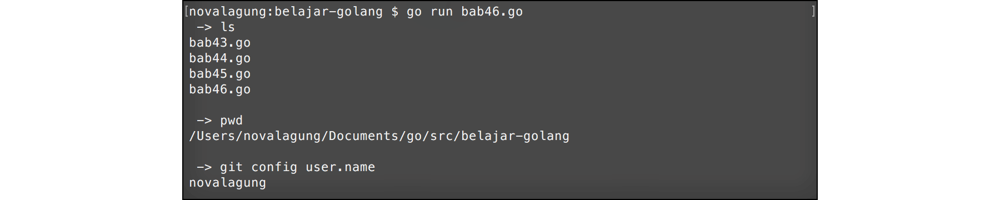

# A.46. Exec

**Exec** digunakan untuk eksekusi perintah command line lewat kode program. Command yang bisa dieksekusi adalah semua command yang bisa dieksekusi di terminal (atau CMD untuk pengguna Windows).

## A.46.1. Penggunaan Exec

Go menyediakan package `exec` berisikan banyak fungsi untuk keperluan eksekusi perintah CLI.

Cara untuk eksekusi command cukup mudah, yaitu dengan menuliskan command dalam bentuk string, diikuti arguments-nya (jika ada) sebagai parameter variadic pada fungsi `exec.Command()`.

```go
package main

import "fmt"
import "os/exec"

func main() {
    var output1, _ = exec.Command("ls").Output()
    fmt.Printf(" -> ls\n%s\n", string(output1))

    var output2, _ = exec.Command("pwd").Output()
    fmt.Printf(" -> pwd\n%s\n", string(output2))

    var output3, _ = exec.Command("git", "config", "user.name").Output()
    fmt.Printf(" -> git config user.name\n%s\n", string(output3))
}
```

Fungsi `exec.Command()` digunakan untuk menjalankan command. Fungsi tersebut bisa langsung di-chain dengan method `Output()`, jika ingin mendapatkan outputnya. Output yang dihasilkan berbentuk `[]byte`, gunakan cast ke string untuk mengambil bentuk string-nya.



## A.46.2. Rekomendasi Penggunaan Exec

Kadang kala, pada saat eksekusi command yang sudah jelas-jelas ada (seperti `ls`, `dir`, atau lainnya) kita menemui error yang mengatakan command not found. Hal itu terjadi karena executable dari command-command tersebut tidak ada. Seperti di windows tidak ada `dir.exe` dan lainnya. Di OS non-windows-pun juga demikian.

Untuk mengatasi masalah ini, tambahkan `bash -c` pada linux/nix command atau `cmd /C` untuk windows.

```go
if runtime.GOOS == "windows" {
    output, err = exec.Command("cmd", "/C", "git config user.name").Output()
} else {
    output, err = exec.Command("bash", "-c", "git config user.name").Output()
}
```

Statement `runtime.GOOS` mengembalikan informasi sistim operasi dalam string.

## A.46.3. Method Exec Lainnya

Selain `.Output()` ada sangat banyak sekali API untuk keperluan komunikasi dengan OS/CLI yang bisa dipergunakan. Detailnya silakan langsung merujuk ke dokumentasi [https://golang.org/pkg/os/exec/](https://golang.org/pkg/os/exec/)

---

<div class="source-code-link">
    <div class="source-code-link-message">Source code praktek pada bab ini tersedia di Github</div>
    <a href="https://github.com/novalagung/dasarpemrogramangolang-example/tree/master/chapter-A.46-exec">https://github.com/novalagung/dasarpemrogramangolang-example/.../chapter-A.46...</a>
</div>
