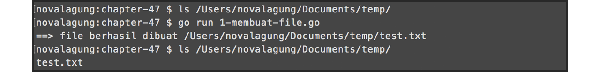
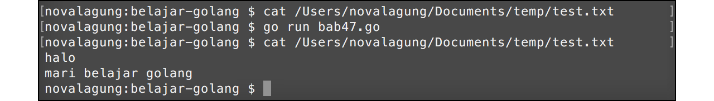
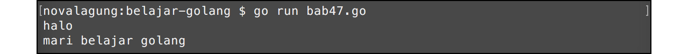
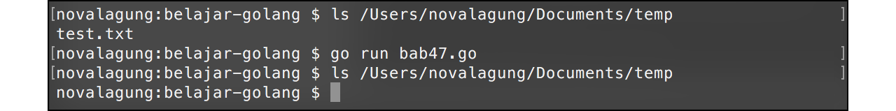

# File

Ada beberapa cara yang bisa digunakan untuk operasi file di Golang. Pada bab ini kita akan mempelajari teknik yang paling dasar, yaitu dengan memanfaatkan `os.File`.

## Membuat File Baru

Pembuatan file di Golang sangatlah mudah, cukup dengan memanggil fungsi `os.Create()` lalu memasukkan path file ingin dibuat sebagai parameter fungsi tersebut.

Jika file yang akan dibuat sudah ada, maka akan ditimpa. Bisa memanfaatkan `os.IsNotExist()` untuk mendeteksi apakah file sudah dibuat atau belum.

Berikut merupakan contoh pembuatan file.

```go
package main

import "fmt"
import "os"

var path = "/Users/novalagung/Documents/temp/test.txt"

func checkError(err error) {
    if err != nil {
        fmt.Println(err.Error())
        os.Exit(0)
    }
}

func createFile() {
    // deteksi apakah file sudah ada
    var _, err = os.Stat(path)

    // buat file baru jika belum ada
    if os.IsNotExist(err) {
        var file, err = os.Create(path)
        checkError(err)
        defer file.Close()
    }
}

func main() {
    createFile()
}
```

Fungsi `os.Stat()` mengembalikan 2 data, yaitu informasi tetang path yang dicari, dan error (jika ada). Masukkan error kembalian fungsi tersebut sebagai parameter fungsi `os.IsNotExist()`, untuk mendeteksi apakah file yang akan dibuat sudah ada. Jika belum ada, maka fungsi tersebut akan mengembalikan nilai `true`.

Fungsi `os.Create()` digunakan untuk membuat file pada path tertentu. Fungsi ini mengembalikan objek `*os.File` dari file yang bersangkutan. Perlu diketahui bahwa file yang baru terbuat statusnya adalah otomatis **open**, jadi perlu untuk di-**close** menggunakan method `file.Close()` setelah file tidak digunakan lagi. Membiarkan file terbuka ketika sudah tak lagi digunakan bukan hal yang baik, menyebabkan alokasi memory menjadi sia-sia.



## Mengedit Isi File

Untuk mengedit file, yang perlu dilakukan pertama adalah membuka file dengan level akses **write**. Setelah mendapatkan objek file-nya, gunakan method `WriteString()` untuk pengisian data. Terakhir panggil method `Sync()` untuk menyimpan perubahan.

```go
func writeFile() {
    // buka file dengan level akses READ & WRITE
    var file, err = os.OpenFile(path, os.O_RDWR, 0644)
    checkError(err)
    defer file.Close()

    // tulis data ke file
    _, err = file.WriteString("halo\n")
    checkError(err)
    _, err = file.WriteString("mari belajar golang\n")
    checkError(err)

    // simpan perubahan
    err = file.Sync()
    checkError(err)
}

func main() {
    writeFile()
}
```

Pada program di atas, file dibuka dengan level akses **read** dan **write** dengan kode permission **0664**. Setelah itu, beberapa string diisikan kedalam file tersebut menggunakan `WriteString()`. Di akhir, semua perubahan terhadap file akan disimpan dengan dipanggilnya `Sync()`.



## Membaca Isi File

File yang ingin dibaca harus dibuka terlebih dahulu menggunakan fungsi `os.OpenFile()` dengan level akses minimal  adalah **read**. Setelah itu, gunakan method `Read()` dengan parameter adalah variabel yang dimana hasil proses baca akan disimpan ke variabel tersebut.

```go
// tambahkan di bagian import package io
import "io"

func readFile() {
    // buka file
    var file, err = os.OpenFile(path, os.O_RDONLY, 0644)
    checkError(err)
    defer file.Close()

    // baca file
    var text = make([]byte, 1024)
    for {
        n, err := file.Read(text)
        if err != io.EOF {
            checkError(err)
        }
        if n == 0 {
            break
        }
    }
    fmt.Println(string(text))
    checkError(err)
}

func main() {
    readFile()
}
```

`os.OpenFile()` digunakan untuk membuka file. Fungsi tersebut memiliki beberapa parameter.

 1. Parameter pertama adalah path file yang akan dibuka
 2. Parameter kedua adalah level akses. `os.O_RDONLY` maksudnya adalah **read only**.
 3. Parameter ketiga adalah permission file-nya

Kemudian disiapkan variabel `text` yang bertipe slice `[]byte` dengan alokasi elemen 1024. Variabel tersebut akan berisikan data hasil fungsi `file.Read()`. Proses pembacaan file akan dilakukan terus menerus, berurutan dari baris pertama hingga akhir.

Error yang muncul ketika eksekusi `file.Read()` akan difilter, ketika error tersebut adalah selain `io.EOF` maka proses baca file akan berlanjut.

Error `io.EOF` sendiri menandakan bahwa file yang sedang dibaca adalah baris terakhir isi file atau **end of file**.



## Menghapus File

Cara menghapus file sangatlah mudah, cukup panggil fungsi `os.Remove()`, masukkan path file yang ingin dihapus sebagai parameter.

```go
func deleteFile() {
    var err = os.Remove(path)
    checkError(err)
}

func main() {
    deleteFile()
}
```


