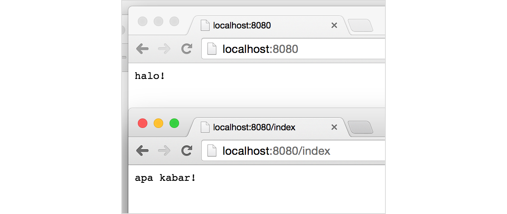

# A.48. Web

Go menyediakan package `net/http`, berisi berbagai macam fitur untuk keperluan pembuatan aplikasi berbasi web. Termasuk didalamnya web server, routing, templating, dan lainnya.

Go memiliki web server sendiri, dan web server tersebut berada di dalam Go, tdak seperti bahasa lain yang server nya terpisah dan perlu di-instal sendiri (seperti PHP yang memerlukan Apache, .NET yang memerlukan IIS).

Di bab ini kita akan belajar cara pembuatan aplikasi web sederhanda dan pemanfaatan template untuk mendesain view.

## A.48.1. Membuat Aplikasi Web Sederhana

Package `net/http` memiliki banyak sekali fungsi yang bisa dimanfaatkan. Di bagian ini kita akan mempelajari beberapa fungsi penting seperti *routing* dan *start server*.

Program dibawah ini merupakan contoh sederhana untuk memunculkan text di web ketika url tertentu diakses.

```go
package main

import "fmt"
import "net/http"

func index(w http.ResponseWriter, r *http.Request) {
    fmt.Fprintln(w, "apa kabar!")
}

func main() {
    http.HandleFunc("/", func(w http.ResponseWriter, r *http.Request) {
        fmt.Fprintln(w, "halo!")
    })

    http.HandleFunc("/index", index)

    fmt.Println("starting web server at http://localhost:8080/")
    http.ListenAndServe(":8080", nil)
}
```

Jalankan program tersebut.


Jika muncul dialog **Do you want the application “bab48” to accept incoming network connections?** atau sejenis, pilih allow. Setelah itu, buka url [http://localhost/](http://localhost/) dan [http://localhost/index](http://localhost/index/) lewat browser.



Fungsi `http.HandleFunc()` digunakan untuk routing aplikasi web. Maksud dari routing adalah penentuan aksi ketika url tertentu diakses oleh user.

Pada kode di atas 2 rute didaftarkan, yaitu `/` dan `/index`. Aksi dari rute `/` adalah menampilkan text `"halo"` di halaman website. Sedangkan `/index` menampilkan text `"apa kabar!"`.

Fungsi `http.HandleFunc()` memiliki 2 buah parameter yang harus diisi. Parameter pertama adalah rute yang diinginkan. Parameter kedua adalah *callback* atau aksi ketika rute tersebut diakses. Callback tersebut bertipe fungsi `func(w http.ResponseWriter, r *http.Request)`.

Pada pendaftaran rute `/index`, callback-nya adalah fungsi `index()`, hal seperti ini diperbolehkan asalkan tipe dari fungsi tersebut sesuai.

Fungsi `http.listenAndServe()` digunakan untuk menghidupkan server sekaligus menjalankan aplikasi menggunakan server tersebut. Di Go, 1 web aplikasi adalah 1 buah server berbeda.

Pada contoh di atas, server dijalankan pada port `8080`.

Perlu diingat, setiap ada perubahan pada file `.go`, `go run` harus dipanggil lagi.

Untuk menghentikan web server, tekan **CTRL+C** pada terminal atau CMD, dimana pengeksekusian aplikasi berlangsung.

## A.48.2. Penggunaan Template Web

Template engine memberikan kemudahan dalam mendesain tampilan view aplikasi website. Dan kabar baiknya Go menyediakan engine template sendiri, dengan banyak fitur yang tersedia didalamnya.

Di sini kita akan belajar contoh sederhana penggunaan template untuk menampilkan data. Pertama siapkan dahulu template nya. Buat file `template.html` lalu isi dengan kode berikut.

```html
<html>
    <head>
        <title>Go learn net/http</title>
    </head>
    <body>
        <p>Hello {{.Name}} !</p>
        <p>{{.Message}}</p>
    </body>
</html>
```

Kode `{{.Name}}` artinya memunculkan isi data property `Name` yang dikirim dari router. Kode tersebut nantinya di-replace dengan isi variabel `Name`.

Selanjutnya ubah isi file `.go` dengan kode berikut.

```go
package main

import "fmt"
import "html/template"
import "net/http"

func main() {
    http.HandleFunc("/", func(w http.ResponseWriter, r *http.Request) {
        var data = map[string]string{
            "Name":    "john wick",
            "Message": "have a nice day",
        }

        var t, err = template.ParseFiles("template.html")
        if err != nil {
            fmt.Println(err.Error())
            return
        }

        t.Execute(w, data)
    })

    fmt.Println("starting web server at http://localhost:8080/")
    http.ListenAndServe(":8080", nil)
}
```

Jalankan, lalu buka [http://localhost:8080/](http://localhost:8080/), maka data `Nama` dan `Message` akan muncul di view.


Fungsi `template.ParseFiles()` digunakan untuk parsing template, mengembalikan 2 data yaitu instance template-nya dan error (jika ada). Pemanggilan method `Execute()` akan membuat hasil parsing template ditampilkan ke layar web browser.

Pada kode di atas, variabel `data` disisipkan sebagai parameter ke-2 method `Execute()`. Isi dari variabel tersebut bisa diakses di-view dengan menggunakan notasi `{{.NAMA_PROPERTY}}` (nama variabel sendiri tidak perlu dituliskan, langsung nama property didalamnya).

Pada contoh di atas, statement di view `{{.Name}}` akan menampilkan isi dari `data.Name`.

## A.48.3. Advance Web Programming

Sampai bab ini yang kita pelajari adalah dasar-dasar pemrograman Go, di bahas per topik adalah per bab. Nantinya jika sudah masuk [Bab B.1. Golang Web App: Hello World](/B-1-golang-web-hello-world.html) hingga seterusnya akan membahas mostly mengenai pemrograman web, jadi sabar dulu. Mari kita selesaikan dulu yang fundamental sebelum masuk ke web development.

---

<div class="source-code-link">
    <div class="source-code-link-message">Source code praktek pada bab ini tersedia di Github</div>
    <a href="https://github.com/novalagung/dasarpemrogramangolang-example/tree/master/chapter-A.48-web">https://github.com/novalagung/dasarpemrogramangolang-example/.../chapter-A.48...</a>
</div>
