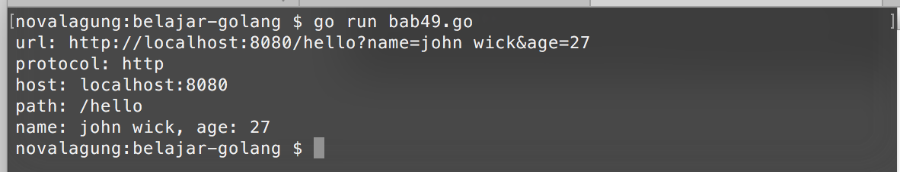

# URL Parsing

Di bab ini kita akan belajar tentang konversi url yang sebelumnya berbentuk string, menjadi instance url.

URL tipe datanya adalah `url.URL`, didalamnya terdapat banyak informasi yang bisa diakses, seperti diantaranya jenis protokol yang digunakan, path yang diakses, query, dan lainnya.

Berikut adalah contoh program konversi string ke bentuk URL.

```go
import "fmt"
import "net/url"

func main() {
    var urlString = "http://localhost:8080/hello?name=john wick&age=27"
    var u, e = url.Parse(urlString)
    if e != nil {
        fmt.Println(e.Error())
    }

    fmt.Printf("url: %s\n", urlString)

    fmt.Printf("protocol: %s\n", u.Scheme) // http
    fmt.Printf("host: %s\n", u.Host)       // localhost:8080
    fmt.Printf("path: %s\n", u.Path)       // /hello

    var name = u.Query()["name"][0] // john wick
    var age = u.Query()["age"][0]   // 27
    fmt.Printf("name: %s, age: %s\n", name, age)
}
```

Fungsi `url.Parse` digunakan untuk parsing string ke bentuk url. Mengembalikan 2 data, variabel objek bertipe `url.URL` dan error (jika ada). Lewat variabel objek tersebut pengaksesan informasi url akan menjadi lebih mudah, contohnya seperti nama host bisa didapatkan lewat `u.Host`, protokol lewat `u.Scheme`, dan lainnya.

Selain itu, query yang ada pada url akan otomatis diparsing juga, menjadi bentuk `map[string][]string`, dengan key adalah nama elemen query, dan value array string yang berisikan value elemen query.




