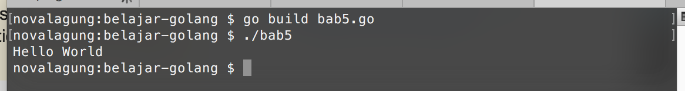

# Command

Pengembangan aplikasi Golang tak jauh dari hal-hal yang berbau command line interface. Seperti kompilasi, testing, semua dilakukan lewat command line.

Golang menyediakan command `go` yang berguna untuk keperluan pengembangan aplikasi. Di bab ini kita akan belajar mengenai pemanfaatannya.

## Command `go run`

Command `go run` digunakan untuk eksekusi file program (file ber-ekstensi `.go`). Cara penggunaannya adalah dengan menuliskan command tersebut diikut nama file.

Berikut adalah contoh penerapan `go run` untuk eksekusi file program `bab5.go` yang tersimpan di path `$GOPATH/src/belajar-golang`.

```
$ cd $GOPATH/src/belajar-golang
$ go run bab5.go
```


Command `go run` hanya bisa digunakan pada file yang package-nya adalah **main**. Untuk lebih jelasnya akan dibahas pada bab selanjutnya (bab 6).

Jika ada banyak file yang ber-package `main` dan file-file tersebut di-import di file utama, maka eksekusinya dengan menyisipkan semua file sebagai argument `go run` (lebih jelasnya akan dibahas pada bab 25). Contohnya bisa dilihat pada kode berikut.

```
$ go run bab5.go library.go
```


## Command `go test`

Golang menyediakan package `testing` yang bisa dimanfaatkan untuk keperluan unit testing. File yang akan di-test harus ber-suffix `_test.go`. 

Berikut adalah contoh penggunaan command `go test` untuk testing file `bab5_test.go`.

```
$ go test bab5_test.go
```


## Command `go build`

Command ini digunakan untuk mengkompilasi file program.

Sebenarnya ketika eksekusi program menggunakan `go run`, terjadi proses kompilasi juga, hanya saja file hasil kompilasi akan disimpan pada folder temporary untuk selanjutnya langsung dieksekusi.

Berbeda dengan `go build`, command ini menghasilkan file executable pada folder yang sedang aktif. Contohnya bisa dilihat pada kode berikut.



Pada contoh di atas, file `bab5.go` di-build, menghasilkan file baru pada folder yang sama, yaitu `bab5`, yang kemudian dieksekusi.

> Pada pengguna windows, file executable ber-ekstensi `.exe`.

## Command `go install`

Command `go install` akan mengkompilasi file program, lalu menginstalnya. 

Target eksekusi harus berupa folder proyek (bukan file `.go`), dan path folder tersebut dituliskan relatif terhadap `$GOPATH/src`. Contoh:

```
$ go install github.com/novalagung/godong
```

`go install` menghasilkan output berbeda untuk package `main` dan non-main.

 - Pada package **non-main**, menghasilkan file berekstensi `.a` tersimpan dalam folder `$GOPATH/pkg`
 - Pada package **main**, menghasilkan file *executable* tersimpan dalam folder `$GOPATH/bin`

Berikut merupakan contoh penerapan `go install`.


Pada kode di atas bisa dilihat command `go install` dieksekusi 2 kali.

 1. Pada package non-main, `github.com/novalagung/godong`. Hasil instalasi adalah file berekstensi `.a` tersimpan pada folder `$GOPATH/pkg` 
 2. Pada package main, `github.com/novalagung/godong/godong_test`. Hasil instalasi adalah file executable tersimpan pada folder `$GOPATH/bin`

## Command `go get`

Command ini berbeda dengan command-command yang sudah dibahas di atas. `go get` digunakan untuk mendownload package. Sebagai contoh saya ingin men-download package **mgo**.

```
$ go get gopkg.in/mgo.v2
$ ls $GOPATH/src/gopkg.in/mgo.v2
```


[gopkg.in/mgo.v2](gopkg.in/mgo.v2) adalah alamat url package mgo. Package yang sudah ter-download akan tersimpan pada `$GOPATH/src` dengan struktur folder sesuai dengan url package-nya. Sebagai contoh mgo di atas tersimpan di `$GOPATH/src/gopkg.in/mgo.v2`.