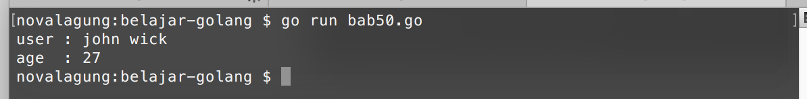
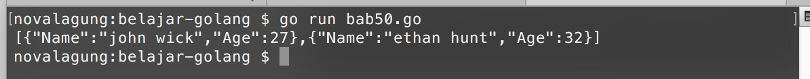

# JSON

**JSON** atau *Javascript Object Notation* adalah notasi standar yang umum digunakan untuk komunikasi data via web. JSON merupakan subset dari *javascript*.

Golang menyediakan package `encoding/json` yang berisikan banyak fungsi untuk kebutuhan oeprasi json.

Di bab ini, kita akan belajar cara untuk konverstri string yang berbentuk json menjadi objek golang, dan sebaliknya.

## Decode JSON Ke Variabel Objek Cetakan Struct

Data json tipenya adalah `[]byte`, bisa didapat dari file ataupun string (dengan hasil casting). Dengan menggunakan `json.Unmarshal`, data tersebut bisa dikonversi menjadi bentuk objek, entah itu dalam bentuk `map[string]interface{}` ataupun variabel objek hasil `struct`.

Program berikut ini adalah contoh cara decoding json ke bentuk objek. Pertama import package yang dibutuhkan, dan siapkan struct `User`.

```go
package main

import "encoding/json"
import "fmt"

type User struct {
    FullName string `json:"Name"`
    Age      int
}
```

Hasil decode nantinya akan disimpan ke variabel objek cetakan struct `User`.

Selanjutnya siapkan data json string sederhana, gunakan casting ke `[]byte` agar dideteksi sebagai data json.

```go
func main() {
    var jsonString = `{"Name": "john wick", "Age": 27}`
    var jsonData = []byte(jsonString)

    var data User

    var err = json.Unmarshal(jsonData, &data)
    if err != nil {
        fmt.Println(err.Error())
    }

    fmt.Println("user :", data.FullName)
    fmt.Println("age  :", data.Age)
}
```

Dalam penggunaan fungsi `json.Unmarshal`, variabel yang akan menampung hasil decode harus di-passing sebagai pointer (`&data`).



Pada kode di atas bisa dilihat bahwa salah satu proprty struct `User` ada yang memiliki **tag**, yaitu `FullName`. Tag tersebut digunakan untuk mapping data json ke property yang bersangkutan.

Data json yang akan diparsing memiliki 2 property yaitu `Name` dan `Age`. Kebetulan penulisan `Age` pada data json dan pada struktur struct adalah sama, berbeda dengan `Name` yang tidak ada pada struct.

Property `FullName` struct tersebut kemudian ditugaskan untuk menampung data json property `Name`, ditandai dengan penambahan tag `json:"Name"` pada saat deklarasi struct-nya.

Perlu diketahui bahwa untuk decode data json ke variabel objek hasil struct, semua level akses property struct-nya harus publik.

## Decode JSON Ke `map[string]interface{}` & `interface{}`

Selain ke variabel objek, target decoding data json juga bisa berupa variabel bertipe `map[string]interface{}`.

```go
var data1 map[string]interface{}
json.Unmarshal(jsonData, &data1)

fmt.Println("user :", data1["Name"])
fmt.Println("age  :", data1["Age"])
```

Selain itu, `interface{}` juga bisa digunakan untuk menampung hasil decode. Dengan catatan pada pengaksesan nilai property, harus dilakukan casting terlebih dahulu ke `map[string]interface{}`.

```go
var data2 interface{}
json.Unmarshal(jsonData, &data2)

var decodedData = data2.(map[string]interface{})
fmt.Println("user :", decodedData["Name"])
fmt.Println("age  :", decodedData["Age"])
```

## Decode Array JSON Ke Array Objek

Jika data json adalah array berisikan objek, maka variabel penampung harus bertipe array dengan isi pointer objek. Pada pemanggilan `json.Unmarshal`, variabel tersebut juga di-passing-kan sebagai pointer. Contoh:

```go
var jsonString = `[
    {"Name": "john wick", "Age": 27},
    {"Name": "ethan hunt", "Age": 32}
]`

var data []*User

var err = json.Unmarshal([]byte(jsonString), &data)
if err != nil {
    fmt.Println(err.Error())
}

fmt.Println("user 1:", data[0].FullName)
fmt.Println("user 2:", data[1].FullName)
```

## Encode Objek Ke JSON

Setelah sebelumnya dijelaskan beberapa cara decode data dari json ke objek, sekarang kita akan belajar cara **encode** data ke bentuk json.

Fungsi `json.Marshal` digunakan untuk decoding data ke json. Data tersebut bisa berupa variabel objek cetakan struct, `map[string]interface{}`, bisa juga bertipe array.

Pada contoh berikut, data array struct akan dikonversi ke dalam bentuk json. Hasil konversi json bisa ditampilkan dengan di-casting terlebih dahulu ke string.

```go
var object = []User{{"john wick", 27}, {"ethan hunt", 32}}
var jsonData, err = json.Marshal(object)
if err != nil {
    fmt.Println(err.Error())
}

var jsonString = string(jsonData)
fmt.Println(jsonString)
```

Hasil encode adalah data bertipe `[]byte`. Casting ke `string` bisa digunakan untuk menampilkan data.

