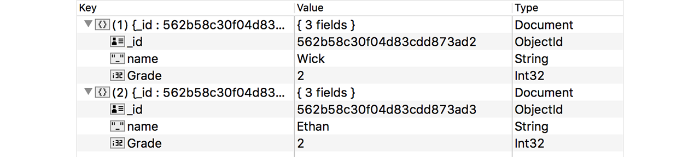
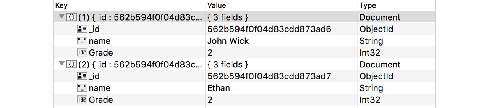
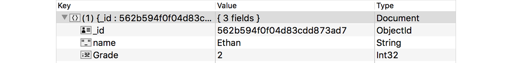

# NoSQL MongoDB

Golang tidak menyediakan interface generic untuk NoSQL, hal ini menjadikan driver tiap brand NoSQL untuk Golang bisa berbeda satu dengan lainnya. 

Dari sekian banyak teknologi NoSQL yang ada, yang terpilih untuk dibahas di buku ini adalah MongoDB. Dan pada bab ini kita akan belajar cara berkomunikasi dengan MongoDB menggunakan driver [mgo](https://labix.org/mgo).

## Persiapan

Ada beberapa hal yang perlu disiapkan sebelum mulai masuk ke bagian coding.

 1. Instal mgo menggunakan `go get`.

    ```
    go get gopkg.in/mgo.v2
    ```

    

 2. Pastikan sudah terinstal MongoDB di komputer anda, dan jangan lupa untuk menjalankan daemon-nya. Jika belum, [download](ihttps://www.mongodb.org/downloads) dan install terlebih dahulu.

 3. Instal juga MongoDB GUI untuk mempermudah browsing data. Bisa menggunakan [MongoChef](http://3t.io/mongochef/), [Robomongo](http://robomongo.org/), atau lainnya.

## Insert Data

Cara insert data lewat mongo tidak terlalu sulit. Yang pertama perlu dilakukan adalah import package yang dibutuhkan, dan juga menyiapkan struct model.

```go
package main

import "fmt"
import "gopkg.in/mgo.v2"
import "os"

type student struct {
    Name  string `bson:"name"`
    Grade int    `bson:"Grade"`
}
```

Tag `bson` pada property struct dalam konteks mgo, digunakan sebagai penentu nama field ketika data disimpan kedalam collection. Jika sebuah property tidak memiliki tag bson, secara default nama field adalah sama dengan nama property hanya saja lowercase. Untuk customize nama field, gunakan tag `bson`.

Pada contoh di atas, property `Name` ditentukan nama field nya sebagai `name`, dan `Grade` sebagai `Grade`.

Selanjutnya siapkan fungsi untuk membuat session baru.

```go
func connect() *mgo.Session {
    var session, err = mgo.Dial("localhost")
    if err != nil {
        os.Exit(0)
    }
    return session
}
```

Fungsi `mgo.Dial()` digunakan untuk membuat session baru (bertipe `*mgo.Session`). Fungsi tersebut memiliki sebuah parameter yang harus diisi, yaitu connection string dari server mongo yang akan diakses.

Secara default jenis konsistensi session yang digunakan adalah `mgo.Primary`. Anda bisa mengubahnya lewat method `SetMode()` milik struct `mgo.Session`. Lebih jelasnya silakan merujuk [https://godoc.org/gopkg.in/mgo.v2#Session.SetMode](https://godoc.org/gopkg.in/mgo.v2#Session.SetMode).

Terkahir buat fungsi insert yang didalamnya berisikan kode untuk insert data ke mongodb, lalu implementasikan di `main`.

```go
func insert() {
    var session = connect()
    defer session.Close()
    var collection = session.DB("belajar_golang").C("student")

    var err = collection.Insert(&student{"Wick", 2}, &student{"Ethan", 2})
    if err != nil {
        fmt.Println(err.Error())
    }
}

func main() {
    insert()
}
```

Session di mgo juga harus di close ketika sudah tidak digunakan, seperti pada instance connection di bab SQL. Statement `defer session.Close()` akan mengakhirkan proses close session dalam fungsi `insert()`.

Struct `mgo.Session` memiliki method `DB()` yang digunakan untuk memilih database yang digunakan, dan bisa langsung di chain dengan fungsi `C()` untuk memilih collection.

Setelah mendapatkan instance collection-nya, digunakan method `Insert()` untuk insert data ke database. Method ini memiliki parameter variadic pointer data yang ingin di-insert.

Jalankan program tersebut, lalu cek menggunakan mongo GUI untuk melihat apakah data sudah masuk.



## Membaca Data

method `Find()` milik tipe collection `mgo.Collection` digunakan untuk melakukan pembacaan data. Query selectornya dituliskan menggunakan `bson.M` lalu disisipkan sebagai parameter fungsi `Find()`.

Untuk menggunakan `bson.M`, package `gopkg.in/mgo.v2/bson` harus di-import terlebih dahulu.

```go
import "gopkg.in/mgo.v2/bson"
```

Setelah itu buat fungsi `find` yang didalamnya terdapat proses baca data dari database.

```go
func find() {
    var session = connect()
    defer session.Close()
    var collection = session.DB("belajar_golang").C("student")

    var result = student{}
    var selector = bson.M{"name": "Wick"}
    var err = collection.Find(selector).One(&result)
    if err != nil {
        fmt.Println(err.Error())
    }

    fmt.Println("Name  :", result.Name)
    fmt.Println("Grade :", result.Grade)
}

func main() {
    find()
}
```

Variabel `result` di-inisialisasi menggunakan struct `student`. Variabel tersebut nantinya digunakan untuk menampung hasil pencarian data.

Tipe `bson.M` sebenarnya adalah alias dari `map[string]interface{}`, digunakan dalam penulisan selector.

Selector tersebut kemudian dimasukan sebagai parameter method `Find()`, yang kemudian di chain langsung dengan method `One()` untuk mengambil 1 baris datanya. Kemudian pointer variabel `result` disisipkan sebagai parameter method tersebut.


## Update Data

Method `Update()` milik struct `mgo.Collection` digunakan untuk update data. Ada 2 parameter yang harus diisi:

 1. Parameter pertama adalah query selector data yang ingin di update
 2. Parameter kedua adalah data perubahannya

```go
func update() {
    var session = connect()
    defer session.Close()
    var collection = session.DB("belajar_golang").C("student")

    var selector = bson.M{"name": "Wick"}
    var changes = student{"John Wick", 2}
    var err = collection.Update(selector, changes)
    if err != nil {
        fmt.Println(err.Error())
    }
}

func main() {
    update()
}
```

Bisa dicek lewat Mongo GUI apakah data sudah berubah.



## Menghapus Data

Cara menghapus document pada collection cukup mudah, tinggal gunakan method `Remove()` dengan isi parameter adalah query selector document yang ingin dihapus.

```go
func remove() {
    var session = connect()
    defer session.Close()
    var collection = session.DB("belajar_golang").C("student")

    var selector = bson.M{"name": "John Wick"}
    var err = collection.Remove(selector)
    if err != nil {
        fmt.Println(err.Error())
    }
}

func main() {
    remove()
}
```

2 data yang sebelumnya sudah di-insert kini tinggal satu saja.


