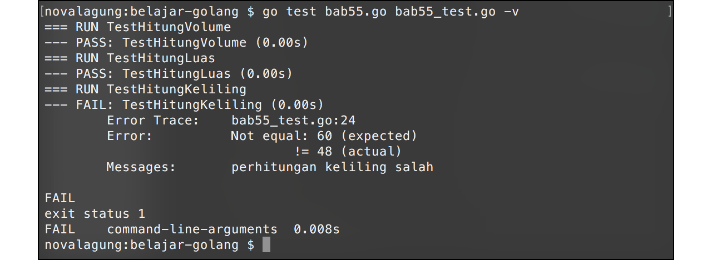

# Automated Testing

Golang menyediakan package `testing`, yang berisikan banyak sekali tools untuk keperluan automation testing. 

Pada bab ini kita akan belajar mengenai testing, benchmark, dan juga testing menggunakan [testify](github.com/stretchr/testify).

## Persiapan

Pertama siapkan terlebih dahulu sebuah struct `Kubus`. Variabel object hasil struct ini nantinya kita gunakan sebagai bahan testing.

```go
package main

import "math"

type Kubus struct {
    Sisi float64
}

func (k Kubus) Volume() float64 {
    return math.Pow(k.Sisi, 3)
}

func (k Kubus) Luas() float64 {
    return math.Pow(k.Sisi, 2) * 6
}

func (k Kubus) Keliling() float64 {
    return k.Sisi * 12
}
```

Kode di atas saya simpan ke file bernama `bab55.go`.

## Testing

File untuk keperluan testing terpisah dengan file utama, namanya harus berakhiran `_test.go`, dan package-nya harus sama. Pada bab ini, file utama adalah `bab55.go`, maka file testing saya beri nama `bab55_test.go`.

Testing di Golang dituliskan dalam bentuk fungsi, sebagai contoh jika ada 2 fungsi maka ada 2 test. Fungsi tersebut namanya harus diawali dengan **Test** dan memiliki parameter yang bertipe `*testing.T` (pastikan sudah meng-import package `testing` sebelumnya). Lewat parameter tersebut, kita bisa mengakses method-method untuk keperluan testing.

Pada contoh di bawah ini disiapkan 3 buah fungsi test, yang masing-masing digunakan untuk mengecek apakah hasil kalkulasi volume, luas, dan keliling kubus adalah benar.

```go
package main

import "testing"

var (
    kubus              Kubus   = Kubus{4}
    volumeSeharusnya   float64 = 64
    luasSeharusnya     float64 = 96
    kelilingSeharusnya float64 = 48
)

func TestHitungVolume(t *testing.T) {
    t.Logf("Volume : %.2f", kubus.Volume())

    if kubus.Volume() != volumeSeharusnya {
        t.Errorf("SALAH! harusnya %.2f", volumeSeharusnya)
    }
}

func TestHitungLuas(t *testing.T) {
    t.Logf("Luas : %.2f", kubus.Luas())

    if kubus.Luas() != luasSeharusnya {
        t.Errorf("SALAH! harusnya %.2f", luasSeharusnya)
    }
}

func TestHitungKeliling(t *testing.T) {
    t.Logf("Keliling : %.2f", kubus.Keliling())

    if kubus.Keliling() != kelilingSeharusnya {
        t.Errorf("SALAH! harusnya %.2f", kelilingSeharusnya)
    }
}
```

Method `t.Logf()` digunakan untuk memunculkan log. Method ini equivalen dengan `fmt.Printf()`.

Method `Errorf()` digunakan untuk memunculkan log dengan diikuti keterangan bahwa terjadi **fail** pada saat testing.

Jalankan aplikasi, maka akan terlihat bahwa tidak ada fail.


Cara eksekusi testing adalah menggunakan command `go test`. Karena struct yang diuji berada dalam file `bab55.go`, maka pada saat eksekusi test menggunakan `go test`, nama file `bab55_test.go` dan `bab55.go` perlu dituliskan sebagai argument.

Argument `-v` atau verbose digunakan menampilkan semua output log pada saat pengujian.

OK, selanjutnya coba ubah rumus kalkulasi method `Keliling()`. Tujuan dari pengubahan ini adalah untuk mengetahui bagaimana penanda fail muncul ketika ada test yang gagal.

```go
func (k Kubus) Keliling() float64 {
    return k.Sisi * 15
}
```

Setelah itu jalankan lagi test.


## Method Test

Table berikut berisikan method standar testing yang bisa digunakan di Golang.

| Method | Kegunaan |
| :----- | :------- |
| `Log()` | Menampilkan log |
| `Logf()` | Menampilkan log menggunakan format |
| `Fail()` | Menandakan terjadi `Fail()` dan proses testing fungsi tetap diteruskan |
| `FailNow()` | Menandakan terjadi `Fail()` dan proses testing fungsi dihentikan |
| `Failed()` | Menampilkan laporan fail |
| `Error()` | `Log()` diikuti dengan `Fail()` |
| `Errorf()` | `Logf()` diikuti dengan `Fail()` |
| `Fatal()` | `Log()` diikuti dengan `failNow()` |
| `Fatalf()` | `Logf()` diikuti dengan `failNow()` |
| `Skip()` | `Log()` diikuti dengan `SkipNow()` |
| `Skipf()` | `Logf()` diikuti dengan `SkipNow()` |
| `SkipNow()` | Menghentikan proses testing fungsi, dilanjutkan ke testing fungsi setelahnya |
| `Skiped()` | Menampilkan laporan skip |
| `Parallel()` | Menge-set bahwa eksekusi testing adalah parallel |

## Benchmark

Package `testing` selain berisikan tools untuk testing juga berisikan tools untuk benchmarking. Cara pembuatan benchmark sendiri cukup mudah yaitu dengan membuat fungsi yang namanya diawali dengan **Benchmark** dan parameternya bertipe `*testing.B`.

Sebagai contoh, kita akan mengetes performa perhitungan luas kubus. Siapkan fungsi dengan nama `BenchmarkHitungLuas()` dengan isi adalah kode berikut.

```go
func BenchmarkHitungLuas(b *testing.B) {
    for i := 0; i < b.N; i++ {
        kubus.Luas()
    }
}
```

Jalankan test menggunakan argument `-bench=.`, argumen ini digunakan untuk menandai bahwa selain testing terdapat juga benchmark yang perlu diuji.


`30000000  51.1 ns/op` artinya adalah perulangan di atas dilakukan sebanyak **30 juta** kali, dalam waktu **51 nano detik** untuk tiap perulangannya.

## Testing Menggunakan testify

Package **testify** berisikan banyak sekali tools yang bisa dimanfaatkan untuk keperluan testing di Golang.

Testify bisa di-download pada [github.com/stretchr/testify](github.com/stretchr/testify) menggunakan `go get`.

Didalam testify terdapat 5 package dengan kegunaan berbeda-beda satu dengan lainnya. Detailnya bisa dilihat pada tabel berikut.

| Package | Kegunaan |
| :------ | :------- |
| assert | Berisikan tools standar untuk testing |
| http | Berisikan tools untuk keperluan testing http |
| mock | Berisikan tools untuk mocking object |
| require | Sama seperti assert, hanya saja jika terjadi fail pada saat test akan menghentikan eksekusi program |
| suite | Berisikan tools testing yang berhubungan dengan struct dan method |

Pada bab ini akan kita contohkan bagaimana penggunaan package assert untuk keperluan testing. Caranya cukup mudah, contohnya bisa dilihat pada kode berikut.

```go
import "github.com/stretchr/testify/assert"

...

func TestHitungVolume(t *testing.T) {
    assert.Equal(t, kubus.Volume(), volumeSeharusnya, "perhitungan volume salah")
}

func TestHitungLuas(t *testing.T) {
    assert.Equal(t, kubus.Luas(), luasSeharusnya, "perhitungan luas salah")
}

func TestHitungKeliling(t *testing.T) {
    assert.Equal(t, kubus.Keliling(), kelilingSeharusnya, "perhitungan keliling salah")
}
```

Fungsi `assert.Equal()` digunakan untuk uji perbandingan. Parameter ke-2 dibandingkan nilainya dengan parameter ke-3. Jika tidak sama, maka pesan parameter ke-3 akan dimunculkan.


