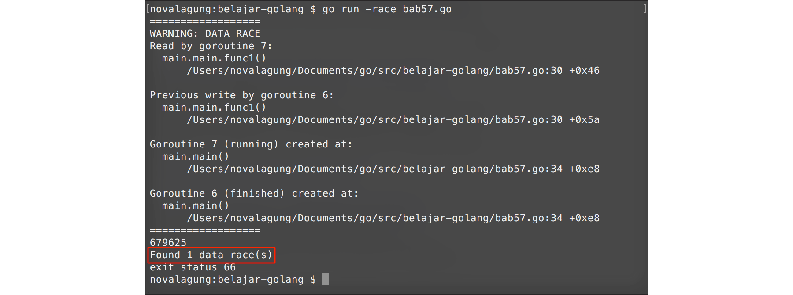

# A.57. Mutex

Sebelum kita membahas mengenai apa itu **mutex**? ada baiknya untuk mempelajari terlebih dahulu apa itu **race condition**, karena kedua konsep ini berhubungan erat satu sama lain.

Race condition adalah kondisi dimana lebih dari satu goroutine, mengakses data yang sama pada waktu yang bersamaan (benar-benar bersamaan). Ketika hal ini terjadi, nilai data tersebut akan menjadi kacau. Dalam **concurrency programming** situasi seperti ini ini sering terjadi.

Mutex melakukan pengubahan level akses sebuah data menjadi eksklusif, menjadikan data tersebut hanya dapat dikonsumsi (read / write) oleh satu buah goroutine saja. Ketika terjadi race condition, maka hanya goroutine yang beruntung saja yang bisa mengakses data tersebut. Goroutine lain (yang waktu running nya kebetulan bersamaan) akan dipaksa untuk menunggu, hingga goroutine yang sedang memanfaatkan data tersebut selesai.

Go menyediakan `sync.Mutex` yang bisa dimanfaatkan untuk keperluan **lock** dan **unlock** data. Pada bab ini kita akan membahas mengenai race condition, dan menanggulanginya menggunakan mutex.

## A.57.1. Persiapan

Pertama siapkan struct baru bernama `counter`, dengan isi satu buah property `val` bertipe `int`. Property ini nantinya dikonsumsi dan diolah oleh banyak goroutine.

Lalu buat beberapa method struct `counter`.

 1. Method `Add()`, untuk increment nilai.
 2. Method `Value()`, untuk mengembalikan nilai.

```go
package main

import (
    "fmt"
    "runtime"
    "sync"
)

type counter struct {
    val int
}

func (c *counter) Add(x int) {
    c.val++
}

func (c *counter) Value() (x int) {
    return c.val
}
```

Kode di atas kita gunakan sebagai template contoh source code yang ada pada bab ini.

## A.57.2. Contoh Race Condition

Program berikut merupakan contoh program yang didalamnya memungkinkan terjadi race condition atau kondisi goroutine balapan.

> Pastikan jumlah core prosesor komputer anda adalah lebih dari satu. Karena contoh pada bab ini hanya akan berjalan sesuai harapan jika `GOMAXPROCS` > 1.

```go
func main() {
    runtime.GOMAXPROCS(2)

    var wg sync.WaitGroup
    var meter counter

    for i := 0; i < 1000; i++ {
        wg.Add(1)

        go func() {
            for j := 0; j < 1000; j++ {
                meter.Add(1)
            }

            wg.Done()
        }()
    }

    wg.Wait()
    fmt.Println(meter.Value())
}
```

Pada kode diatas, disiapkan sebuah instance `sync.WaitGroup` bernama `wg`, dan variabel object `meter` bertipe `counter` (nilai property `val` default-nya adalah **0**).

Setelahnya dijalankan perulangan sebanyak 1000 kali, yang ditiap perulanganya dijalankan sebuah goroutine baru. Didalam goroutine tersebut, terdapat perulangan lagi, sebanyak 1000 kali. Dalam perulangan tersebut nilai property `val` dinaikkan sebanyak 1 lewat method `Add()`.

Dengan demikian, ekspektasi nilai akhir `meter.val` harusnya adalah 1000000.

Di akhir, `wg.Wait()` dipanggil, dan nilai variabel counter `meter` diambil lewat `meter.Value()` untuk kemudian ditampilkan.

Jalankan program, lihat hasilnya.


Nilai `meter.val` tidak genap 1000000? kenapa bisa begitu? Padahal seharusnya tidak ada masalah dalam kode yang kita tulis di atas.

Inilah yang disebut dengan race condition, data yang diakses bersamaan dalam 1 waktu menjadi kacau.

## A.57.3. Deteksi Race Condition Menggunakan Go Race Detector

Go menyediakan fitur untuk [deteksi race condition](http://blog.golang.org/race-detector). Cara penggunaannya adalah dengan menambahkan flag `-race` pada saat eksekusi aplikasi.



Terlihat pada gambar diatas, ada pesan memberitahu terdapat kemungkinan data race pada program yang kita jalankan.

## A.57.4. Penerapan `sync.Mutex`

Sekarang kita tahu bahwa program di atas menghasilkan bug, ada kemungkinan data race didalamnya. Untuk mengatasi masalah ini ada beberapa cara yang bisa digunakan, dan disini kita akan menggunakan `sync.Mutex`.

Ubah kode di atas, embed struct `sync.Mutex` kedalam struct `counter`, agar lewat objek cetakan `counter` kita bisa melakukan lock dan unlock dengan mudah. Tambahkan method `Lock()` dan `Unlock()` didalam method `Add()`.

```go
type counter struct {
	sync.Mutex
	val int
}

func (c *counter) Add(x int) {
	c.Lock()
	c.val++
	c.Unlock()
}

func (c *counter) Value() (x int) {
	return c.val
}
```

Method `Lock()` digunakan untuk menandai bahwa semua operasi pada baris setelah kode tersebut adalah bersifat eksklusif. Hanya ada satu buah goroutine yang bisa melakukannya dalam satu waktu. Jika ada banyak goroutine yang eksekusinya bersamaan, harus antri.

Pada kode di atas terdapat kode untuk increment nilai `meter.val`. Maka property tersebut hanya bisa diakses oleh satu goroutine saja.

Method `Unlock()` akan membuka kembali akses operasi ke property/variabel yang di lock, proses mutual exclusion terjadi diantara method `Lock()` dan `Unlock()`.

Di contoh di atas, pada saat bagian pengambilan nilai, mutex tidak dipasang, karena kebetulan pengambilan nilai terjadi setelah semua goroutine selesai. Data Race bisa terjadi saat pengubahan maupun pengambilan data, jadi penggunaan mutex harus disesuaikan dengan kasus.

Coba jalankan program, dan lihat hasilnya.


Pada contoh di atas, mutex diterapkan dengan cara di-embed ke objek yang memerlukan proses lock-unlock, menjadikan variabel mutex tersebut adalah eksklusif untuk objek tersebut saja. Cara ini merupakan cara yang dianjurkan. Meskipun demikian, mutex tetap bisa digunakan dengan cara tanpa ditempelkan ke objek yang memerlukan lock-unlock. Contohnya bisa dilihat dibawah ini.

```go
func (c *counter) Add(x int) {
	c.val++
}

func (c *counter) Value() (x int) {
	return c.val
}

func main() {
	runtime.GOMAXPROCS(2)

	var wg sync.WaitGroup
	var mtx sync.Mutex
	var meter counter

	for i := 0; i < 1000; i++ {
		wg.Add(1)

		go func() {
			for j := 0; j < 1000; j++ {
				mtx.Lock()
				meter.Add(1)
				mtx.Unlock()
			}

			wg.Done()
		}()
	}

	wg.Wait()
	fmt.Println(meter.Value())
}
```

> `sync.Mutex` merupakan salah satu tipe yang *thread safe*. Kita tidak perlu khawatir terhadap potensi *race condition* karena variabel bertipe ini aman untuk digunakan di banyak goroutine secara paralel.

---

<div class="source-code-link">
    <div class="source-code-link-message">Source code praktek pada bab ini tersedia di Github</div>
    <a href="https://github.com/novalagung/dasarpemrogramangolang-example/tree/master/chapter-A.57-mutex">https://github.com/novalagung/dasarpemrogramangolang-example/.../chapter-A.57...</a>
</div>
