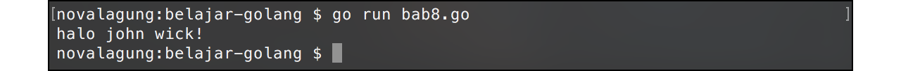
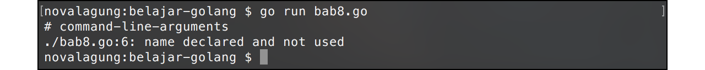

# Variabel

Golang mengadopsi dua jenis penulisan variabel, yang dituliskan tipe data-nya dan yang tidak. Kedua cara tersebut intinya adalah sama, pembedanya hanyalah cara penulisannya saja.

Pada bab ini akan dikupas tuntas tentang macam-macam cara deklarasi variabel.

## Deklarasi Variabel Dengan Tipe Data

Golang memiliki aturan cukup ketat dalam hal penulisan variabel. Pada saat deklarasinya, tipe data yg digunakan harus dituliskan juga. Istilah lain dari konsep ini adalah **manifest typing**.

Berikut adalah contoh cara pembuatan variabel yang tipe datanya harus ditulis.

```go
package main

import "fmt"

func main() {
    var firstName string = "john"

    var lastName string
    lastName = "wick"

    fmt.Printf("halo %s %s!\n", firstName, lastName)
}
```

Keyword `var` digunakan untuk deklarasi variabel. Contohnya bisa dilihat pada `firstName` dan `lastName`. Nilai variabel `firstName` diisi langsung ketika deklarasi, berbeda dibanding `lastName` yang nilainya diisi setelah baris kode deklarasi. Cara tersebut diperbolehkan di Golang.



## Deklarasi Variabel Menggunakan Keyword `var`

Pada kode di atas bisa dilihat bagaimana sebuah variabel dideklarasikan dan di set nilainya. Keyword `var` digunakan untuk membuat variabel baru.

Skema penggunaan keyword var:

```go
var <nama-variabel> <tipe-data>
var <nama-variabel> <tipe-data> = <nilai>
```

Contoh:

```go
var lastName string
var firstName string = "john"
```

Nilai variabel bisa diisi langsung pada saat deklarasi variabel.

## Penggunaan Fungsi `fmt.Printf()`

Fungsi ini digunakan untuk menampilkan output dalam bentuk tertentu. Kegunaannya sama seperti fungsi `fmt.Println()`, hanya saja struktur outputnya didefinisikan di awal.

Perhatikan bagian `"halo %s %s!\n"`, karakter `%s` disitu akan diganti dengan data `string` yang berada di parameter ke-2, ke-3, dan seterusnya.

Agar lebih mudah dipahami, silakan perhatikan kode berikut. Ketiga baris kode di bawah ini menghasilkan output yang sama, meskipun cara penulisannya berbeda.

```go
fmt.Printf("halo john wick!\n")
fmt.Printf("halo %s %s!\n", firstName, lastName)
fmt.Println("halo", firstName, lastName + "!")
```

Tanda plus (`+`) jika ditempatkan di antara string, fungsinya adalah untuk penggabungan string (*concatenation*).

Fungsi `fmt.Printf()` tidak menghasilkan baris baru di akhir text, oleh karena itu digunakanlah literal `\n` untuk memunculkan baris baru di akhir. Hal ini sangat berbeda jika dibandingkan dengan fungsi `fmt.Println()` yang secara otomatis menghasilkan end line (baris baru) di akhir. 

## Deklarasi Variabel Tanpa Tipe Data

Selain **manifest typing**, Golang juga mengadopsi metode **type inference**, yaitu metode deklarasi variabel yang tipe data-nya ditentukan oleh tipe data nilainya, kontradiktif jika dibandingkan dengan cara pertama. Dengan metode jenis ini, keyword `var` dan tipe data tidak perlu ditulis. Agar lebih jelas, silakan perhatikan kode berikut.

```go
var firstName string = "john"
lastName := "wick"

fmt.Printf("halo %s %s!\n", firstName, lastName)
```

Variabel `lastName` dideklarasikan dengan menggunakan metode type inference. Penandanya tipe data tidak dituliskan pada saat deklarasi. Pada penggunaan metode ini, operand `=` harus diganti dengan `:=` dan keyword `var` dihilangkan.

Tipe data `lastName` secara otomatis akan ditentukan menyesuaikan value atau nilai-nya. Jika nilainya adalah berupa `string` maka tipe data variabel adalah `string`. Pada contoh di atas, nilainya adalah string `"wick"`.

Diperbolehkan untuk tetap menggunakan keyword `var` pada saat deklarasi, dengan ketentuan tidak menggunakan tanda `:=`, melainkan tetap menggunakan `=`. Contohnya bisa dilihat pada kode berikut.

```go
// menggunakan var, tanpa tipe data, menggunakan perantara "="
var firstName = "john"

// tanpa var, tanpa tipe data, menggunakan perantara ":="
lastName := "wick"
```

Kedua deklarasi di atas maksudnya adalah sama. Silakan pilih yang nyaman di hati.

Tanda `:=` hanya digunakan sekali di awal pada saat deklarasi saja. Setelah itu, untuk assignment nilai selanjutnya harus menggunakan tanda `=`. Contoh:

```go
lastName := "wick"
lastName = "ethan"
lastName = "bourne"
```

## Deklarasi Multi Variabel

Golang mendukung deklarasi banyak variabel secara bersamaan, caranya dengan menuliskan variabel-variabel-nya dengan pembatas tanda koma (`,`). Untuk pengisian nilainya-pun diperbolehkan secara bersamaan. Contoh:

```go
var first, second, third string
first, second, third = "satu", "dua", "tiga"
```

Pengisian nilai juga bisa dilakukan bersamaan pada saat deklarasi. Caranya dengan menuliskan nilai masing-masing variabel berurutan sesuai variabelnya dengan pembatas koma (`,`). Contohnya seperti pada kode berikut.

```go
var fourth, fifth, sixth string = "empat", "lima", "enam"
```

Kalau ingin lebih ringkas:

```go
seventh, eight, ninth := "tujuh", "delapan", "sembilan"
```

Dengan menggunakan teknik type inference, deklarasi multi variabel bisa dilakukan untuk variabel-variabel yang tipe data satu sama lainnya berbeda. Contoh:

```
one, isFriday, twoPointTwo, say := 1, true, 2.2, "hello"
```

Istimewa bukan? Istimewa sekali.

## Variabel Underscore `_`

Golang memiliki aturan unik yang tidak dimiliki bahasa lain, yaitu tidak boleh ada satupun variabel yang menganggur. Artinya, semua variabel yang dideklarasikan harus digunakan. Jika ada variabel yang tidak digunakan tapi dideklarasikan, program akan gagal dikompilasi.



Underscore (`_`) adalah predefined variabel yang bisa dimanfaatkan untuk menampung nilai yang tidak dipakai. Bisa dibilang variabel ini merupakan keranjang sampah. Berikut adalah contoh penggunaan variabel tersebut.

```go
_ = "belajar Golang"
_ = "Golang itu mudah"
name, _ := "john", "wick"
```

Pada contoh di atas, variabel `name` akan berisikan text `john`, sedang nilai `wick` akan ditampung oleh variabel underscore, menandakan bahwa nilai tersebut tidak akan digunakan.

Variabel underscore adalah predefined, jadi tidak perlu menggunakan `:=` untuk pengisian nilai, cukup dengan `=` saja. Namun khusus untuk pengisian nilai multi variabel yang dilakukan dengan metode type inference, boleh didalamnya terdapat variabel underscore.

Biasanya underscore sering dimanfaatkan untuk menampung nilai balik fungsi yang tidak digunakan.

Perlu diketahui, bahwa isi variabel underscore tidak dapat ditampilkan. Data yang sudah masuk variabel tersebut akan hilang. Ibarat blackhole, sekali masuk, tidak akan bisa keluar :-)

## Deklarasi Variabel Menggunakan Keyword `new`

Keyword `new` digunakan untuk mencetak data **pointer** dengan tipe data tertentu. Nilai data default-nya akan menyesuaikan tipe datanya. Contoh penerapannya:

```go
name := new(string)

fmt.Println(name)   // 0x20818a220
fmt.Println(*name)  // ""
```

Variabel `name` menampung data bertipe **pointer string**. Jika ditampilkan yang muncul bukanlah nilainya melainkan alamat memori nilai tersebut (dalam bentuk notasi heksadesimal). Untuk menampilkan nilai aslinya, variabel tersebut perlu di-**dereference** terlebih dahulu, menggunakan tanda asterisk (`*`).

Mungkin untuk sekarang banyak yang akan bingung, namun tak apa, karena nantinya di bab 22 akan dikupas habis tentang apa itu pointer dan dereference.

## Deklarasi Variabel Menggunakan Keyword `make`

Keyword ini hanya bisa digunakan untuk pembuatan beberapa jenis variabel saja, yaitu:

- channel
- slice
- map

Dan lagi, mungkin banyak yang akan bingung, tapi tak apa. Ketika sudah masuk ke pembahasan masing-masing poin tersebut, akan terlihat apa kegunaan dari keyword ini.
