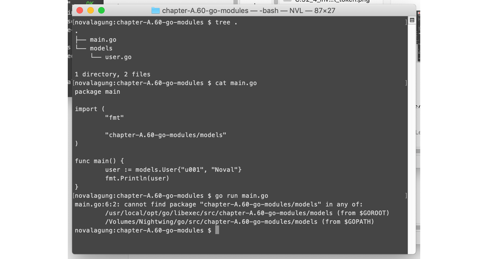
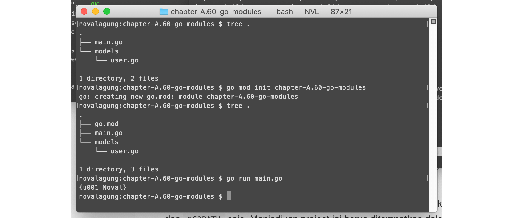
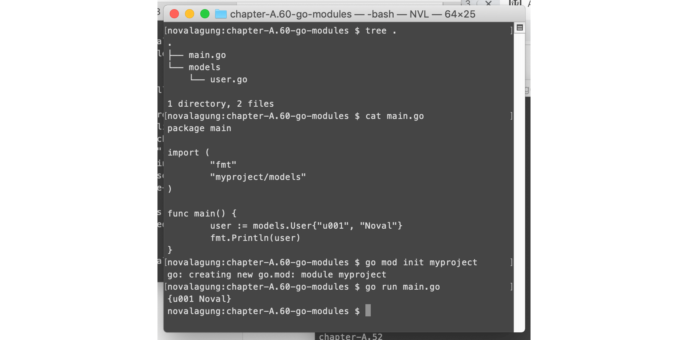
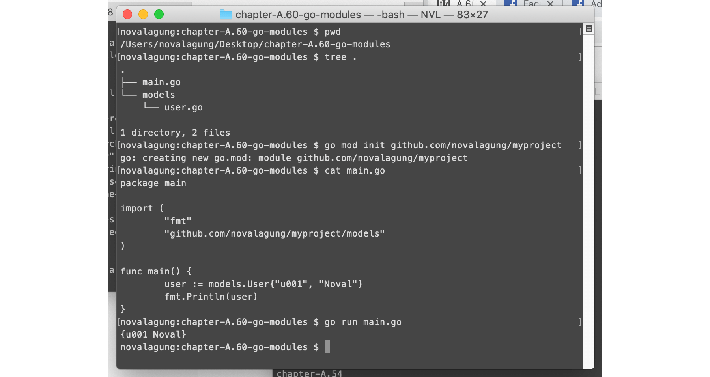
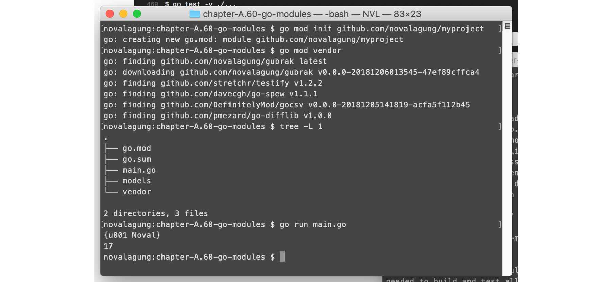

# A.60. Go Modules

Pada bagian ini kita akan belajar cara pemanfaatan Go Modules untuk manajemen project dan dependency. Go Modules merupakan bagian dari **Go Toolchain** yang sekarang sedang dikembangkan.

Sebelum kita belajar mengenai go modules secara intensif, ada baiknya kita coba melihat kebelakang sejenak untuk mengenang `$GOPATH`.

## A.60.1. *The Infamous* `$GOPATH`

Sebelumnya sudah di bahas dalam [Bab A.3. GOPATH Dan Workspace](/3-gopath-dan-workspace.html) bahwa project Go harus ditempatkan didalam workspace, lebih spesifiknya dalam folder `$GOPATH/src/`. Sudah dibahas juga bahwa ada baiknya untuk men-centralize 3rd party library yang digunakan per project dengan memanfaatkan [vendoring](/A-58-go-vendoring.html) dan [package management tools: Dep](/A-59-go-dep.html).

Sebenarnya masih ada satu masalah yang masih belum terselesaikan yang berhubungan dengan manajemen project dan dependency di Go. Yaitu `$GOPATH`. Ya, `$GOPATH` adalah **masalah besar** untuk beberapa kasus.

Perlu diketahui, meskipun sebuah project sudah menerapkan vendoring (semua 3rd party sudah ada di sub folder `vendor`), project itu sendiri masih harus ditempatkan dalam workspace!

Silakan lihat gambar di bawah ini untuk pembuktian. Di dalam project `chapter-A.60-go-modules` terdapat package `models` yang harus di-import. Karena project tidak ditempatkan dalam workspace, eksekusinya gagal.

> Jika dalam satu project hanya ada satu package, `main` saja, maka meski projek tidak ditempatkan dalam workspace, tidak akan terjadi error. Tapi jelasnya tidak mungkin dalam real world development sebuah project hanya memilik satu package saja. Brutal sekali kalau misal ada 😁

Bisa dilihat dari stack trace error pada gambar di atas, proses pencarian package `models` dilakukan hanya pada `$GOROOT` dan `$GOPATH` saja, pencarian dalam folder project itu sendiri tidak dilakukan. Ini merupakan pengingat halus bahwa project ini harus ditempatkan dalam workspace, agar package `models`-nya bisa dikenali.

Masalah bukan?

## A.60.2. Go Modules

Setelah cukup lama menunggu, akhirnya pada rilisnya `go1.11` dikenalkanlah sebuah fasilitas baru bernama **Go Modules** (experimental). Tujuan diciptakannya Go Modules ini adalah untuk mengatasi masalah ketergantuan sebuah project dengan `$GOPATH`. Jadi dengan mengimplementasikan Go Modules, sebuah project tidak harus berada dalam `$GOPATH`.

Cara penerapan Go Modules cukup mudah. Inisialisasi project sebagai module lewat command `go mod init <module-name>`.

Bisa dilihat di gambar, bahwa setelah project di-inisialisasi sebagai module, proses running aplikasi menjadi sukses.

## A.60.3. Penjelasan `go mod`

Command `go mod init` menghasilkan sebuah file bernama `go.mod`, yang isinya adalah konfigurasi module.

Ok, mungkin akan muncul beberapa pertanyaan. Salah satunya adalah kenapa command-nya harus `go mod init chapter-A.60-go-modules`, kenapa tidak cukup hanya `go mod init` saja? Hal ini karena mulai awal, projek ini sudah tidak didalam `$GOPATH`. Argument `chapter-A.60-go-modules` setelah command inisialisasi berguna untuk menentukan package path dari project, hal ini penting untuk keperluan import package lain yang merupakan sub folder project.

Agar lebih mudah untuk dipahami, silakan lihat contoh berikut.

Coba perhatikan gambar di atas. Nama folder adalah `chapter-A.60-go-modules`, tetapi pada saat import `models`, package path yang digunakan adalah `myproject/models`. Harusnya ini error kan? Tetapi tidak, *hmmmm*.

Dengan menggunakan Go Modules kita bisa menentukan base package path suatu project, tidak harus sama dengan nama folder-nya. Pada contoh ini nama folder adalah `chapter-A.60-go-modules` tapi base package path adalah `myproject`.

Agar lebih jelas lagi, lanjut ke contoh ke-dua.

Pada contoh ini, nama module di-set panjang, `github.com/novalagung/myproject`. Dengan nama folder masih tetap sama. Hasilnya aplikasi tetap berjalan lancar.

Nama package path bisa di set dalam bentuk arbitrary path seperti pada gambar. Sangat membantu bukan sekali, tidak perlu membuat nested folder terlebih dahulu seperti yang biasa dilakukan dalam `$GOPATH`.

## A.60.4. Vendoring Dengan Go Modules

Vendoring, seperti yang kita tau berguna untuk men-centralize 3rd party libraries. Sedangkan dari yang sudah dipelajari, kita bisa membuat sebuah project untuk tidak tergantung dengan `$GOPATH` lewat Go Modules.

Sebenarnya, Go Modules, selain untuk membuat sebuah project tidak tergantung dengan `$GOPATH`, adalah juga berguna untuk manajemen dependencies project. Jadi dengan Go Modules tidak perlu menggunakan `dep`, karena di dalam Go Modules sudah include kapabilitas yang sama dengan `dep` yaitu untuk me-manage dependencies.

Cara untuk meng-enable vendoring dengan Go Modules, adalah lewat command `go mod vendor`.

Jika pada sebuah projek sudah enabled `dep`, dan ingin di enable Go Modules. Maka file `Gopkg.lock` yang sudah ada akan dikonversi ke-dalam bentuk `go.mod` dan `go.sum`.

## A.60.5. Sinkronisasi Dependencies

Gunakan command `go mod tidy` untuk sinkronisasi dependencies yang digunakan dalam project. Dengan command tersebut, secara otomatis 3rd party yang belum ditambahkan akan dicatat dan ditambahkan; dan yang tidak digunakan tapi terlanjut tercatat akan dihapuskan.

---

    
Source code praktek pada bab ini tersedia di Github

    <a href="https://github.com/novalagung/dasarpemrogramangolang-example/tree/master/chapter-A.60-go-modules">https://github.com/novalagung/dasarpemrogramangolang-example/.../chapter-A.60...</a>

