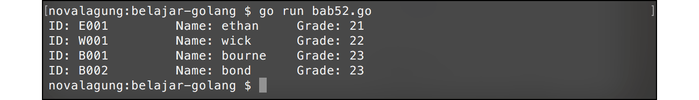
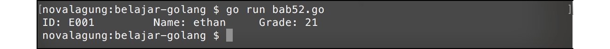

# A.52. Client HTTP Request

Di bab sebelumnya telah dibahas bagaimana membuat Web Service API yang mem-provide data JSON, pada bab ini kita akan belajar mengenai cara untuk mengkonsumsi data tersebut.

Pastikan anda sudah mempraktekkan apa-apa yang ada pada bab sebelumnya [Bab A.51. Web Service API](/51-web-json-api.html), karena web service yang telah dibuat pada bab tersebut dipergunakan juga pada bab ini.


## A.52.1. Penggunaan HTTP Request

Package `net/http`, selain berisikan tools untuk keperluan pembuatan web, juga berisikan fungsi-fungsi untuk melakukan http request. Salah satunya adalah `http.NewRequest()` yang akan kita bahas di sini.

Sebelumnya, import package yang dibutuhkan. Dan siapkan struct `student` yang nantinya akan dipakai sebagai tipe data reponse dari web API. Struk tersebut skema nya sama dengan yang ada pada bab 51.

```go
package main

import "fmt"
import "net/http"
import "encoding/json"

var baseURL = "http://localhost:8080"

type student struct {
    ID    string
    Name  string
    Grade int
}
```

Setelah itu buat fungsi `fetchUsers()`. Fungsi ini bertugas melakukan request ke [http://localhost:8080/users](http://localhost:8080/users), menerima response dari request tersebut, lalu menampilkannya.

```go
func fetchUsers() ([]student, error) {
	var err error
	var client = &http.Client{}
	var data []student

	request, err := http.NewRequest("POST", baseURL+"/users", nil)
	if err != nil {
		return nil, err
	}

	response, err := client.Do(request)
	if err != nil {
		return nil, err
	}
	defer response.Body.Close()

	err = json.NewDecoder(response.Body).Decode(&data)
	if err != nil {
		return nil, err
	}

	return data,nil
}
```

Statement `&http.Client{}` menghasilkan instance `http.Client`. Objek ini nantinya diperlukan untuk eksekusi request.

Fungsi `http.NewRequest()` digunakan untuk membuat request baru. Fungsi tersebut memiliki 3 parameter yang wajib diisi.

 1. Parameter pertama, berisikan tipe request **POST** atau **GET** atau lainnya
 2. Parameter kedua, adalah URL tujuan request
 3. Parameter ketiga, form data request (jika ada)

Fungsi tersebut menghasilkan instance bertipe `http.Request`. Objek tersebut nantinya disisipkan pada saat eksekusi request.

Cara eksekusi request sendiri adalah dengan memanggil method `Do()` pada instance `http.Client` yang sudah dibuat, dengan parameter adalah instance request-nya. Contohnya seperti pada `client.Do(request)`.

Method tersebut mengembalikan instance bertipe `http.Response`, yang didalamnya berisikan informasi yang dikembalikan dari web API.

Data response bisa diambil lewat property `Body` dalam bentuk string. Gunakan JSON Decoder untuk mengkonversinya menjadi bentuk JSON. Contohnya bisa dilihat di kode di atas, `json.NewDecoder(response.Body).Decode(&data)`. Setelah itu barulah kita bisa menampilkannya.

Perlu diketahui, data response perlu di-**close** setelah tidak dipakai. Caranya seperti pada kode `defer response.Body.Close()`.

Selanjutnya, eksekusi fungsi `fetchUsers()` dalam fungsi `main()`.

```go
func main() {
	var users, err = fetchUsers()
	if err != nil {
		fmt.Println("Error!", err.Error())
		return
	}

	for _, each := range users {
		fmt.Printf("ID: %s\t Name: %s\t Grade: %d\n", each.ID, each.Name, each.Grade)
	}
}
```

Ok, terakhir sebelum memulai testing, run terlebih dahulu aplikasi pada bab sebelumya [A.51. Web Service API (JSON Data)](/51-web-json-api.html) (jika belum). Kemudian start prompt cmd/terminal baru dan jalankan program yang barusan kita buat pada bab ini.



## A.52.2. HTTP Request Dengan Form Data

Untuk menyisipkan data pada sebuah request, ada beberapa hal yang perlu ditambahkan. Yang pertama, import beberapa package lagi, `bytes` dan `net/url`.

```go
import "bytes"
import "net/url"
```

Buat fungsi baru, isinya request ke [http://localhost:8080/user](http://localhost:8080/user) dengan data yang disisipkan adalah `ID`.

```go
func fetchUser(ID string) (student, error) {
	var err error
	var client = &http.Client{}
	var data student

	var param = url.Values{}
	param.Set("id", ID)
	var payload = bytes.NewBufferString(param.Encode())

	request, err := http.NewRequest("POST", baseURL+"/user", payload)
	if err != nil {
		return data, err
	}
	request.Header.Set("Content-Type", "application/x-www-form-urlencoded")

	response, err := client.Do(request)
	if err != nil {
		return data, err
	}
	defer response.Body.Close()

	err = json.NewDecoder(response.Body).Decode(&data)
	if err != nil {
		return data, err
	}

	return data, nil
}
```

Isi fungsi di atas bisa dilihat memiliki beberapa kemiripan dengan fungsi `fetchUsers()` sebelumnya.

Statement `url.Values{}` akan menghasilkan objek yang nantinya digunakan sebagai form data request. Pada objek tersebut perlu di set data apa saja yang ingin dikirimkan menggunakan fungsi `Set()` seperti pada `param.Set("id", ID)`.

Statement `bytes.NewBufferString(param.Encode())` maksudnya, objek form data di-encode lalu diubah menjadi bentuk `bytes.Buffer`, yang nantinya disisipkan pada parameter ketiga pemanggilan fungsi `http.NewRequest()`.

Karena data yang akan dikirim di-encode, maka pada header perlu di set tipe konten request-nya. Kode `request.Header.Set("Content-Type", "application/x-www-form-urlencoded")` artinya tipe konten request di set sebagai `application/x-www-form-urlencoded`.

> Pada konteks HTML, HTTP Request yang di trigger dari tag `<form></form>` secara default tipe konten-nya sudah di set `application/x-www-form-urlencoded`. Lebih detailnya bisa merujuk ke spesifikasi HTML form [http://www.w3.org/TR/html401/interact/forms.html#h-17.13.4.1](http://www.w3.org/TR/html401/interact/forms.html#h-17.13.4.1)

Response dari endpoint `/user` bukanlah slice, tetapi berupa objek. Maka pada saat decode perlu pastikan tipe variabel penampung hasil decode data response adalah `student` (bukan `[]student`).

Lanjut ke perkodingan, terakhir, implementasikan `fetchUser()` pada fungsi `main()`.

```go
func main() {
	var user1, err = fetchUser("E001")
	if err != nil {
		fmt.Println("Error!", err.Error())
		return
	}

	fmt.Printf("ID: %s\t Name: %s\t Grade: %d\n", user1.ID, user1.Name, user1.Grade)
}
```

Untuk keperluan testing, kita hardcode `ID` nilainya `"E001"`. Jalankan program untuk test apakah data yang dikembalikan sesuai.



## A.52.3. Secure & Insecure HTTP Request

Kita telah mempelajari bagaimana cara membuat http request sederhana untuk kirim data dan juga ambil data. Nantinya pada [Bab C.25. Secure & Insecure Client HTTP Request](/C-25-secure-insecure-client-http-request.html) kita akan belajar cara membuat http client request yang lebih njlimet untuk kasus yang lebih advance, tapi sabar dulu hehe.

---

<div class="source-code-link">
    <div class="source-code-link-message">Source code praktek pada bab ini tersedia di Github</div>
    <a href="https://github.com/novalagung/dasarpemrogramangolang-example/tree/master/chapter-A.52-http-request">https://github.com/novalagung/dasarpemrogramangolang-example/.../chapter-A.52...</a>
</div>
