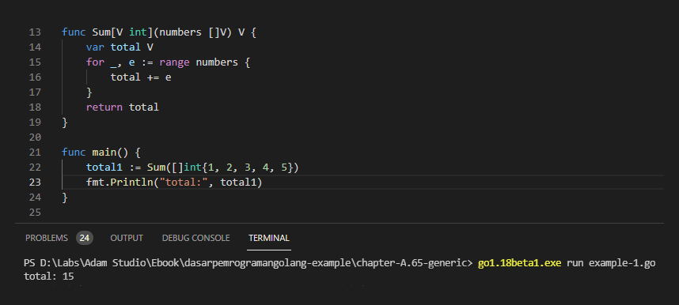
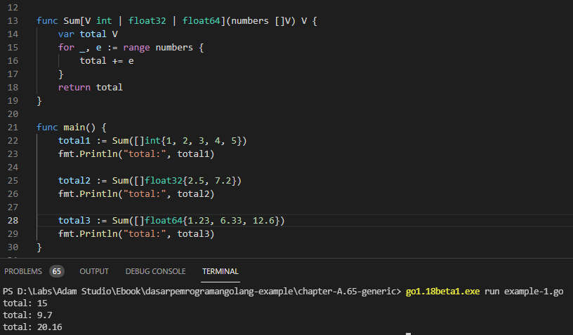
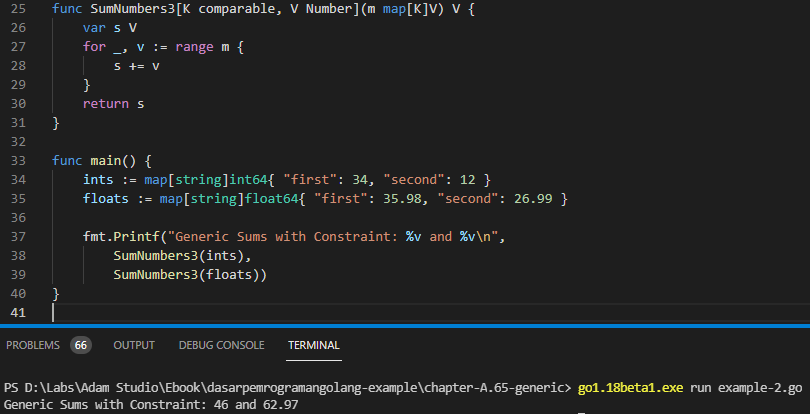

# A.65. Go Generics

Pada chapter ini kita akan belajar tentang Generics di Go.

> Go Generics API ini diperkenalkan pada Go v1.18 (yang pada saat artikel ini ditulis, versi tersebut masih belum officially rilis). Jika pembaca berminat mencoba, silakan install terlebih dahulu `go1.18beta1`. Untuk panduan instalasinya bisa merujuk ke [A.2. Instalasi Golang](/2-instalasi-golang.html#a23-instalasi-go-unstabledevelopment) di section **Instalasi Go Unstable/Development**.

## A.65.1. Konsep Generic Programming

Generic Programming adalah salah satu metode dalam penulisan kode program, di mana tipe data dalam kode didefinisikan menggunakan tipe data yang tipe pastinya adalah dituliskan belakangan saat kode tersebut di-call atau dieksekusi. Konsep ini sudah cukup umum terutama pada bahasa yang static type.

Di Go, kita punya tipe `interface{}` yang biasa difungsikan sebagai tipe untuk menampung data yang tidak pasti tipe datanya. Generic dan `interface{}` berbeda. Tipe `interface{}` akan membungkus data aslinya atau *underlying value*-nya, dan untuk mengakses data tersebut, kita perlu menerapkan *type assertion*, contohnya `data.(int)`.

Berbeda dibanding `interface{}`, pada penggunaan generic kita perlu mendefinisikan cakupan tipe data yang kompatibel untuk dipakai saat pemanggilan kode, atau bisa juga menggunakan keyword `comparable`, yang artinya tipe data adalah kompatibel dengan tipe apapun.

Ok, mari kita lanjut ke pembahasan yang lebih teknis agar tidak bingung.

## A.65.2. Penerapan Generic pada Fungsi

Mari kita mulai pembelajaran dengan kode di bawah ini:

```go
package main

import "fmt"

func Sum(numbers []int) int {
	var total int
	for _, e := range numbers {
		total += e
	}
	return total
}

func main() {
	total1 := Sum([]int{1, 2, 3, 4, 5})
	fmt.Println("total:", total1)
}
```

Pada kode di atas, didefinisikan sebuah fungsi `Sum()` yang tugasnya menghitung total atau *summary* dari data slice numerik yang disisipkan di parameter. Dalam `main()`, kita panggil fungsi tersebut untuk menghitung total dari sejumlah data dengan tipe `[]int`. Saya rasa sampai sini cukup jelas.

Fungsi `Sum()` memiliki satu limitasinya, yaitu hanya bisa digunakan pada data yang tipenya `[]int`, tidak bisa untuk tipe slice numerik lain. Bagaimana jika menggunakan tipe `interface{}`? apakah bisa? bisa saja sebenarnya, tapi pastinya lebih report karena sulit untuk menerapkan *type assertion* kalau tidak tau tipe pasti parameter `numbers` itu apa. Penggunaan `interface{}` perlu dibarengi dengan penerapan [reflection API](/A-reflect.html).

Di sini kita bisa terapkan Generic, kita akan modifikasi fungsi di atas agar bisa menampung tipe data slice numerik lainnya diluar `[]int`.

Ok, sekarang ubah kode fungsi `Sum` menjadi seperti di bawah ini:

```go
func Sum[V int](numbers []V) V {
	var total V
	for _, e := range numbers {
		total += e
	}
	return total
}
```

Notasi penulisan di atas mungkin akan cukup asing teruntuk pembaca yang belum pernah menggunakan Generic pada bahasa selain Go. Tidak apa, di sini kita belajar dari awal :-)

Penulisan notasi fungsi dengan Generic kurang lebih sebagai berikut:

```go
func FuncName[dataType <ComparableType>](params)
```

Pada kode di atas, tipe data `[]int` kita ganti menjadi tipe data `[]V`, yang di mana tipe `V` dideklarasikan dengan notasi `[V int]`. Tipe data `V` di situ artinya kompatibel atau *comparable* dengan tipe `int`. Bisa diambil kesimpulan kedua fungsi yang telah kita tulis adalah ekuivalen.

```go
func Sum(numbers []int) int {
	var total int
    // ...
}

func Sum[V int](numbers []V) V {
	var total V
    // ...
}
```

Ok, sekarang kita sudah mengubah penulisan kode fungsi `Sum` menggunakan Generic, tanpa merubah kegunaan fungsi. Coba jalankan aplikasi untuk mengetes hasilnya.



## A.65.3. Comparable Data Type pada Fungsi Generic

Selanjutnya kita modifikasi lagi fungsi `Sum` agar tipe kompatibel `V` di sini kompatibel dengan tipe numerik lainnya seperti `float64`. Caranya sangat mudah, cukup tambahkan tipe datanya pada statement `V int` dengan delimiter pipe (`|`).

```go
func Sum[V int | float32 | float64](numbers []V) V {
	var total V
	for _, e := range numbers {
		total += e
	}
	return total
}
```

Notasi `V int | float32 | float64` artinya tipe `V` adalah kompatibel dengan `int`, `float32`, dan `float64`.

Sekarang coba panggil fungsi tersebut 3x dengan 3 parameter berbeda.

```go
total1 := Sum([]int{1, 2, 3, 4, 5})
fmt.Println("total:", total1)

total2 := Sum([]float32{2.5, 7.2})
fmt.Println("total:", total2)

total3 := Sum([]float64{1.23, 6.33, 12.6})
fmt.Println("total:", total3)
```



Nice, hasilnya sesuai harapan. Sampai sini kita sudah paham bagaimana cara pendefinisian tipe kompatibel pada fungsi dan cara pemanfaatannya.

## A.65.4. Tipe Argumen Saat Pemanggilan Fungsi Generic

Ada 2 cara pemanggilan fungsi generic, yang pertama seperti contoh di atas.

```go
Sum([]int{1, 2, 3, 4, 5})
Sum([]float32{2.5, 7.2})
Sum([]float64{1.23, 6.33, 12.6})
```

Atau bisa juga dengan menuliskan secara eksplisit tipe data kompatibelnya. Seperti contoh berikut:

```go
Sum[int]([]int{1, 2, 3, 4, 5})
Sum[float32]([]float32{2.5, 7.2})
Sum[float64]([]float64{1.23, 6.33, 12.6})
```

Di case ini (dan banyak case lainnya), tipe data kompatibel tidak perlu dituliskan secara eksplisit karena secara cerdas kompiler bisa mendeteksi tipe yang kompatibel berdasarkan tipe data parameter saat pemanggilan fungsi.

## A.65.5. Keyword `comparable`

Sekarang kita akan belajar kegunaan satu keyword penting, yaitu `comparable`. Keyword tersebut merupakan tipe data yang kompatibel dengan semua tipe yang ada.

Pada kode di atas kita menggunakan `V int | float32 | float64` untuk mendefinisikan tipe yang kompatibel dengan tipe `int`, `float32`, dan `float64`. Jika ingin membuat tipe `V` kompatibel dengan banyak tipe lainnya, tambahkan saja tipe2 yang diinginkan. Atau, jika ingin kompatibel dengan **semua tipe data** maka gunakan `comparable`, penulisannya menjadi `V comparable`.

Ok, mari kita coba terapkan. O iya, sebelum mulai, agar pembaca makin paham perihal fungsi generic, kita siapkan 2 fungsi yang mirip berikut:

```go
func SumNumbers1(m map[string]int64) int64 {
    var s int64
    for _, v := range m {
        s += v
    }
    return s
}

func SumNumbers2[K comparable, V int64 | float64](m map[K]V) V {
    var s V
    for _, v := range m {
        s += v
    }
    return s
}

func main() {
    ints := map[string]int64{ "first": 34, "second": 12 }
    floats := map[string]float64{ "first": 35.98, "second": 26.99 }

    fmt.Printf("Generic Sums with Constraint: %v and %v\n",
        SumNumbers2(ints),
        SumNumbers2(floats))
}
```

Dua fungsi di atas mirip, tapi memiliki beberapa perbedaan:

1. Penulisan `SumNumbers1` adalah non-generic, sedangkan `SumNumbers2` adalah generic.
2. Pada `SumNumbers1`, kita menggunakan kombinasi dua tipe data untuk membentuk `map`, yaitu `string` sebagai map key dan `int64` sebagai map value.
3. Pada `SumNumbers2`, kita breakdown pendefinisian tipe data map menjadi lebih mendetail:
    - Tipe map key adalah `K` yang tipe datanya kompatibel dengan semua tipe data.
    - Tipe map value adalah `V` yang tipe datanya kompatibel dengan `int64` dan `float64`.
    - Yang sebelumnya `map[string]int64` kini menjadi `map[K]V`.

Karena `SumNumbers2` menggunakan generic, maka fungsi ini mendukung sangat banyak tipe data karena menggunakan kombinasi dari tipe `K` yang kompatibel dengan semua tipe; dan tipe `V` yang kompatibel dengan `int64` dan `float64`.

- `map[string]int64`
- `map[interface{}]int64`
- `map[string]float64`
- `map[bool]float64`
- ... dan banyak tipe lainnya

Jalankan kode, lihat hasilnya.



## A.65.6. Generic *Type Constraint*

Selanjutnya buat fungsi `SumNumbers3`, isinya kurang lebih sama, hanya saja pada tipe data generic kita tidak menggunakan `V int64 | float64`, yang digunakan adalah `Number` yang merupakan tipe data baru (generic *type constraint*).

```go
type Number interface {
    int64 | float64
}

func SumNumbers3[K comparable, V Number](m map[K]V) V {
    var s V
    for _, v := range m {
        s += v
    }
    return s
}
```

Cara pendefinisian generic *type constraint* adalah seperti pendefinisan tipe data kustom menggunakan keyword `type`, bedanya adalah di sini `interface{}` dipergunakan sebagai tipe, dan di dalamnya di-embed 2 tipe yang diinginkan untuk menjadi *comparable type*, yaitu `int64` dan `float64`. Dari sini, selanjutnya tipe `Number` bisa dimanfaatkan sebagai tipe data kompatibel dalam generic.

> Perlu diketahui, tipe yang didefinisikan menggunakan *type constraint* ini hanya bisa dimanfaatkan pada generic. Tipe jenis ini tidak bisa digunakan di luar scope kode generic. Sebagai contoh, coba deklarasikan `var s Number` dalam fungsi `main()`, hasilnya akan muncul syntax error.

Ok, sekarang mari ubah pemanggilan fungsi `SumNumbers2` pada main menjadi `SumNumbers3` dan lihat hasilnya, jalan.

## A.65.7. Struct Generic

Generic juga bisa diterapkan pada pendefinisian struct, contohnya seperti berikut:

```go
type UserModel[T int | float64] struct {
	Name string
    Scores []T
}

func (m *UserModel[int]) SetScoresA(scores []int) {
	m.Scores = scores
}

func (m *UserModel[float64]) SetScoresB(scores []float64) {
	m.Scores = scores
}

func main() {
	var m1 UserModel[int]
	m1.Name = "Noval"
	m1.Scores = []int{1, 2, 3}
    fmt.Println("scores:", m1.Scores)

	var m2 UserModel[float64] 
	m2.Name = "Noval"
	m2.SetScoresB([]float64{10, 11})
    fmt.Println("scores:", m2.Scores)
}
```

Pada penuilisan struct, sisipkan notasi generic. Lalu pada deklarasi variabel object, tulis secara eksplisit tipe data untuk variabel kompatibel.


## A.65.8. Method Generic

Sampai artikel ini ditulis, generic tidak bisa diterapkan pada method (meski bisa diterapkan pada fungsi)

---

Ok, sekian pembahasan mengenai generics. Jika ada update perihal generic API akan penulis update ke chapter ini juga.

---

<div class="source-code-link">
    <div class="source-code-link-message">Source code praktek chapter ini tersedia di Github</div>
    <a href="https://github.com/novalagung/dasarpemrogramangolang-example/tree/master/chapter-A.65-generic">https://github.com/novalagung/dasarpemrogramangolang-example/.../chapter-A.65...</a>
</div>
