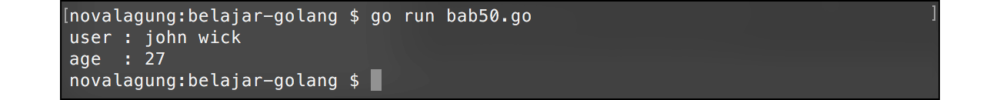

# A.50. JSON

**JSON** atau *Javascript Object Notation* adalah notasi standar yang umum digunakan untuk komunikasi data dalam web. JSON merupakan subset dari *javascript*.

Go menyediakan package `encoding/json` yang berisikan banyak fungsi untuk kebutuhan operasi json.

Di bab ini, kita akan belajar cara untuk konverstri string yang berbentuk json menjadi objek Go, dan sebaliknya.

## A.50.1. Decode JSON Ke Variabel Objek Struct

Di Go, data json dituliskan sebagai `string`. Dengan menggunakan `json.Unmarshal`, json string bisa dikonversi menjadi bentuk objek, entah itu dalam bentuk `map[string]interface{}` ataupun objek struct.

Program berikut ini adalah contoh cara decoding json ke bentuk objek. Pertama import package yang dibutuhkan, lalu siapkan struct `User`.

```go
package main

import "encoding/json"
import "fmt"

type User struct {
    FullName string `json:"Name"`
    Age      int
}
```

Struct `User` ini nantinya digunakan untuk membuat variabel baru penampung hasil decode json string. Proses decode sendiri dilakukan lewat fungsi `json.Unmarshal()`, dengan json string tersebut dimasukan ke statement fungsi tersebut.

Silakan tulis kode berikut.

```go
func main() {
    var jsonString = `{"Name": "john wick", "Age": 27}`
    var jsonData = []byte(jsonString)

    var data User

    var err = json.Unmarshal(jsonData, &data)
    if err != nil {
        fmt.Println(err.Error())
        return
    }

    fmt.Println("user :", data.FullName)
    fmt.Println("age  :", data.Age)
}
```

Fungsi unmarshal hanya menerima data json dalam bentuk `[]byte`, maka dari itu data json string pada kode di atas di-casting terlebih dahulu ke tipe `[]byte` sebelum dipergunakan pada fungsi unmarshal.

Juga, perlu diperhatikan, argument ke-2 fungsi unmarshal harus diisi dengan **pointer** dari objek yang nantinya akan menampung hasilnya.



Jika kita perhatikan lagi, pada struct `User`, salah satu property-nya yaitu `FullName` memiliki **tag** `json:"Name"`. Tag tersebut digunakan untuk mapping informasi json ke property yang bersangkutan.

Data json yang akan diparsing memiliki 2 property yaitu `Name` dan `Age`. Kebetulan penulisan `Age` pada data json dan pada struktur struct adalah sama, berbeda dengan `Name` yang tidak ada pada struct.

Dengan menambahkan tag json, maka property `FullName` struct akan secara cerdas menampung data json property `Name`.

> Pada kasus decoding data json string ke variabel objek struct, semua level akses property struct penampung harus publik.

## A.50.2. Decode JSON Ke `map[string]interface{}` & `interface{}`

Tak hanya ke objek cetakan struct, target decoding data json juga bisa berupa variabel bertipe `map[string]interface{}`.

```go
var data1 map[string]interface{}
json.Unmarshal(jsonData, &data1)

fmt.Println("user :", data1["Name"])
fmt.Println("age  :", data1["Age"])
```

Variabel bertipe `interface{}` juga bisa digunakan untuk menampung hasil decode. Dengan catatan pada pengaksesan nilai property, harus dilakukan casting terlebih dahulu ke `map[string]interface{}`.

```go
var data2 interface{}
json.Unmarshal(jsonData, &data2)

var decodedData = data2.(map[string]interface{})
fmt.Println("user :", decodedData["Name"])
fmt.Println("age  :", decodedData["Age"])
```

## A.50.3. Decode Array JSON Ke Array Objek

Decode data dari array json ke slice/array objek masih sama, siapkan saja variabel penampung hasil decode dengan tipe slice struct. Contohnya bisa dilihat pada kode berikut.

```go
var jsonString = `[
    {"Name": "john wick", "Age": 27},
    {"Name": "ethan hunt", "Age": 32}
]`

var data []User

var err = json.Unmarshal([]byte(jsonString), &data)
if err != nil {
    fmt.Println(err.Error())
    return
}

fmt.Println("user 1:", data[0].FullName)
fmt.Println("user 2:", data[1].FullName)
```

## A.50.4. Encode Objek Ke JSON String

Setelah sebelumnya dijelaskan beberapa cara decode data dari json string ke objek, sekarang kita akan belajar cara **encode** data objek ke bentuk json string.

Fungsi `json.Marshal` digunakan untuk encoding data ke json string. Sumber data bisa berupa variabel objek cetakan struct, `map[string]interface{}`, atau slice.

Pada contoh berikut, data slice struct dikonversi ke dalam bentuk json string. Hasil konversi berupa `[]byte`, casting terlebih dahulu ke tipe `string` agar bisa ditampilkan bentuk json string-nya.

```go
var object = []User{{"john wick", 27}, {"ethan hunt", 32}}
var jsonData, err = json.Marshal(object)
if err != nil {
    fmt.Println(err.Error())
    return
}

var jsonString = string(jsonData)
fmt.Println(jsonString)
```

Output:


---

<div class="source-code-link">
    <div class="source-code-link-message">Source code praktek pada bab ini tersedia di Github</div>
    <a href="https://github.com/novalagung/dasarpemrogramangolang-example/tree/master/chapter-A.50-json">https://github.com/novalagung/dasarpemrogramangolang-example/.../chapter-A.50...</a>
</div>
