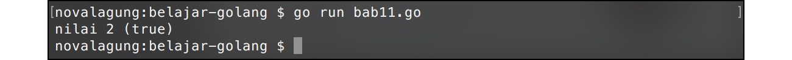

# A.12. Operator

Bab ini membahas mengenai macam operator yang bisa digunakan di Go. Secara umum terdapat 3 kategori operator: aritmatika, perbandingan, dan logika.

## A.12.1. Operator Aritmatika

Operator aritmatika adalah operator yang digunakan untuk operasi yang sifatnya perhitungan. Go mendukung beberapa operator aritmatika standar, list-nya bisa dilihat di tabel berikut.

| Tanda | Penjelasan |
| :---: | :--------- |
| `+` | penjumlahan |
| `-` | pengurangan |
| `*` | perkalian |
| `/` | pembagian |
| `%` | modulus / sisa hasil pembagian |

Contoh penggunaan:

```go
var value = (((2 + 6) % 3) * 4 - 2) / 3
```

## A.12.2. Operator Perbandingan

Operator perbandingan digunakan untuk menentukan kebenaran suatu kondisi. Hasilnya berupa nilai boolean, `true` atau `false`.

Tabel di bawah ini berisikan operator perbandingan yang bisa digunakan di Go.

| Tanda | Penjelasan |
| :---: | :--------- |
| `==`  | apakah nilai kiri **sama dengan** nilai kanan |
| `!=`  | apakah nilai kiri **tidak sama dengan** nilai kanan |
| `<`   | apakah nilai kiri **lebih kecil daripada** nilai kanan  |
| `<=`  | apakah nilai kiri **lebih kecil atau sama dengan** nilai kanan |
| `>`   | apakah nilai kiri **lebih besar dari** nilai kanan |
| `>=`  | apakah nilai kiri **lebih besar atau sama dengan** nilai kanan |

Contoh penggunaan:

```go
var value = (((2 + 6) % 3) * 4 - 2) / 3
var isEqual = (value == 2)

fmt.Printf("nilai %d (%t) \n", value, isEqual)
```

Pada kode di atas, terdapat statement operasi aritmatika yang hasilnya ditampung oleh variabel `value`. Selanjutnya, variabel tersebut tersebut dibandingkan dengan angka **2** untuk dicek apakah nilainya sama. Jika iya, maka hasilnya adalah `true`, jika tidak maka `false`. Nilai hasil operasi perbandingan tersebut kemudian disimpan dalam variabel `isEqual`.



Untuk memunculkan nilai `bool` menggunakan `fmt.Printf()`, bisa gunakan layout format `%t`.

## A.12.3. Operator Logika

Operator ini digunakan untuk mencari benar tidaknya kombinasi data bertipe `bool` (bisa berupa variabel bertipe `bool`, atau hasil dari operator perbandingan).

Beberapa operator logika standar yang bisa digunakan:

| Tanda | Penjelasan |
| :---: | :--------- |
| `&&` | kiri **dan** kanan |
| <code>&#124;&#124;</code> | kiri **atau** kanan |
| `!` | negasi / nilai kebalikan |

Contoh penggunaan:

```go
var left = false
var right = true

var leftAndRight = left && right
fmt.Printf("left && right \t(%t) \n", leftAndRight)

var leftOrRight = left || right
fmt.Printf("left || right \t(%t) \n", leftOrRight)

var leftReverse = !left
fmt.Printf("!left \t\t(%t) \n", leftReverse)
```

Hasil dari operator logika sama dengan hasil dari operator perbandingan, yaitu berupa boolean.


Berikut penjelasan statemen operator logika pada kode di atas.

 - `leftAndRight` bernilai `false`, karena hasil dari `false` **dan** `true` adalah `false`.
 - `leftOrRight` bernilai `true`, karena hasil dari `false` **atau** `true` adalah `true`.
 - `leftReverse` bernilai `true`, karena **negasi** (atau lawan dari) `false` adalah `true`.

Template `\t` digunakan untuk menambahkan indent tabulasi. Biasa dimanfaatkan untuk merapikan tampilan output pada console.

---

<div class="source-code-link">
    <div class="source-code-link-message">Source code praktek pada bab ini tersedia di Github</div>
    <a href="https://github.com/novalagung/dasarpemrogramangolang-example/tree/master/chapter-A.11-operator">https://github.com/novalagung/dasarpemrogramangolang-example/.../chapter-A.11...</a>
</div>
