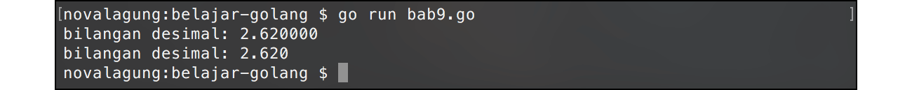

# A.10. Tipe Data

Go mengenal beberapa jenis tipe data, di antaranya adalah tipe data numerik (desimal & non-desimal), string, dan boolean.

Pada pembahasan-pembahasan sebelumnya secara tak sadar kita sudah mengaplikasikan beberapa tipe data, seperti `string` dan tipe numerik `int`.

Pada chapter ini akan dijelaskan beberapa macam tipe data standar yang disediakan oleh Go, beserta cara penggunaannya.

## A.10.1. Tipe Data Numerik Non-Desimal

Tipe data numerik non-desimal atau **non floating point** di Go ada beberapa jenis. Secara umum ada 2 tipe data kategori ini yang perlu diketahui.

 - `uint`, tipe data untuk bilangan cacah (bilangan positif).
 - `int`, tipe data untuk bilangan bulat (bilangan negatif dan positif).

Kedua tipe data di atas kemudian dibagi lagi menjadi beberapa jenis, dengan pembagian berdasarkan lebar cakupan nilainya, detailnya bisa dilihat di tabel berikut.

| Tipe data | Cakupan bilangan |
| :-------: | :---- |
| `uint8` | 0 ↔ 255 |
| `uint16` | 0 ↔ 65535 |
| `uint32` | 0 ↔ 4294967295 |
| `uint64` | 0 ↔ 18446744073709551615 |
| `uint` | sama dengan `uint32` atau `uint64` (tergantung nilai) |
| `byte` | sama dengan `uint8` |
| `int8` | -128 ↔ 127 |
| `int16` | -32768 ↔ 32767 |
| `int32` | -2147483648 ↔ 2147483647 |
| `int64` | -9223372036854775808 ↔ 9223372036854775807 |
| `int` | sama dengan `int32` atau `int64` (tergantung nilai) |
| `rune` | sama dengan `int32` |

Dianjurkan untuk tidak sembarangan dalam menentukan tipe data variabel, sebisa mungkin tipe yang dipilih harus disesuaikan dengan nilainya, karena efeknya adalah ke alokasi memori variabel. Pemilihan tipe data yang tepat akan membuat pemakaian memori lebih optimal, tidak berlebihan.

```go
var positiveNumber uint8 = 89
var negativeNumber = -1243423644

fmt.Printf("bilangan positif: %d\n", positiveNumber)
fmt.Printf("bilangan negatif: %d\n", negativeNumber)
```

Variabel `positiveNumber` bertipe `uint8` dengan nilai awal `89`. Sedangkan variabel `negativeNumber` dideklarasikan dengan nilai awal `-1243423644`. Compiler secara cerdas akan menentukan tipe data variabel tersebut sebagai `int32` (karena angka tersebut masuk ke cakupan tipe data `int32`).

Template `%d` pada `fmt.Printf()` digunakan untuk memformat data numerik non-desimal.

## A.10.2. Tipe Data Numerik Desimal

Tipe data numerik desimal yang perlu diketahui ada 2, `float32` dan `float64`. Perbedaan kedua tipe data tersebut berada di lebar cakupan nilai desimal yang bisa ditampung. Untuk lebih jelasnya bisa merujuk ke spesifikasi [IEEE-754 32-bit floating-point numbers](http://www.h-schmidt.net/FloatConverter/IEEE754.html).

```go
var decimalNumber = 2.62

fmt.Printf("bilangan desimal: %f\n", decimalNumber)
fmt.Printf("bilangan desimal: %.3f\n", decimalNumber)
```

Pada kode di atas, variabel `decimalNumber` akan memiliki tipe data `float32`, karena nilainya berada di cakupan tipe data tersebut.



Template `%f` digunakan untuk memformat data numerik desimal menjadi string. Digit desimal yang akan dihasilkan adalah **6 digit**. Pada contoh di atas, hasil format variabel `decimalNumber` adalah `2.620000`. Jumlah digit yang muncul bisa dikontrol menggunakan `%.nf`, tinggal ganti `n` dengan angka yang diinginkan. Contoh: `%.3f` maka akan menghasilkan 3 digit desimal, `%.10f` maka akan menghasilkan 10 digit desimal.

## A.10.3. Tipe Data `bool` (Boolean)

Tipe data `bool` berisikan hanya 2 variansi nilai, `true` dan `false`. Tipe data ini biasa dimanfaatkan dalam seleksi kondisi dan perulangan (yang nantinya akan kita bahas pada [A.13. Seleksi Kondisi](/A-seleksi-kondisi.html) dan [A.14. Perulangan](/A-perulangan.html)).

```go
var exist bool = true
fmt.Printf("exist? %t \n", exist)
```

Gunakan `%t` untuk memformat data `bool` menggunakan fungsi `fmt.Printf()`.

## A.10.4. Tipe Data `string`

Ciri khas dari tipe data string adalah nilainya di apit oleh tanda *quote* atau petik dua (`"`). Contoh penerapannya:

```go
var message string = "Halo"
fmt.Printf("message: %s \n", message)
```

Selain menggunakan tanda quote, deklarasi string juga bisa dengan tanda *grave accent/backticks* (<code>`</code>), tanda ini terletak di sebelah kiri tombol 1. Keistimewaan string yang dideklarasikan menggunakan backtics adalah membuat semua karakter di dalamnya **tidak di escape**, termasuk `\n`, tanda petik dua dan tanda petik satu, baris baru, dan lainnya. Semua akan terdeteksi sebagai string.

```go
var message = `Nama saya "John Wick".
Salam kenal.
Mari belajar "Golang".`

fmt.Println(message)
```

Ketika dijalankan, output akan muncul sama persisi sesuai nilai variabel `message` di atas. Tanda petik dua akan muncul, baris baru juga muncul, sama persis.


## A.10.5. Nilai `nil` & Zero Value

`nil` bukan merupakan tipe data, melainkan sebuah nilai. Variabel yang isi nilainya `nil` berarti memiliki nilai kosong.

Semua tipe data yang sudah dibahas di atas memiliki zero value (nilai default tipe data). Artinya meskipun variabel dideklarasikan dengan tanpa nilai awal, tetap akan ada nilai default-nya.

 - Zero value dari `string` adalah `""` (string kosong).
 - Zero value dari `bool` adalah `false`.
 - Zero value dari tipe numerik non-desimal adalah `0`.
 - Zero value dari tipe numerik desimal adalah `0.0`.

Zero value berbeda dengan `nil`. `Nil` adalah nilai kosong, benar-benar kosong. `nil` tidak bisa digunakan pada tipe data yang sudah dibahas di atas. Ada beberapa tipe data yang bisa di-set nilainya dengan `nil`, di antaranya:

- pointer
- tipe data fungsi
- slice
- `map`
- `channel`
- interface kosong atau `any` (yang merupakan alias dari `interface{}`)

> Tipe data `any` hanya tersedia pada go versi `1.18` ke atas


Nantinya kita akan sering bertemu dengan `nil` setelah masuk pada pembahasan-pembahasan tersebut.

---

<div class="source-code-link">
    <div class="source-code-link-message">Source code praktek chapter ini tersedia di Github</div>
    <a href="https://github.com/novalagung/dasarpemrogramangolang-example/tree/master/chapter-A.10-tipe-data">https://github.com/novalagung/dasarpemrogramangolang-example/.../chapter-A.10...</a>
</div>
