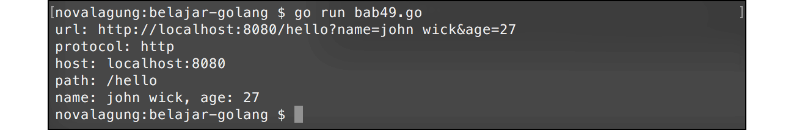

# A.52. URL Parsing

Data string url bisa dikonversi ke dalam bentuk `url.URL`. Dengan menggunakan tipe tersebut akan ada banyak informasi yang bisa kita manfaatkan, di antaranya adalah jenis protokol yang digunakan, path yang diakses, query, dan lainnya.

Berikut adalah contoh sederhana konversi string ke `url.URL`.

```go
package main

import "fmt"
import "net/url"

func main() {
    var urlString = "http://kalipare.com:80/hello?name=john wick&age=27"
    var u, e = url.Parse(urlString)
    if e != nil {
        fmt.Println(e.Error())
        return
    }

    fmt.Printf("url: %s\n", urlString)

    fmt.Printf("protocol: %s\n", u.Scheme) // http
    fmt.Printf("host: %s\n", u.Host)       // kalipare.com:80
    fmt.Printf("path: %s\n", u.Path)       // /hello

    var name = u.Query()["name"][0] // john wick
    var age = u.Query()["age"][0]   // 27
    fmt.Printf("name: %s, age: %s\n", name, age)
}
```

Fungsi `url.Parse()` digunakan untuk parsing string ke bentuk url. Mengembalikan 2 data, variabel objek bertipe `url.URL` dan error (jika ada). Lewat variabel objek tersebut pengaksesan informasi url akan menjadi lebih mudah, contohnya seperti nama host bisa didapatkan lewat `u.Host`, protokol lewat `u.Scheme`, dan lainnya.

Selain itu, query yang ada pada url akan otomatis diparsing juga, menjadi bentuk `map[string][]string`, dengan key adalah nama elemen query, dan value array string yang berisikan value elemen query.



---

<div class="source-code-link">
    <div class="source-code-link-message">Source code praktek chapter ini tersedia di Github</div>
    <a href="https://github.com/novalagung/dasarpemrogramangolang-example/tree/master/chapter-A.52-url-parsing">https://github.com/novalagung/dasarpemrogramangolang-example/.../chapter-A.52...</a>
</div>

---

<iframe src="https://novalagung.substack.com/embed" width="100%" height="320" class="substack-embed" frameborder="0" scrolling="no"></iframe>
