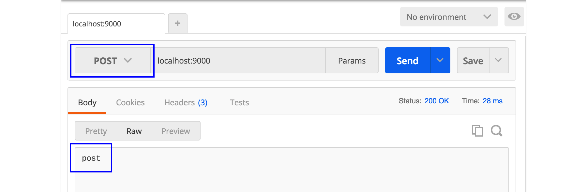
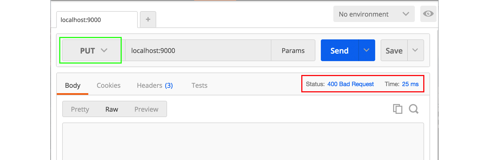

# B.11. HTTP Method: POST & GET

Setelah sebelumnya kita telah mempelajari banyak hal yang berhubungan dengan template view, kali ini topik yang terpilih sedikit berbeda, yaitu mengenai penanganan http request di back end.

Sebuah route handler pada dasarnya bisa menerima segala jenis request dalam artian apapun HTTP method-nya. Seperti **POST**, **GET**, dan atau lainnya. Untuk memisah request berdasarkan method-nya, bisa menggunakan seleksi kondisi.

> Pada bab lain kita akan belajar teknik routing yg lebih advance dengan bantuan routing library.

## B.11.1. Praktek

Silakan pelajari dan praktekkan kode berikut.

```go
package main

import "net/http"
import "fmt"

func main() {
	http.HandleFunc("/", func(w http.ResponseWriter, r *http.Request) {
		if r.Method == "POST" {
			w.Write([]byte("post"))
		} else if r.Method == "GET" {
			w.Write([]byte("get"))
		} else {
			http.Error(w, "", http.StatusBadRequest)
		}
	})

	fmt.Println("server started at localhost:9000")
	http.ListenAndServe(":9000", nil)
}
```

Struct `*http.Request` memiliki property bernama `Method` yang bisa digunakan untuk mengecek method daripada request yang sedang berjalan.

Pada contoh di atas, request ke rute `/` dengan method POST akan menghasilkan output text `post`, sedangkan method GET menghasilkan output text `get`.

## B.11.2. Test

Gunakan [postman](https://chrome.google.com/webstore/detail/postman/fhbjgbiflinjbdggehcddcbncdddomop?hl=en), atau tools sejenisnya untuk mempermudah testing. Berikut adalah contoh request dengan method GET.


Sedangkan di bawah ini adalah untuk method POST.



Jika method yang digunakan adalah selain POST dan GET, maka sesuai source code di atas, harusnya request akan menghasilkan response **400 Bad Request**. Di bawah ini adalah contoh request dengan method **PUT**.


