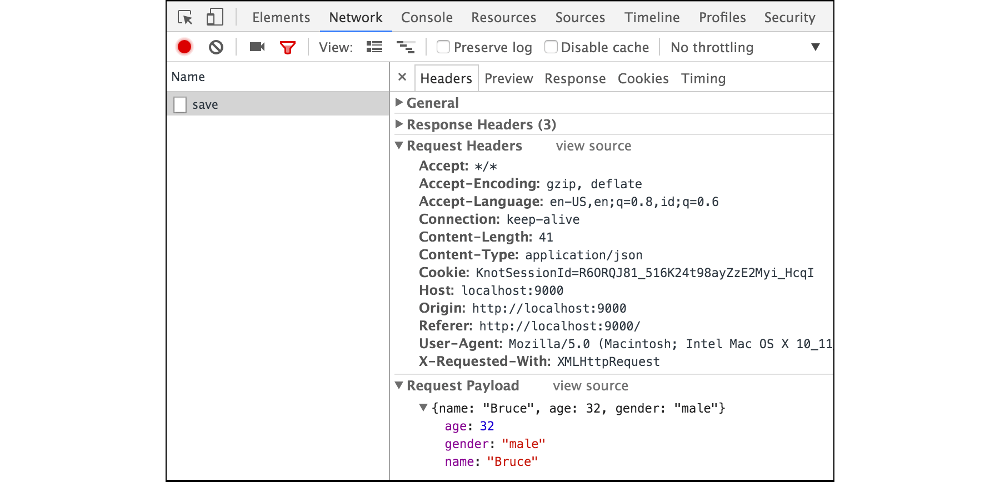

# B.14. AJAX JSON Payload

Sebelumnya kita telah belajar bagaimana cara submit data dari front-end ke back-end menggunakan teknik **Form Data**. Kali ini kita akan belajar tentang cara request menggunakan teknik **Request Payload** dengan tipe payload adalah **JSON**.

Teknik request **Form Data** digunakan salah satu nya pada request submit lewat `<form />`. Pada bab ini, kita tidak akan menggunakan cara submit lewat form, melainkan menggunakan teknik AJAX (Asynchronous JavaScript And XML), dengan payload ber-tipe JSON.

[Perbedaan](http://stackoverflow.com/a/23152367/1467988) antara kedua jenis request tersebut adalah pada isi header `Content-Type`, dan bentuk informasi dikirimkan. Secara default, request lewat `<form />`, content type-nya adalah `application/x-www-form-urlencoded`. Data dikirimkan dalam bentuk query string (key-value) seperti `id=n001&nama=bruce`.

> Ketika di form ditambahkan atribut `enctype="multipart/form-data"`, maka content type berubah menjadi `multipart/form-data`.

Request Payload JSON sedikit berbeda, `Content-Type` berisikan `application/json`, dan data disisipkan dalam `Body` dalam bentuk **JSON** string.

## B.14.1. Struktur Folder Proyek 

OK, langsung saja, pertama siapkan proyek dengan struktur seperti pada gambar di bawah ini.


> Silakan unduh file js jQuery dari situs official-nya.

## B.14.2. Front End - HTML

Layout dari view perlu disiapkan terlebih dahulu, tulis kode berikut pada file `view.html`.

```html
<!DOCTYPE html>
<html>
	<head>
		<title>JSON Payload</title>
		<script src="static/jquery-1.12.0.min.js"></script>
		<script>
			$(function () {
				// javascript code here
			});
		</script>
	</head>
	<body>
		<p class="message"></p>
		<form id="user-form" method="post" action="/save">
			<!-- html code here -->
		</form>
	</body>
</html>
```

Selanjutnya, pada tag `<form />` tambahkan tabel sederhana berisikan inputan-inputan yang diperlukan. Ada tiga buah inputan yang harus dipersiapkan, yaitu: *Name*, *Age*, dan *Gender*; dan juga sebuah button untuk submit form.

```html
<table noborder>
	<tr>
		<td><label>Name :</label></td>
		<td>
			<input required type="text" name="name" placeholder="Type name here" />
		</td>
	</tr>
	<tr>
		<td><label>Age :</label></td>
		<td>
			<input required type="number" name="age" placeholder="Set age" />
		</td>
	</tr>
	<tr>
		<td><label>Gender :</label></td>
		<td>
			<select name="gender" required style="width: 100%;">
				<option value="">Select one</option>
				<option value="male">Male</option>
				<option value="female">Female</option>
			</select>
		</td>
	</tr>
	<tr>
		<td colspan="2" style="text-align: right;">
			<button type="submit">Save</button>
		</td>
	</tr>
</table>
```

## B.14.3. Front End - HTML

Sekarang kita masuk ke bagian paling menyenangkan/menyebalkan (tergantung taste), yaitu javascript. Siapkan sebuah event `submit` pada `#user-form`. Dalam event tersebut default handler event submit milik `<form />` di-override, diganti dengan AJAX request.

```js
$("#user-form").on("submit", function (e) {
	e.preventDefault();

	var $self = $(this);
	var payload = JSON.stringify({
		name: $('[name="name"]').val(),
		age: parseInt($('[name="age"]').val(), 10),
		gender: $('[name="gender"]').val()
	});

	$.ajax({
		url: $self.attr("action"),
		type: $self.attr("method"),
		data: payload,
		contentType: 'application/json',
	}).then(function (res) {
		$(".message").text(res);
	}).catch(function (a) {
		alert("ERROR: " + a.responseText);
	});
});
```

Value semua inputan diambil lalu dimasukkan dalam sebuah objek lalu di stringify (agar menjadi JSON string), untuk kemudian di jadikan sebagai payload request. Bisa dilihat pada kode AJAX di atas, `contentType` nilainya adalah `application/json`. 

Respon dari ajax di atas akan dimunculkan pada `<p class="message"></p>`.

## B.14.4. Back End

3 buah rute perlu disiapkan, yang pertama adalah untuk menampilkan `view.html`, untuk keperluan submit data, dan registrasi asset.

```go
package main

import "fmt"
import "net/http"
import "html/template"
import "encoding/json"

func main() {
	http.HandleFunc("/", handleIndex)
	http.HandleFunc("/save", handleSave)

	http.Handle("/static/", 
		http.StripPrefix("/static/", 
			http.FileServer(http.Dir("assets"))))

	fmt.Println("server started at localhost:9000")
	http.ListenAndServe(":9000", nil)
}
```

Handler `handleIndex` berisikan kode untuk parsing `view.html`.

```go
func handleIndex(w http.ResponseWriter, r *http.Request) {
	tmpl := template.Must(template.ParseFiles("view.html"))
	if err := tmpl.Execute(w, nil); err != nil {
		http.Error(w, err.Error(), http.StatusInternalServerError)
	}
}
```

Sedangkan `handleSave` akan memproses request yang di-submit dari bagian depan.

```go
func handleSave(w http.ResponseWriter, r *http.Request) {
	if r.Method == "POST" {
		decoder := json.NewDecoder(r.Body)
		payload := struct {
			Name   string `json:"name"`
			Age    int    `json:"age"`
			Gender string `json:"gender"`
		}{}
		if err := decoder.Decode(&payload); err != nil {
			http.Error(w, err.Error(), http.StatusInternalServerError)
			return
		}

		message := fmt.Sprintf(
			"hello, my name is %s. I'm %d year old %s", 
			payload.Name, 
			payload.Age, 
			payload.Gender,
		)
		w.Write([]byte(message))
		return
	}

	http.Error(w, "Only accept POST request", http.StatusBadRequest)
}
```

Isi payload didapatkan dengan cara men-decode body request (`r.Body`). Proses decoding tidak dilakukan menggunakan `json.Unmarshal()` melainkan lewat json decoder, karena akan [lebih efisien](http://stackoverflow.com/a/21198571/1467988) untuk jenis kasus seperti ini.

> Gunakan `json.Decoder` jika data adalah stream `io.Reader`. Gunakan `json.Unmarshal()` untuk decode data sumbernya sudah ada di memory.

## B.14.5. Test

Jalankan program, test hasilnya di browser.


Gunakan fasilitas Developer Tools pada Chrome untuk melihat detail dari request.



---

<div class="source-code-link">
    <div class="source-code-link-message">Source code praktek pada bab ini tersedia di Github</div>
    <a href="https://github.com/novalagung/dasarpemrogramangolang/tree/master/chapter-B.14-ajax-json-payload">https://github.com/novalagung/dasarpemrogramangolang/.../chapter-B.14...</a>
</div>
