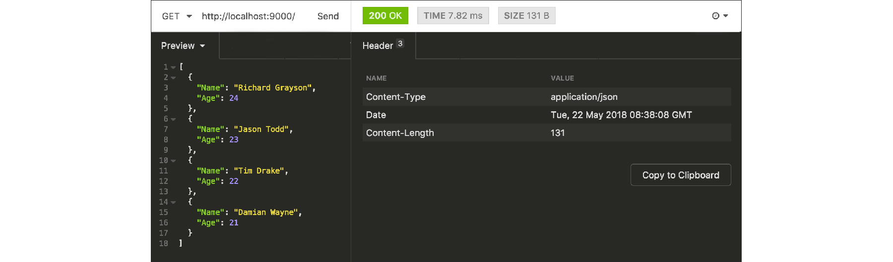

# B.15. AJAX JSON Response

Pada bab sebelumnya, kita belajar cara untuk memproses request dengan paylaod JSON string. Pada bab ini kita akan belajar untuk membuat satu endpoint yang mengembalikan data JSON string.

## B.15.1. Praktek

Siapkan satu buah folder proyek baru, dengan satu buah file di dalamnya bernama `main.go`. Dalam file ini siapkan rute `/`.

```go
package main

import "fmt"
import "net/http"
import "encoding/json"

func main() {
    http.HandleFunc("/", ActionIndex)

    fmt.Println("server started at localhost:9000")
    http.ListenAndServe(":9000", nil)
}
```

Selanjutnya buat handler untuk rute `/`. Di dalam fungsi ini, data dummy ber-tipe slice object disiapkan. Data ini akan dikonversi ke JSON lalu dijadikan nilai balik endpoint `/`.

```go
func ActionIndex(w http.ResponseWriter, r *http.Request) {
    data := [] struct {
        Name string
        Age  int
    } {
        { "Richard Grayson", 24 },
        { "Jason Todd", 23 },
        { "Tim Drake", 22 },
        { "Damian Wayne", 21 },
    }

    jsonInBytes, err := json.Marshal(data)
    if err != nil {
        http.Error(w, err.Error(), http.StatusInternalServerError)
        return
    }

    w.Header().Set("Content-Type", "application/json")
    w.Write(jsonInBytes)
}
```

Cara mengkonversi data ke bentuk json cukup mudah, bisa menggunakan `json.Marshal()`. Fungsi ini mengembalikan dua nilai balik, data json (dalam bentuk `[]byte`) dan error jika ada. 

> Untuk mengambil bentuk string dari hasil konversi JSON, cukup lakukan casting pada data slice bytes tersebut. Contoh: `string(jsonInBytes)`

Karena nilai balik konversi sudah dalam bentuk bytes, maka langsung saja panggil method `Write()` milik `http.ResponseWriter` dan sisipkan data json sebagai argument.

Jangan lupa juga untuk menambahkan response header `Content-Type: application/json`.

## B.15.2. Testing

OK, semua sudah selesai, lakukan testing.



## B.15.3. JSON Response menggunakan JSON.Encoder

Di bab sebelumnya sudah disinggung, bahwa lebih baik menggunakan `json.Decoder` jika ingin men-decode data yang sumbernya ada di stream `io.Reader`

Package json juga memiliki fungsi lain-nya yaitu `json.Encoder`, yang sangat cocok digunakan untuk meng-encode data menjadi JSON dengan tujuan objek langsung ke stream `io.Reader`. 

Karena tipe `http.ResponseWriter` adalah meng-embed `io.Reader`, maka jelasnya bisa kita terapkan penggunaan encoder di sini. 

Contohnya penerapannya sebagai berikut.

```go
w.Header().Set("Content-Type", "application/json")

err := json.NewEncoder(w).Encode(data)
if err != nil {
    http.Error(w, err.Error(), http.StatusInternalServerError)
    return
}
```

Kode di atas hasilnya ekuivalen dengan penggunaan `json.Marshal`.
