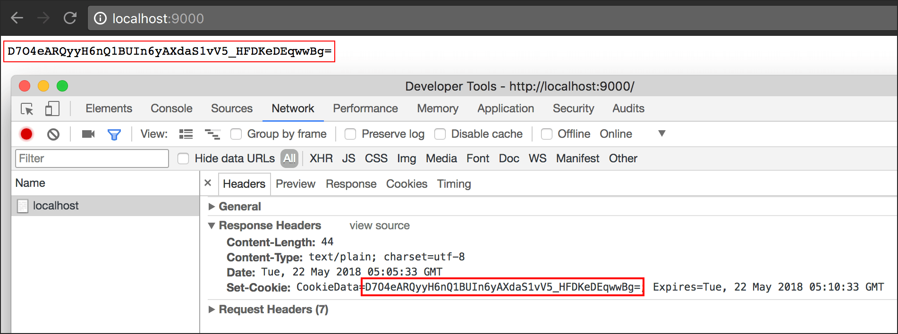

# B.21. HTTP Cookie

Cookie adalah data dalam bentuk teks yang disimpan pada komputer (oleh web browser) ketika pengunjung sedang surfing ke sebuah situs. Cookie dapat dibuat dari sisi front end (javascript) maupun back end (dalam konteks ini golang).

Cookie merupakan salah satu aspek penting dalam pengembangan aplikasi web. Sangat sering kita membutuhkan sebuah data bisa disimpan dan diakses untuk keperluan aplikasi web kita, seperti pengecekan preferensi pengunjung, pengecekan status login tidak nya user.

Pada bab ini kita akan belajar bagaimana cara membuat dan mengakses cookie di golang.

## B.21.1. Praktek

Buat sebuah folder proyek, siapkan satu buah file `main.go`. Buat fungsi `main()`, registrasikan dua buah rute.


```go
package main

import (
    "fmt"
    "github.com/novalagung/gubrak"
    "net/http"
    "time"
)

type M map[string]interface{}

var cookieName = "CookieData"

func main() {
    http.HandleFunc("/", ActionIndex)
    http.HandleFunc("/delete", ActionDelete)

    fmt.Println("server started at localhost:9000")
    http.ListenAndServe(":9000", nil)
}
```

Variabel `cookieName` berisikan string, akan kita gunakan sebagai nama cookie.

 - Rute `/` bertugas untuk membuat cookie baru (jika belum ada atau cookie sudah ada namun expired).
 - Rute `/delete` mempunyai tugas untuk menghapus cookie, lalu redirect ke `/` sehingga cookie baru akan dibuat

OK, sekarang buat fungsi handler `ActionIndex()`. Di dalam fungsi ini, data berupa random string disimpan dalam cookie.

```go
func ActionIndex(w http.ResponseWriter, r *http.Request) {
    cookieName := "CookieData"

    c := &http.Cookie{}

    if storedCookie, _ := r.Cookie(cookieName); storedCookie != nil {
        c = storedCookie
    }

    if c.Value == "" {
        c = &http.Cookie{}
        c.Name = cookieName
        c.Value = gubrak.RandomString(32)
        c.Expires = time.Now().Add(5 * time.Minute)
        http.SetCookie(w, c)
    }

    w.Write([]byte(c.Value))
}
```

Cookie bisa dikases lewat method `.Cookie()` milik objek `*http.Request`. Method ini mengembalikan 2 informasi: 

 - Objek cookie 
 - Error, jika ada

Pada kode di atas, ketika `storedCookie` nilainya bukanlah `nil` (berarti cookie dengan nama `cookieName` sudah dibuat), maka objek cookie tersebut disimpan dalam `c`.

Pembuatan cookie cukup mudah, tinggal cetak saja objek baru dari struct `http.Cookie`.

Jika `c.Value` adalah kosong, kita asumsikan bahwa cookie belum pernah dibuat (atau expired), maka kita buat cookie baru dengan data adalah random string. 

> Untuk mempermudah generate random string, kita gunakan library bernama [gubrak](https://github.com/novalagung/gubrak). Fungsi `gubrak.RandomString(32)` akan menghasilkan string ajak 32 karakter.

Cookie bisa expired. Lama cookie aktif ditentukan lewat property `Expires`. Pada kode di atas expiration duration kita set selama 5 menit.

Gunakan `http.SetCookie()` untuk menyimpan cookie yang baru dibuat.

OK, selanjutnya buat handler `ActionDelete()`, seperti yang sudah disinggung di atas. Handler ini difungsikan untuk menghapus cookie dengan nama `cookieName`, lalu redirect ke `/` agar cookie baru diciptakan.

```go
func ActionDelete(w http.ResponseWriter, r *http.Request) {
    c := &http.Cookie{}
    c.Name = cookieName
    c.Expires = time.Unix(0, 0)
    c.MaxAge = -1
    http.SetCookie(w, c)

    http.Redirect(w, r, "/", http.StatusTemporaryRedirect)
}
```

Cara menghapus cookie adalah dengan menge-set ulang cookie dengan nama yang sama, dengan isi property `Expires = time.Unix(0, 0)` dan `MaxAge = -1`. Tujuannya agar cookie expired.

## B.21.2. Testing

Jalankan aplikasi, lalu akses `/`. Sebuah random string akan muncul di layar, dan jika kita cek pada bagian response header, informasi cookie nya juga tampil.



Coba refresh page beberapa kali, informasi header cookie dan data yang muncul adalah tetap sama. Karena ketika cookie sudah pernah dibuat, maka seterusnya endpoint ini akan menggunakan data cookie yang sudah tersimpan tersebut.

Selanjutnya, buka url `/delete`, halaman akan di redirect kembali ke `/`, dan random string baru beserta cookie baru terbuat. Dalam endpoint ini, cookie di hapus, dan karena step selanjutnya adalah redirect ke `/`, maka proses pengecekan dan pembuatan cookie akan dimulai kembali. Pengunjung akan mendapatkan data cookie baru dengan nama yang sama.

## B.21.3. Properties Object `http.Cookie`

Objek cookie memiliki beberapa property, beberapa diantaranya:

| Property | Tipe Data | Deskripsi |
| -------- | --------- | --------- |
| Value | `string` | Data yang disimpan di cookie |
| Path | `string` | Scope path cookie |
| Domain | `string` | Scope domain cookie |
| Expires | `time.Time` | Durasi cookie, ditulis dalam tipe `time.Time` |
| MaxAge | `int` | Durasi cookie, ditulis dalam detik (numerik) |
| Secure | `bool` | Scope cookie dalam konteks protocol yang digunakan ketika pengaksesan web. Proprty ini hanya berguna pada saat web server SSL/TLS enabled.<br /><ul><li>Jika <code>false</code>, maka cookie yang disimpan ketika web diakses menggunakan protocol <code>http://</code>, tetap bisa diakses lewat <code>https://</code>, dan berlaku juga untuk kebalikannya.</li><li>Jika <code>true</code>, pada saat pengaksesan lewat protokol <code>https://</code>, maka data cookie akan di-enkripsi. Sedangkan pada pengaksesan lewat protokol <code>http://</code> cookie disimpan seperti biasa (tanpa dienkripsi). Jika dalam satu web server, dua protokol tersebut bisa diakses, <code>https://</code> dan <code>https://</code>, maka aturan di atas tetap berlaku untuk masing-masing protokol, dengan catatan data yang disimpan lewat <code>https://</code> hanya bisa diakses lewat protokol tersebut.</li></ul> |
| HttpOnly | `bool` | <ul><li>Jika <code>false</code>, maka cookie bisa dibuat lewat back end (golang), maupun lewat front end (javascript)</li><li>Jika <code>true</code>, maka cookie hanya bisa diciptakan dari back end</li></ul> |

---

 - [Gubrak](https://github.com/novalagung/gubrak), by Noval Agung, MIT license
