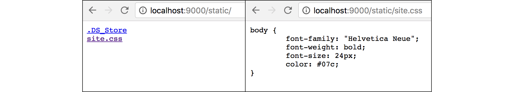

# B.3. Routing Static Assets

Pada bagian ini kita akan belajar bagaimana cara routing static assets atau static contents. Seperti file css, js, gambar, umumnya dikategorikan sebagai static assets.

## B.3.1. Struktur Aplikasi

Buat project baru, siapkan file dan folder dengan struktur sesuai dengan gambar berikut.


Dalam folder `assets`, isi dengan file apapun, bisa gambar atau file js. Selanjutnya masuk ke bagian routing static assets.

## B.3.2. Routing

Berbeda dengan routing menggunakan `http.HandleFunc()`, routing static assets lebih mudah. Silakan tulis kode berikut dalam `main.go`, setelahnya kita akan bahas secara mendetail.

```go
package main

import "fmt"
import "net/http"

func main() {
    http.Handle("/static/",
        http.StripPrefix("/static/",
            http.FileServer(http.Dir("assets"))))

    fmt.Println("server started at localhost:9000")
    http.ListenAndServe(":9000", nil)
}
```

Syarat yang dibutuhkan untuk routing static assets masih sama dengan routing handler, yaitu perlu didefiniskan rute-nya dan handler-nya. Hanya saja pembedanya, dalam routing static assets yang digunakan adalah `http.Handle()`, bukan `http.HandleFunc()`.

 1. Rute terpilih adalah `/static/`, maka nantinya semua request yang di-awali dengan `/static/` akan diarahkan ke sini. Registrasi rute menggunakan `http.Handle()` adalah berbeda dengan routing menggunakan `http.HandleFunc()`, lebih jelasnya akan ada sedikit penjelasan di bab lain.

 2. Sedang untuk handler-nya bisa di-lihat, ada pada parameter ke-2 yang isinya statement `http.StripPrefix()`. Sebenarnya actual handler nya berada pada `http.FileServer()`. Fungsi `http.StripPrefix()` hanya digunakan untuk membungkus actual handler.

Fungsi `http.FileServer()` mengembalikan objek ber-tipe `http.Handler`. Fungsi ini berguna untuk men-serve semua http request, dengan konten yang didefinisikan pada parameter. Pada konteks ini yang di-maksud adalah `http.Dir("assets")`. Semua konten, entah file ataupun folder, yang ada di dalam folder `assets` akan di proses dalam handler.

Jalankan `main.go`, lalu test hasilnya di browser `http://localhost:9000/static/`.



## B.3.3. Penjelasan

Penjelasan akan lebih mudah dipahami jika disajikan juga contoh praktek, maka sejenak kita coba bahas menggunakan contoh sederhana berikut.

```go
http.Handle("/", http.FileServer(http.Dir("assets")))
```

Jika dilihat pada struktur folder yang sudah di-buat, di dalam folder `assets` terdapat file bernama `site.css`. Maka dengan bentuk routing pada contoh sederhana di atas, request ke `/site.css` akan diarahkan ke path `./site.css` (relatif dari folder `assets`). Permisalan contoh lainnya:

 * Request ke `/site.css` mengarah path `./site.css` relatif dari folder `assets`
 * Request ke `/script.js` mengarah path `./script.js` relatif dari folder `assets`
 * Request ke `/some/folder/test.png` mengarah path `./some/folder/test.png` relatif dari folder `assets`
 * ... dan seterusnya

> Fungsi `http.Dir()` berguna untuk adjustment path parameter. Separator dari path yang di-definisikan akan otomatis di-konversi ke path separator sesuai sistem operasi.

Contoh selainjutnya, silakan perhatikan kode berikut.

```go
http.Handle("/static", http.FileServer(http.Dir("assets")))
```

Hasil dari routing:

 * Request ke `/static/site.css` mengarah ke `./static/site.css` relatif dari folder `assets`
 * Request ke `/static/script.js` mengarah ke `./static/script.js` relatif dari folder `assets`
 * Request ke `/static/some/folder/test.png` mengarah ke `./static/some/folder/test.png` relatif dari folder `assets`
 * ... dan seterusnya

Terlihat bahwa rute yang didaftarkan juga akan digabung dengan path destinasi file yang dicari, dan ini menjadikan path tidak valid. File `site.css` berada pada path `assets/site.css`, sedangkan dari routing di atas pencarian file mengarah ke path `assets/static/site.css`. Di sinilah kegunaan dari fungsi `http.StripPrefix()`.

Fungsi `http.StripPrefix()` ini berguna untuk menghapus prefix dari endpoint yang di-request. Pada contoh paling atas, request ke url yang di-awali dengan `/static/` hanya akan di ambil url setelahnya.

 * Request ke `/static/site.css` menjadi `/site.css`
 * Request ke `/static/script.js` menjadi `/script.js`
 * Request ke `/static/some/folder/test.png` menjadi `/some/folder/test.png`
 * ... dan seterusnya

Routing static assets menjadi valid, karena file yang di-request akan cocok dengan path folder dari file yang di request.
