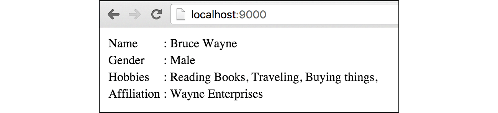
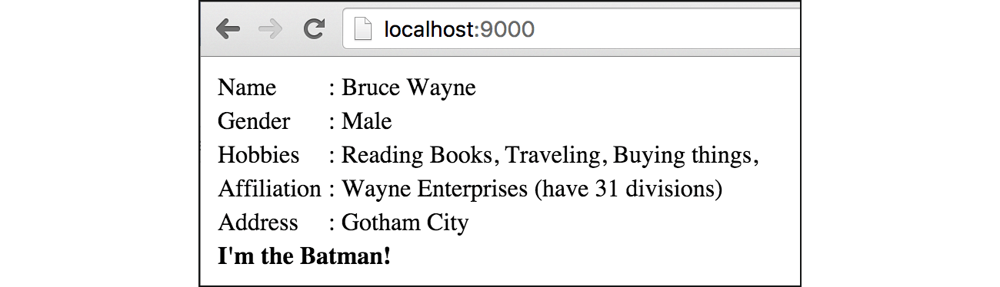

# B.6. Template: Actions & Variables

[**Actions**](https://golang.org/pkg/text/template/#hdr-Actions) adalah *predefined* keyword yang sudah disediakan Go, biasa dimanfaatkan dalam pembuatan template. 

Sebenarnya pada dua chapter sebelumnya, secara tidak sadar kita telah menggunakan beberapa jenis actions, di antaranya:

 - Penggunaan **pipeline output**. Nilai yang diapit tanda <code>\{\{ \}\}</code>, yang nantinya akan dimunculkan di layar sebagai output, contohnya: <code>\{\{"hello world"\}\}</code>.
 - Include template lain menggunakan keyword `template`, contohnya: <code>\{\{template "name"\}\}</code>.

Pada chapter ini, kita akan belajar lebih banyak lagi tentang actions lain yang disediakan Go, juga cara pembuatan dan pemanfaatan variabel pada template view.

## B.6.1. Persiapan

Pertama-tama, siapkan sebuah file bernama `main.go`, lalu isi dengan kode berikut.

```go
package main

import "net/http"
import "fmt"
import "html/template"

type Info struct {
	Affiliation string
	Address     string
}

type Person struct {
	Name    string
	Gender  string
	Hobbies []string
	Info    Info
}
```

Pada kode di atas, dua buah struct disiapkan, `Info` dan `Person` (yang di mana struct `Info` di-embed ke dalam struct `Person`). Kedua struct tersebut nantinya akan digunakan untuk pembuatan objek, yang kemudian object tersebut disisipkan ke dalam view.

Selanjutnya, siapkan fungsi `main()`, dengan di dalamnya berisikan 1 buah route handler `/`, dan juga kode untuk menjalankan server pada port `9000`.

```go
func main() {
	http.HandleFunc("/", func(w http.ResponseWriter, r *http.Request) {
		var person = Person{
			Name:    "Bruce Wayne",
			Gender:  "male",
			Hobbies: []string{"Reading Books", "Traveling", "Buying things"},
			Info:    Info{"Wayne Enterprises", "Gotham City"},
		}

		var tmpl = template.Must(template.ParseFiles("view.html"))
		if err := tmpl.Execute(w, person); err != nil {
			http.Error(w, err.Error(), http.StatusInternalServerError)
		}
	})

	fmt.Println("server started at localhost:9000")
	http.ListenAndServe(":9000", nil)
}
```

Pada route handler `/` di atas, variabel objek `person` dibuat, lalu disisipkan sebagai data pada view `view.html` yang sebelumya sudah diparsing.

Perlu diketahui, ketika data yang disisipkan ke view berbentuk `map`, maka `key` (yang nantinya akan menjadi nama variabel) boleh dituliskan dalam huruf kecil. Sedangkan jika berupa variabel objek `struct`, maka property harus dituliskan public (huruf pertama kapital).

> Data yang disisipkan ke view, jika tipe nya adalah struct, maka hanya properties ber-modifier public (ditandai dengan huruf kapital di awal nama property) yang bisa diakses dari view.

OK, bagian back end sudah selesai, sekarang saatnya lanjut ke bagian depan. Buat file view baru bernama `view.html`, isi dengan kode berikut.

```html
<html>
	<head>
		<title>Learning html/template Actions</title>
	</head>
	<body>
		<table>
		</table>
	</body>
</html>
```

Selanjutnya silakan ikuti step-step berikut.

## B.6.2. Pipeline Output & Komentar

Actions pertama yang akan kita coba terapkan adalah pipeline output, menampilkan output ke layar. Caranya cukup mudah, cukup dengan menuliskan apa yang ingin ditampilkan di layar dengan diapit tanda `{{ }}` (bisa berupa variabel yang dilempar dari back end, bisa juga literal string).

Tulis kode berikut di dalam tag `<table></table>` pada `view.html`.

```html
<tr>
	{{/* example how to use actions */}}
	<td>{{"Name"}}</td>
	<td>: {{.Name}}</td>
</tr>
```

Test hasilnya pada browser.


Untuk menampilkan tipe data lain selain string, caranya masih sama, langsung dituliskan dalam `{{ }}`. Untuk menampilkan nilai variabel, caranya juga masih sama, hanya saja perlu ditambahkan tanda titik `.` pada penulisannya (tanda titik `.` adalah penanda bahwa variabel tersebut adalah variabel terluar; bukan merupakan elemen array, item map, atau property struct).

Sedangkan untuk komentar, gunakan tanda `{{/* */}}`. Komentar tidak akan dimunculkan dalam output.

## B.6.3. Membuat & Menampilkan Isi Variabel

Cara membuat variabel dalam template adalah dengan mendeklarasikannya menggunakan operator `:=`, dengan ketentuan nama variabel harus diawali dengan tanda dollar `$`.

```html
<tr>
	<td>Gender</td>
	{{$gender := .Gender}}
	<td style="text-transform: capitalize;">: 
		{{$gender}}
	</td>
</tr>
```

Jika ingin menampilkan isi variabel, tuliskan sebagai pipeline.


## B.6.4. Perulangan

Actions `range` digunakan untuk melakukan perulangan pada template view. Keyword ini bisa diterapkan pada tipe data `map` atau array. Cara penggunaannya sedikit berbeda dibanding penggunaan range pada Go. Silakan perhatikan contoh berikut.

```html
<tr>
	<td>Hobbies</td>
	<td>: 
		{{range $index, $elem := .Hobbies}}
			{{$elem}},
		{{end}}
	</td>
</tr>
```

Penulisannya cukup unik, keyword `range` dituliskan terlebih dahulu, diikuti variabel penampung index dan elemen. Jika yang dibutuhkan hanya elemen saja, bisa cukup gunakan `{{range $elem := .Hobbies}}`. Semua kode setelah baris deklarasi hingga penutup `{{end}}`, akan diulang sesuai jumlah elemen/item-nya.


## B.6.5. Pengaksesan Property Variabel Objek

Cara mengakses property sebuah variabel objek bisa dilakukan lewat notasi titik `.`, dengan ketentuan property tersebut bermodifier public.

```html
<tr>
	<td>Affiliation</td>
	<td>: {{.Info.Affiliation}}</td>
</tr>
```



Sedangkan untuk pengaksesan method, caranya juga sama, hanya saja tidak perlu dituliskan tanda kurung method-nya. Buat sebuah method pada struct `Info`.

```go
func (t Info) GetAffiliationDetailInfo() string {
	return "have 31 divisions"
}
```

Lalu akses method tersebut pada template view.

```html
<tr>
	<td>Affiliation</td>
	<td>: {{.Info.Affiliation}} ({{.Info.GetAffiliationDetailInfo}})</td>
</tr>
```


Lalu bagaimana cara pengaksesan method yang membutuhkan parameter, jika tanda kurungnya tidak boleh dituliskan? Jawabannya akan kita temukan pada chapter selanjutnya.

## B.6.6. Penggunaan Keyword `with` Untuk Mengganti Scope Variabel Pada Suatu Blok

Secara default **current scope** di template view adalah data yang dilempar back end. Scope current objek bisa diganti dengan menggunakan keyword `with`, sehingga nantinya untuk mengakses sub-property variabel objek (seperti `.Info.Affiliation`), bisa tidak dilakukan dari objek terluar.

> Current scope yg dimaksud di sini adalah seperti object `this` ibarat bahasa pemrograman lain.

Sebagai contoh property `Info` yang merupakan variabel objek. Kita bisa menentukan scope suatu block adalah mengikuti variabel objek tersebut.

```html
{{with .Info}}
<tr>
	<td>Address</td>
	<td>: {{.Address}}</td>
</tr>
{{end}}
```

Pada contoh di atas, sebuah blok ditentukan scope-nya adalah `Info`. Maka di dalam blok kode tersebut, untuk mengakses sub property-nya (`Address`, `Affiliation`, dan `GetAffiliationDetailInfo`), tidak perlu dituliskan dari objek terluar, cukup langsung nama property-nya. Sebagai contoh `.Address` di atas merujuk ke variabel `.Info`.


## B.6.7. Seleksi Kondisi

Seleksi kondisi juga bisa dilakukan pada template view. Keyword actions yang digunakan adalah `if` dan `eq` (equal atau sama dengan).

```html
{{if eq .Name "Bruce Wayne"}}
<tr>
	<td colspan="2" style="font-weight: bold;">
		I'm the Batman!
	</td>
</tr>
{{end}}
```



Untuk seleksi kondisi dengan jumlah kondisi lebih dari satu, bisa gunakan `else if`.

```html
{{if pipeline}}
    a
{{else if pipeline}}
    b
{{else}}
    c
{{end}}
```

Untuk seleksi kondisi yang kondisinya adalah bersumber dari variabel bertipe `bool`, maka langsung saja tulis tanpa menggunakan `eq`. Jika kondisi yang diinginkan adalah kebalikan dari nilai variabel, maka gunakan `ne`. Contohnya bisa dilihat pada kode berikut.

```html
{{if .IsTrue}}
	<p>true</p>
{{end}}

{{isTrue := true}}

{{if isTrue}}
	<p>true</p>
{{end}}

{{if eq isTrue}}
	<p>true</p>
{{end}}

{{if ne isTrue}}
	<p>not true (false)</p>
{{end}}
```

---

<div class="source-code-link">
    <div class="source-code-link-message">Source code praktek chapter ini tersedia di Github</div>
    <a href="https://github.com/novalagung/dasarpemrogramangolang-example/tree/master/chapter-B.6-template-actions-variables">https://github.com/novalagung/dasarpemrogramangolang-example/.../chapter-B.6...</a>
</div>
