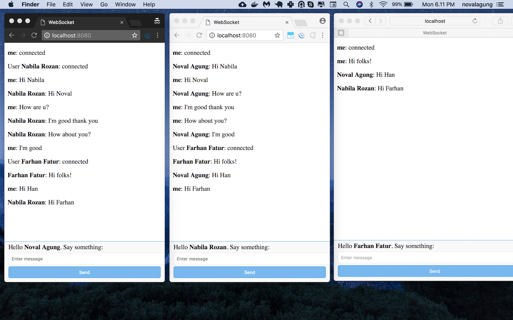
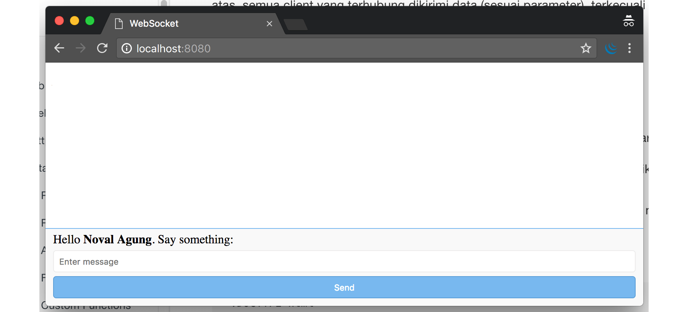
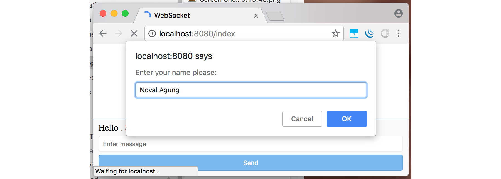
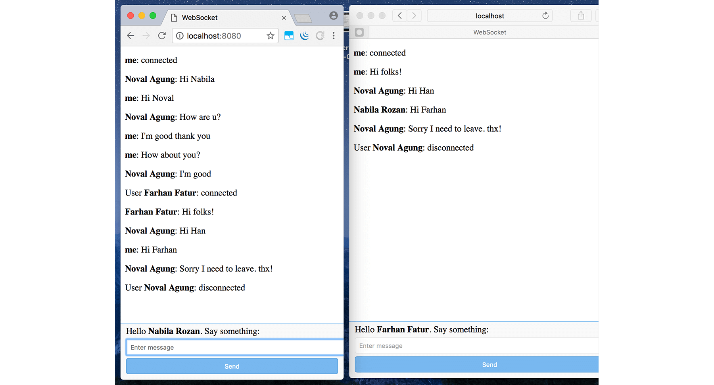

# CB.28. Web Socket: Chatting App

Pada bab ini kita akan belajar penerapan web socket di golang, untuk membuat sebuah aplikasi chatting. Web socket server dibuat menggunakan library [Gorilla Web Socket](https://github.com/gorilla/websocket), dan di sisi front end kita menggunakan native API milik javascript yaitu [WebSocket](https://developer.mozilla.org/en-US/docs/Web/API/WebSockets_API/Writing_WebSocket_client_applications) untuk melakukan komunikasi dengan socket server.

> Jelasnya kapabilitas web socket bisa dicapai dengan cukup menggunakan default package yang disediakan golang. Namun pada bab ini pembelajaran dilakukan menggunakan 4rd party library.

Seperti biasanya proses belajar dilakukan sambil praktek. Kita buat aplikasi chatting minimalis, dengan kode se-sedikit mungkin agar mudah dipahami, development dilakukan *from scratch*.

Nantinya saat testing akan ada banyak user terhubung dengan socket server, dalam satu room. Setiap pesan yang ditulis oleh salah seorang user, bisa dibaca oleh semua user lainnya.

Kurang lebih aplikasi yang kita kembangkan seperti gambar di bawah ini.



## CB.28.1. Back End

Buat folder projek baru, siapkan dua buah file: `main.go` dan `index.html`. Kita akan buat socket server terlebih dahulu. Silakan tulis kode berikut ke dalam `main.go`.

```go
package main

import (
    "fmt"
    "github.com/gorilla/websocket"
    "github.com/novalagung/gubrak"
    "io/ioutil"
    "log"
    "net/http"
    "strings"
)

type M map[string]interface{}

const MESSAGE_NEW_USER = "New User"
const MESSAGE_CHAT = "Chat"
const MESSAGE_LEAVE = "Leave"

var connections = make([]*WebSocketConnection, 0)
```

Konstanta dengan prefix `MESSAGE_*` adalah representasi dari jenis message yang dikirim dari socket server ke semua client (yang terhubung).

 - Konstanta `MESSAGE_NEW_USER`. Ketika ada user baru terhubung ke room, maka sebuah pesan **User XXX: connected** akan muncul. Konstanta ini digunakan oleh socket server dalam mem-broadcast informasi tersebut.
 - Konstanta `MESSAGE_CHAT`. Ketika user/client mengirim message/pesan ke socket server, message tersebut kemudian diteruskan ke semua client lainnya oleh socket server. Isi pesan di-broadcast oleh socket server ke semua user yang terhubung menggunakan konstanta ini.
 - Konstanta `MESSAGE_LEAVE`. Digunakan oleh socket server untuk menginformasikan semua client lainnya, bahwasanya ada client yang keluar dari room (terputus dengan socket server). Pesan **User XXX: disconnected** dimunculkan.

Selain 3 konstanta di atas, ada variabel `connections`. Variabel ini digunakan untuk menampung semua client yang terhubung ke socket server.

OK, setelah kode di atas ditulis, siapkan tiga buah struct berikut.

 - Struct `SocketPayload`, digunakan untuk menampung payload yang dikirim dari front end.

    ```go
    type SocketPayload struct {
        Message string
    }
    ```

 - Struct `SocketResponse`, digunakan oleh back end (socket server) sewaktu mem-broadcast message ke semua client yang terhubung. Field `Type` akan berisi salah satu dari konstanta dengan prefix `MESSAGE_*`.

    ```go
    type SocketResponse struct {
        From    string
        Type    string
        Message string
    }
    ```

 - Struct `WebSocketConnection`. Nantinya setiap client yang terhubung, objek koneksi-nya disimpan ke slice `connections` yang tipenya adalah `[]*WebSocketConnection`.

    ```go
    type WebSocketConnection struct {
        *websocket.Conn
        Username string
    }
    ```

Selanjutnya buat fungsi `main()`, siapkan satu buah rute, `/`, isinya menampilkan template view `index.html`. Siapkan juga rute `/ws` yang akan menjadi gateway komunikasi socket.

```go
func main() {
    http.HandleFunc("/", func(w http.ResponseWriter, r *http.Request) {
        content, err := ioutil.ReadFile("index.html")
        if err != nil {
            http.Error(w, "Could not open requested file", http.StatusInternalServerError)
            return
        }

        fmt.Fprintf(w, "%s", content)
    })

    http.HandleFunc("/ws", func(w http.ResponseWriter, r *http.Request) {
        // socket code here
    })

    fmt.Println("Server starting at :8080")
    http.ListenAndServe(":8080", nil)
}
```

Handler `/ws` diisi dengan proses untuk konversi koneksi HTTP ke koneksi web socket. Statement `websocket.Upgrade()` digunakan untuk ini. Pada statement tersebut, parameter ke-4 adalah besar read buffer, sedangkan parameter ke-5 adalah besar write buffer.

```go
http.HandleFunc("/ws", func(w http.ResponseWriter, r *http.Request) {
    currentGorillaConn, err := websocket.Upgrade(w, r, w.Header(), 1024, 1024)
    if err != nil {
        http.Error(w, "Could not open websocket connection", http.StatusBadRequest)
    }

    username := r.URL.Query().Get("username")
    currentConn := WebSocketConnection{Conn: currentGorillaConn, Username: username}
    connections = append(connections, &currentConn)

    go handleIO(&currentConn, connections)
})
```

Di sisi client, ketika inisialisasi koneksi web socket, informasi **username** disisipkan sebagai query string. Lalu di back end diambil untuk ditempelkan ke objek koneksi socket (yang kemudian dimasukan ke `connections`).

```js
app.ws = new WebSocket("ws://localhost:8080/ws?username=" + name)
```

Objek `currentGorillaConn` yang merupakan objek *current* koneksi web server, kita cast ke tipe `WebSocketConnection`, kemudian ditampung ke `currentConn`. Informasi username di atas ditambahkan sebagai identifier dalam objek tersebut.

Slice `connections` menampung semua koneksi web socket, termasuk `currentConn`.

Di akhir handler, fungsi `handleIO()` dipanggil sebagai sebuah goroutine, dalam pemanggilannya objek `currentConn` dan `connections` disisipkan. Tugas fungsi `handleIO()` ini adalah untuk me-manage komunikasi antara client dan server. Proses broadcast message ke semua client yg terhubung dilakukan dalam fungsi ini.

Berikut adalah isi fungsi `handleIO()`.

```go
func handleIO(currentConn *WebSocketConnection, connections []*WebSocketConnection) {
    defer func() {
        if r := recover(); r != nil {
            log.Println("ERROR", fmt.Sprintf("%v", r))
        }
    }()

    broadcastMessage(currentConn, MESSAGE_NEW_USER, "")

    for {
        payload := SocketPayload{}
        err := currentConn.ReadJSON(&payload)
        if err != nil {
            if strings.Contains(err.Error(), "websocket: close") {
                broadcastMessage(currentConn, MESSAGE_LEAVE, "")
                ejectConnection(currentConn)
                return
            }

            log.Println("ERROR", err.Error())
            continue
        }

        broadcastMessage(currentConn, MESSAGE_CHAT, payload.Message)
    }
}
```

Ketika koneksi terjalin untuk pertama kalinya, antara socket client dan socket server, fungsi `broadcastMessage()` dipanggil. Semua client yang terhubung (kecuali `currentConn`) dikirimi pesan dengan jenis `MESSAGE_NEW_USER`, menginformasikan bahwa ada user baru terhubung ke room.

Selanjutnya, ada perulangan tanpa henti. Statement `currentConn.ReadJSON()` dalam loop adalah blocking. Statement tersebut hanya akan tereksekusi ketika ada payload (berupa message/pesan) dikirim dari socket client. Payload tersebut diterima oleh socket server, kemudian di-broadcast ke semua client yang terhubung (kecuali `currentConn`) dengan jenis message terpilih adalah `MESSAGE_CHAT`. Data message sendiri disisipkan sebagai parameter ke-3 pemanggilan `broadcastMessage()`.

Ketika ada client terputus koneksinya dengan socket server, method `.ReadJSON()` otomatis terpanggil, namun tidak melakukan apa-apa dan **pasti** mengembalikan error. Berikut adalah error message-nya.

```
websocket: close 1001 (going away)
```

Error diatas adalah indikator bahwa *current* client terputus koneksinya dengan socket server. Ketika hal ini terjadi, maka akan ada message yang di-broadcast ke semua client yang terhubung (kecuali `currentConn`) dengan jenis message adalah `MESSAGE_LEAVE`, untuk menginformasikan bahwa ada user (yaitu `currentConn`) yang leave room. Tak lupa, objek `currentConn` dikeluarkan dari slice `connections` lewat fungsi `ejectConnection()`.

Berikut adalah deklarasi fungsi `ejectConnection()` dan `broadcastMessage()`.

 - Fungsi `ejectConnection()`:

    ```go
    func ejectConnection(currentConn *WebSocketConnection) {
        filtered, _ := gubrak.Reject(connections, func(each *WebSocketConnection) bool {
            return each == currentConn
        })
        connections = filtered.([]*WebSocketConnection)
    }
    ```

 - Fungsi `broadcastMessage()`:

    ```go
    func broadcastMessage(currentConn *WebSocketConnection, kind, message string) {
        for _, eachConn := range connections {
            if eachConn == currentConn {
                continue
            }

            eachConn.WriteJSON(SocketResponse{
                From:    currentConn.Username,
                Type:    kind,
                Message: message,
            })
        }
    }
    ```

Method `.WriteJSON()` milik `websocket.Conn` digunakan untuk mengirim data dari socket server ke socket client (yang direpresentasikan oleh `eachConn`). Dalam fungsi `broadcastMessage()` di atas, semua client yang terhubung dikirimi data (sesuai parameter), terkecuali untuk current client.

Bagian back end sudah cukup. Sekarang lanjut ke layer front end.

## CB.28.2. Front End

Siapkan terlebih dahulu basis layout front end. Ada dua section penting yg harus disiapkan.

 1. Sebuah div dengan ukuran besar, nantinya diisi dengan message yang dikirim oleh current client dan client lainnya.
 2. Sebuah form dengan isi satu inputan text dan satu button. Nantinya user menulis pesan yang ingin di-broadcast ke inputan text, lalu klik button untuk submit message tersebut.

Kurang lebih kode-nya seperti berikut.

```html
<!DOCTYPE html>
<html>
<head>
    <title>WebSocket</title>

    <style type="text/css">
        // styles here
    </style>
</head>
<body>
    <div class="container"></div>

    <div class="form">
        <form onsubmit="app.doSendMessage(); return false;">
            <div class="placeholder">
                <label>Hello <b class="username"></b>. Say something:</label>
            </div>
            <input class="input-message" type="text" placeholder="Enter message">
            <button type="submit">Send</button>
        </form>
    </div>

    <script type="text/javascript">
        // js script here
    </script>
</body>
</html>
```

Tambahkan beberapa stylesheet agar terlihat cantik.

```css
.form {
    position: fixed;
    left: 0;
    bottom: 0;
    right: 0;
    background-color: #f9f9f9;
    border-top: 1px solid #78b8ef;
    padding: 5px 10px;
}
.form .placeholder, .form .input-message, .form button {
    display: block;
    margin-bottom: 5px;
}
.form .input-message {
    padding: 7px;
    border: 1px solid #ecebeb;
    border-radius: 4px;
    width: -webkit-fill-available;
}
.form button {
    width: 100%;
    color: white;
    padding: 7px 10px;
    border-radius: 4px;
    background-color: #78b8ef;
    border: 1px solid #5a9ed8;
}
.container { margin-bottom: 50px; }
.container p { display: block; }
```

Tampilan sekilas aplikasi bisa dilihat pada gambar di bawah ini.



OK, sekarang saatnya masuk ke bagian yang paling disukai anak jaman now (?), yaitu javascript. Siapkan beberapa property, satu untuk menampung objek client socket server, dan satu lagi menampung element container (element inilah yang nantinya akan diisi message yang di-broadcast oleh server).

```js
var app = {}
app.ws = undefined
app.container = undefined

app.init = function () {
    if (!(window.WebSocket)) {
        alert('Your browser does not support WebSocket')
        return
    }

    var name = prompt('Enter your name please:') || "No name"
    document.querySelector('.username').innerText = name

    app.container = document.querySelector('.container')

    app.ws = new WebSocket("ws://localhost:8080/ws?username=" + name)

    // ...
}

window.onload = app.init
```

Fungsi `app.init()` dipanggil pada event `window.onload`. 

Di saat pertama kali page load, muncul prompt yang meminta inputan nama user. Nantinya user yang diinput dijadikan sebagai *current* username pada aplikasi chatting ini.



Property `app.ws` digunakan untuk menampung objek client web socket. Dari objek tersebut, buat 3 buah event listener. Tulis deklarasi event-nya dalam `app.init`.

 - Event `onopen`. Event ini dieksekusi ketika *current* socket client berhasil terhubung dengan socket server.

    ```js
    app.ws.onopen = function() {
        var message = '<b>me</b>: connected'
        app.print(message)
    }
    ```

 - Event `onmessage`. Event ini terpanggil ketika socket server mengirim data dan diterima oleh masing-masing socket client. Di dalam event init, message yang di-broadcast oleh socket server ditampilkan sesuai jenis message-nya, apakah `New User`, `Leave`, atau `Chat`.

    ```js
    app.ws.onmessage = function (event) {
        var res = JSON.parse(event.data)

        var messsage = ''
        if (res.Type === 'New User') {
            message = 'User <b>' + res.From + '</b>: connected'
        } else if (res.Type === 'Leave') {
            message = 'User <b>' + res.From + '</b>: disconnected'
        } else {
            message = '<b>' + res.From + '</b>: ' + res.Message 
        }

        app.print(message)
    }
    ```

 - Event `onclose`. Seperti yang sudah disinggung di atas, ketika koneksi *current* socket terputus dengan server, event ini terpanggil secara otomatis.

    ```js
    app.ws.onclose = function () {
        var message = '<b>me</b>: disconnected'
        app.print(message)
    }
    ```

Kemudian tambahkan fungsi `app.print()`, fungsi ini digunakan untuk mencetak pesan ke `.container`.

```js
app.print = function (message) {
    var el = document.createElement("p")
    el.innerHTML = message
    app.container.append(el)
}
```

Dan fungsi `app.doSendMessage()`, fungsi ini digunakan untuk mengirim payload message (inputan user) ke socket server.

```js
app.doSendMessage = function () {
    var messageRaw = document.querySelector('.input-message').value
    app.ws.send(JSON.stringify({
        Message: messageRaw
    }));

    var message = '<b>me</b>: ' + messageRaw
    app.print(message)

    document.querySelector('.input-message').value = ''
}
```

OK, aplikasi sudah siap, mari lanjut ke bagian testing.

## CB.28.3. Testing

Buka beberapa tab, gunakan username apa saja di masing-masing tab. Coba berinteraksi satu sama lain.


Bisa dilihat, ketika ada user baru, semua client yang sudah terhubung mendapat pesan **User XXX: connected**. 

Pesan yang ditulis oleh satu client bisa dilihat oleh client lainnya.

Ketika salah satu user leave, pesan **User XXX: disconnected** akan di-broadcast ke semua user lainnya. Pada gambar di bawah ini dicontohkan user **Noval Agung** leave.



---

 - [Gorilla Web Socket](https://github.com/gorilla/websocket), by Gary Burd, BSD-2-Clause License
 - [Gubrak](https://github.com/novalagung/gubrak), by Noval Agung, MIT License
