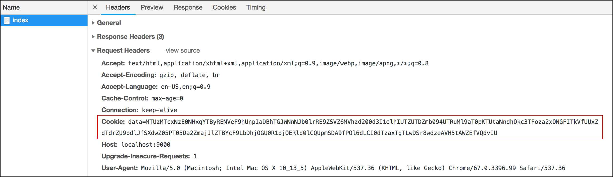

# C.9. Secure Cookie (Gorilla Securecookie)

Pada bab [B-21 HTTP Cookie](B-21-cookie.html), kita telah mempelajari tentang cookie dan implementasinya di golang.

Cookie memiliki beberapa atribut, diantaranya adalah `secure`. Dengan mengaktifkan atribut ini, informasi cookie menjadi lebih aman karena di-enkripsi, namun kapabilitas ini hanya akan aktif pada kondisi aplikasi SSL/TLS enabled.

> TL;DR; Jika atribut `secure` di-isi `true`, namun web server TIDAK menggunakan SSL/TLS, maka cookie disimpan seperti biasa tanpa di-enkripsi.

Lalu bagaimana cara untuk membuat cookie aman pada aplikasi yang meng-enable SSL/TLS maupun yang tidak? caranya adalah dengan menambahkan step enkripsi data sebelum disimpan dalam cookie (dan men-decrypt data tersebut saat membaca).

Gorilla toolkit menyediakan library bernama [securecookie](https://github.com/gorilla/securecookie), berguna untuk mempermudah enkripsi informasi cookie, dengan penerapan yang mudah. Pada bab ini kita akan mempelajari penggunaannya.

## C.9.1. Create & Read Secure Cookie

Penggunaan securecookie cukup mudah, buat objek secure cookie lewat `securecookie.New()` lalu gunakan objek tersebut untuk operasi encode-decode data cookie. Pemanggilan fungsi `.New()` memerlukan 2 buah argument.

 - Hash key, diperlukan untuk otentikasi data cookie menggunakan algoritma kriptografi HMAC.
 - Block key, adalah opsional, diperlukan untuk enkripsi data cookie. Default algoritma enkripsi yang digunakan adalah AES.

OK, langsung saja kita praktekan. Buat folder projek seperti biasa lalu isi `main.go` dengan kode berikut.

```go
package main

import (
    "github.com/gorilla/securecookie"
    "github.com/labstack/echo"
    "github.com/novalagung/gubrak"
    "net/http"
    "time"
)

type M map[string]interface{}

var sc = securecookie.New([]byte("very-secret"), []byte("a-lot-secret-yay"))
```

Variabel `sc` adalah objek secure cookie. Objek ini kita gunakan untuk encode data yang akan disimpan dalam cookie, dan juga untuk decode data.

Buat fungsi `setCookie()`, bertugas untuk mempermudah pembuatan dan penyimpanan cookie.

```go
func setCookie(c echo.Context, name string, data M) error {
    encoded, err := sc.Encode(name, data)
    if err != nil {
        return err
    }

    cookie := &http.Cookie{
        Name:     name,
        Value:    encoded,
        Path:     "/",
        Secure:   false,
        HttpOnly: true,
        Expires:  time.Now().Add(1 * time.Hour),
    }
    http.SetCookie(c.Response(), cookie)

    return nil
}
```

Method `sc.Encode()` digunakan untuk encoding data dengan identifier adalah isi variabel `name`. Variabel `encoded` menampung data setelah di-encode, lalu variabel ini dimasukan ke dalam objek cookie.

Cara menyimpan cookie masih sama, menggunakan `http.SetCookie`.

Selanjutnya buat fungsi `getCookie()`, untuk mempermudah proses pembacaan cookie yang tersimpan.

```go
func getCookie(c echo.Context, name string) (M, error) {
    cookie, err := c.Request().Cookie(name)
    if err == nil {

        data := M{}
        if err = sc.Decode(name, cookie.Value, &data); err == nil {
            return data, nil
        }
    }

    return nil, err
}
```

Setelah cookie diambil menggunakan `c.Request().Cookie()`, data didalamnya perlu di-decode agar bisa terbaca. Method `sc.Decode()` digunakan untuk decoding data.

OK, sekarang buat fungsi `main()`, lalu isi dengan kode di bawah ini.

```go
const COOKIE_NAME = "data"

e := echo.New()

e.GET("/index", func(c echo.Context) error {
    data, err := getCookie(c, COOKIE_NAME)
    if err != nil && err != http.ErrNoCookie && err != securecookie.ErrMacInvalid {
        return err
    }

    if data == nil {
        data = M{"Message": "Hello", "ID": gubrak.RandomString(32)}

        err = setCookie(c, COOKIE_NAME, data)
        if err != nil {
            return err
        }
    }

    return c.JSON(http.StatusOK, data)
})

e.Logger.Fatal(e.Start(":9000"))
```

Konstanta `COOKIE_NAME` disiapkan, kita gunakan sebagai identifier cookie. Dan sebuah rute juga disiapkan dengan tugas menampilkan data cookie jika sudah ada, dan membuat cookie baru jika belum ada. 

Dalam handler rute, terdapat beberapa proses terjadi. Pertama, objek cookie dengan identifier `COOKIE_NAME` diambil, jika muncul error, dan jenisnya adalah selain error karena cookie tidak ada, dan error-nya selain *invalid cookie*, maka kembalikan objek error tersebut.

> `http.ErrNoCookie` adalah variabel penanda error karena cookie kosong, sedangkan `securecookie.ErrMacInvalid` adalah representasi dari invalid cookie.

Lalu, kita cek data cookie yang dikembalikan, jika kosong (bisa karena cookie belum dibuat ataupun sudah ada tetapi datanya kosong) maka buat data baru untuk disimpan dalam cookie. Data tersebut bertipe `map`, salah satu elemen map tersebut ada yg value-nya adalah random.

> Pada kode di atas, generate random string dilakukan dengan memanfaatkan 3rd party library [gubrak](https://github.com/novalagung/gubrak).

Pengaksesan rute akan memunculkan data yang sama. Karena pembuatan cookie hanya dilakukan ketika datanya kosong atau cookie nya belum dibuat.

Jalankan aplikasi untuk mengetes hasilnya. Lakukan refresh beberapa kali, data yang muncul pasti sama.


Lihat pada response header url `index`, data pada cookie terlihat sudah dalam kondisi encoded dan encrypted.



## C.9.2. Delete Secure Cookie

Securecookie perannya hanya pada bagian encode-decode data cookie, sedangkan proses simpan baca cookie masih sama seperti penerapan cookie biasa. Maka cara menghapus cookie pun masih sama, yaitu dengan meng-expired-kan cookie yang sudah disimpan.

```go
cookie := &http.Cookie{}
cookie.Name = name
cookie.Path = "/"
cookie.MaxAge = -1
cookie.Expires = time.Unix(0, 0)
http.SetCookie(c.Response(), cookie)
```

---

 - [Echo](https://github.com/labstack/echo), by Vishal Rana (Lab Stack), MIT license
 - [Gorilla Securecookie](https://github.com/gorilla/securecookie), by Gorilla web toolkit team, BSD-3-Clause license
 - [Gubrak](https://github.com/novalagung/gubrak), by Noval Agung, MIT license
