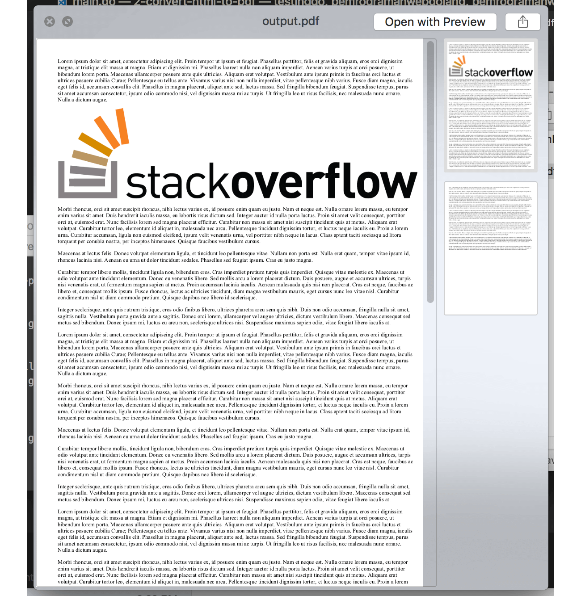

# C.21. Convert HTML to PDF (go-wkhtmltopdf)

Library gofpdf hanya bisa digunakan untuk pembuatan PDF. Biasanya dalam sebuah aplikasi, report berupa pdf diunduh dengan sumber data adalah halaman web report itu sendiri. Nah, pada chapter ini kita akan belajar cara konversi file HTML ke bentuk PDF menggunakan library golang [wkhtmltopdf](https://github.com/wkhtmltopdf/wkhtmltopdf).

> Sebenarnya di jaman ini, export HTML to PDF sudah bisa dilakukan di layer front end menggunakan cukup javascript saja. Apalagi jika menggunakan framework terkenal seperti Kendo UI, report yang dimunculkan menggunakan KendoGrid bisa dengan mudah di export ke excel maupun pdf.<br /><br />Namun pada chapter ini akan tetap kita bahas cara tradisional ini, konversi HTML ke PDF pada back end (golang). Semoga berguna.

## C.21.1. Konversi File HTML ke PDF

Buat file html bernama `input.html`, isi dengan apa saja, kalau bisa ada gambarnya juga. Contohnya seperti berikut.

```html
<!DOCTYPE html>
<html>
    <head>
        <title>Testing</title>
    </head>
    <body>
        <p>
            Lorem ipsum dolor sit amet, consectetur adipiscing elit. 
            Proin tempor ut ipsum et feugiat. Phasellus porttitor, 
            felis et gravida aliquam, 
            eros orci dignissim magna, at tristique elit massa at magna. 
            Etiam et dignissim mi. Phasellus laoreet nulla non aliquam imperdiet. 
            Aenean varius turpis at orci posuere, ut bibendum lorem porta. 
            Maecenas ullamcorper posuere ante quis ultricies. Aliquam erat volutpat. 
            Vestibulum ante ipsum primis in faucibus orci luctus et 
            ultrices posuere cubilia Curae; 
            Pellentesque eu tellus ante. Vivamus varius nisi non nulla imperdiet, 
            vitae pellentesque nibh varius. Fusce diam magna, iaculis eget felis id, 
            accumsan convallis elit. 
            Phasellus in magna placerat, aliquet ante sed, luctus massa. 
            Sed fringilla bibendum feugiat. Suspendisse tempus, purus sit amet 
            accumsan consectetur, ipsum odio commodo nisi, 
            vel dignissim massa mi ac turpis. Ut fringilla leo ut risus facilisis, 
            nec malesuada nunc ornare. Nulla a dictum augue.
        </p>

        

        <!-- other code here -->
    </body>
</html>
```

File html di atas akan kita konversi menjadi sebuah file baru bertipe PDF. Konversi dilakukan menggunakan library wkhtmltopdf. Library ini sebenarnya adalah aplikasi CLI yang dibuat menggunakan bahasa **C++**. Untuk bisa menggunakannya kita harus mengunduh lalu meng-install-nya terlebih dahulu.

Silakan unduh installer wkhtmltopdf di https://wkhtmltopdf.org/downloads.html, pilih sesuai dengan sistem operasi yang digunakan.

karena wkhtmltopdf merupakan sebuah aplikasi CLI, maka penggunaannya bisa lewat dua cara.

 - Cara ke-1: Menggunakan `exec.Command()` untuk mengeksekusi binary. Path file html target disisipkan sebagai argumen command. Silakan merujuk ke referensi pada chapter [A.49. Exec](/A-exec.html) untuk mempelajari cara penggunaan exec.
 - Cara ke-2: Menggunakan golang wrapper [go-wkhtmltopdf](github.com/SebastiaanKlippert/go-wkhtmltopdf). Cara ini adalah yang kita pilih.

Secara teknis, go-wkhtmltopdf melakukan hal yang sama dengan cara pertama, yaitu mengeksekusi binary wkhtmltopdf menggunakan `exec.Command()`.

Mari langsung kita praktekan, buat folder project baru. Siapkan file main. Isi dengan kode berikut.

```go
package main

import (
    "github.com/SebastiaanKlippert/go-wkhtmltopdf"
    "log"
    "os"
)

func main() {
    pdfg, err := wkhtmltopdf.NewPDFGenerator()
    if err != nil {
        log.Fatal(err)
    }

    // ...
}
```

Pembuatan objek PDF dilakukan lewat `wkhtmltopdf.NewPDFGenerator()`. Fungsi tersebut mengembalikan dua buah objek, objek dokumen dan error (jika ada).

Satu objek dokumen merepresentasikan 1 buah file PDF.

Kemudian tambahkan kode untuk membaca file `input.html`. Gunakan `os.Open`, agar file tidak langsung dibaca, melainkan dijadikan sebagai `io.Reader`. Masukan objek reader ke fungsi `wkhtmltopdf.NewPageReader()`, lalu sisipkan kembaliannya sebagai page baru di objek PDF.

Kurang lebih kode-nya seperti berikut.

```go
f, err := os.Open("./input.html")
if f != nil {
    defer f.Close()
}
if err != nil {
    log.Fatal(err)
}

pdfg.AddPage(wkhtmltopdf.NewPageReader(f))

pdfg.Orientation.Set(wkhtmltopdf.OrientationPortrait)
pdfg.Dpi.Set(300)
```

Method `.AddPage()` milik objek PDF, digunakan untuk menambahkan halaman baru. Halaman baru sendiri dibuat lewat `wkhtmltopdf.NewPageReader()`. Jika ternyata konten pada halaman terlalu panjang untuk dijadikan 1 buah page, maka akan secara otomatis dibuatkan page selanjutnya menyesuaikan konten.

Statement `pdfg.Orientation.Set()` digunakan untuk menentukan orientasi dokumen, apakah portrait atau landscape. Statement `pdfg.Dpi.Set()` digunakan untuk menge-set DPI dokumen.

Gunakan API yang tersedia milik go-wkhtmltopdf sesuai kebutuhan. Silakan merujuk ke https://godoc.org/github.com/SebastiaanKlippert/go-wkhtmltopdf untuk melihat API apa saja yang tersedia.

Untuk menyimpan objek dokumen menjadi file fisik PDF, ada beberapa step yang harus dilakukan. Pertama, buat dokumen dalam bentuk buffer menggunakan method `.Create()`.

```go
err = pdfg.Create()
if err != nil {
    log.Fatal(err)
}
```

Setelah itu, outputkan buffer tersebut sebagai file fisik menggunakan `.WriteFile()`. Sisipkan path destinasi file sebagai parameter method tersebut.

```go
err = pdfg.WriteFile("./output.pdf")
if err != nil {
    log.Fatal(err)
}

log.Println("Done")
```

Test aplikasi yang sudah kita buat, lihat hasil generated PDF-nya.



Bisa dilihat, dalam satu PDF dua page muncul, hal ini karena memang isi `input.html` terlalu panjang untuk dijadikan sebagai satu page.

Cara yang kita telah pelajari ini cocok digunakan pada file html yang isinya sudah pasti pada saat file tersebut di-load.

## C.21.2. Konversi HTML dari URL Menjadi PDF

Bagaimana untuk HTML yang sumber nya bukan dari file fisik, melainkan dari URL? tetap bisa dilakukan. Caranya dengan mendaftarkan url sebagai objek page lewat `wkhtmltopdf.NewPage()`, lalu memasukannya ke dalam dokumen sebagai page. Contoh penerapannya bisa dilihat pada kode di bawah ini.

```go
pdfg, err := wkhtmltopdf.NewPDFGenerator()
if err != nil {
    log.Fatal(err)
}

pdfg.Orientation.Set(wkhtmltopdf.OrientationLandscape)

page := wkhtmltopdf.NewPage("http://localhost:9000")
page.FooterRight.Set("[page]")
page.FooterFontSize.Set(10)
pdfg.AddPage(page)

err = pdfg.Create()
if err != nil {
    log.Fatal(err)
}

err = pdfg.WriteFile("./output.pdf")
if err != nil {
    log.Fatal(err)
}

log.Println("Done")
```

Cara ini cocok digunakan untuk konversi data HTML yang isinya muncul pada saat page load. Untuk konten-konten yang munculnya asynchronous, seperti di event `documen.onload` ada AJAX lalu setelahnya konten baru ditulis, tidak bisa menggunakan cara ini. Solusinya bisa menggunakan teknik export ke PDF dari sisi front end.

---

- [gofpdf](https://github.com/jung-kurt/gofpdf), by Kurt Jung, MIT license
- [wkhtmltopdf](https://github.com/wkhtmltopdf/wkhtmltopdf), by Ashish Kulkarni, LGPL-3.0 license
- [go-wkhtmltopdf](https://github.com/SebastiaanKlippert/go-wkhtmltopdf), by Sebastiaan Klippert, MIT license

---

<div class="source-code-link">
    <div class="source-code-link-message">Source code praktek chapter ini tersedia di Github</div>
    <a href="https://github.com/novalagung/dasarpemrogramangolang-example/tree/master/chapter-C.21-convert-html-to-pdf">https://github.com/novalagung/dasarpemrogramangolang-example/.../chapter-C.21...</a>
</div>
