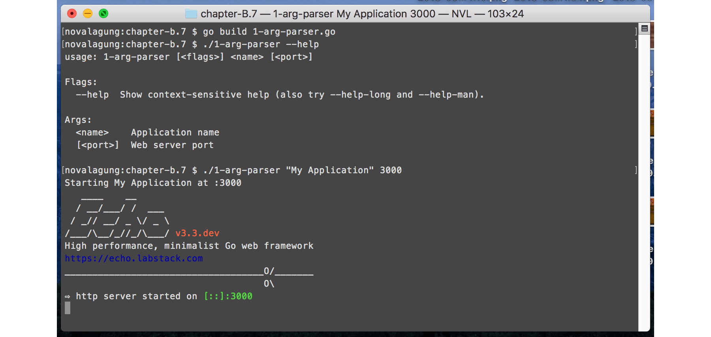

# C.9. CLI Flag Parser (Kingpin v2)

Tidak jarang, sebuah aplikasi dalam eksekusinya membutuhkan argumen untuk disisipkan, entah itu mandatory atau tidak. Contohnya seperti berikut.

```bash
$ ./main --port=3000
```

Pada chapter ini kita akan belajar cara parsing argumen eksekusi aplikasi. Parsing sebenarnya bisa dilakukan dengan cukup memainkan property `os.Args`, akan tetapi pada pembelajaran kali ini kita akan menggunakan 3rd party library [github.com/alecthomas/kingpin](https://github.com/alecthomas/kingpin) untuk mempermudah pelaksanaannya.

## C.9.1. Parsing Argument

Kita akan buat aplikasi yang bisa menerima bentuk argument seperti berikut.

```bash
# $ ./main ArgAppName <ArgPort>
$ ./main "My Application" 4000
```

Argument `ArgAppName` mandatory, harus diisi, sedangkan argument `ArgPort` adalah opsional (ada nilai default-nya).

OK, mari kita praktekan. Buat folder projek baru dengan isi satu buah main file. Siapkan dua buah property untuk menampung `appName` dan `port`, dan satu buah fungsi `main()`.

```go
package main

import (
	"fmt"
	"net/http"

	"github.com/labstack/echo"
	"gopkg.in/alecthomas/kingpin.v2"
)

var (
	argAppName = kingpin.Arg("name", "Application name").Required().String()
	argPort    = kingpin.Arg("port", "Web server port").Default("9000").Int()
)

func main() {
	kingpin.Parse()

	// more code here ...
}
```

Statement `kingpin.Arg()` digunakan untuk menyiapkan objek penampung argument. Tulis nama argument sebagai parameter pertama, dan deskripsi argument sebagai parameter kedua. 2 Informasi tersebut nantinya akan muncul ketika flag `--help` digunakan.

Untuk aplikasi yang memerlukan banyak argument, deklarasi variabel penampungnya harus dituliskan berurutan. Seperti contoh di atas `argAppName` merupakan argument pertama, dan `argPort` adalah argument kedua.

Chain statement `kingpin.Arg()` dengan beberapa method yang tersedia sesuai dengan kebutuhan. Berikut adalah penjelasan dari 4 method yang digunakan di atas.

 - Method `.Required()` membuat argument yang ditulis menjadi mandatory. Jika tidak disisipkan maka muncul error.
 - Method `.String()` menandakan bahwa argument ditampung dalam tipe `string`.
 - Method `.Default()` digunakan untuk menge-set default value dari argument. Method ini adalah kebalikan dari `.Required()`. Jika default value di-set maka argument boleh untuk tidak diisi. Objek penampung akan berisi default value.
 - Method `.Int()` menandakan bahwa argument ditampung dalam tipe `int`.

Perlu diketahui, dalam pendefinisian argument, penulisan statement-nya harus diakhiri dengan pemanggilan method `.String()`, `.Int()`, `.Bool()`, atau method tipe lainnya yang di-support oleh kingpin. Lebih jelasnya silakan cek [laman dokumentasi](https://godoc.org/github.com/alecthomas/kingpin#ArgClause).

Mari kita selesaikan aplikasi, silakan tulis kode berikut dalam fungsi `main()`.

```go
appName := *argAppName
port := fmt.Sprintf(":%d", *argPort)

fmt.Printf("Starting %s at %s", appName, port)

e := echo.New()
e.GET("/index", func(c echo.Context) (err error) {
  return c.JSON(http.StatusOK, true)
})
e.Logger.Fatal(e.Start(port))
```

Objek argument kingpin pasti bertipe pointer, maka *dereference* objek tersebut untuk mengambil nilai aslinya.

Jalankan aplikasi, cek hasilnya.



Bisa dilihat dari gambar di atas ketika flag `--help` dipanggil list semua argument muncul.

## C.9.2. Penggunaan Kingpin Application Instance

Dari yang sudah kita praktekan di atas, fungsi-fungsi diakses langsung dari package `kingpin`.

```go
kingpin.Arg("name", "Application name").Required().String()
kingpin.Arg("port", "Web server port").Default("9000").Int()

kingpin.Parse()
```

Kingpin menyediakan fasilitas untuk membuat *-what-so-called-* objek kingpin application. Lewat objek ini, semua fungsi yang biasa digunakan (seperti `.Arg()` atau `.Parse()`) bisa diakses sebagai method.

Kelebihan menggunakan kingpin application, kita bisa buat custom handler untuk antisipasi error. Pada aplikasi yg sudah dibuat di atas, jika argument yang *required* tidak disisipkan dalam eksekusi binary, maka aplikasi langsung exit dan error muncul. Error sejenis ini bisa kita override jika menggunakan kingpin application.

Berikut adalah contoh implementasinya.

```go
app        = kingpin.New("App", "Simple app")
argAppName = app.Arg("name", "Application name").Required().String()
argPort    = app.Arg("port", "Web server port").Default("9000").Int()

command, err := app.Parse(os.Args[1:])
if err != nil {
  // handler error here ...
}
```

Statement `kingpin.Arg()` diganti dengan `app.Arg()`. Juga, `kingpin.Parse()` diganti dengan `app.Parse()`, dengan pemanggilannya harus disisipkan `os.Args[1:]`.

Manfaatkan objek `err` kembalian `app.Parse()` untuk membuat custom error handling. Atau bisa tetap gunakan default custom error handling milik kingpin, caranya dengan membungkus statement `app.Parse()` ke dalam `kingpin.MustParse()`.

```go
kingpin.MustParse(app.Parse(os.Args[1:]))
```

## C.9.3. Parsing Flag

Flag adalah argument yang lebih terstruktur. Golang sebenarnya sudah menyediakan package `flag`, isinya API untuk parsing flag.

 - Contoh argument:

  ```bash
  $ ./executable "My application" 4000
  ```

 - Contoh flag:

  ```bash
  $ ./executable --name="My application" --port=4000
  $ ./executable --name "My application" --port 4000
  $ ./executable --name "My application" -p 4000
  ```

Kita tetap menggunakan kingpin pada bagian ini. Pembuatan flag di kingpin tidak sulit, cukup gunakan `.Flag()` (tidak menggunakan `.Arg()`). Contohnya seperti berikut.

```go
app         = kingpin.New("App", "Simple app")
flagAppName = app.Flag("name", "Application name").Required().String()
flagPort    = app.Flag("port", "Web server port").Short('p').Default("9000").Int()

kingpin.MustParse(app.Parse(os.Args[1:]))
```

Method `.Short()` digunakan untuk mendefinisikan short flag. Pada kode di atas, flag port bisa ditulis dalam bentuk `--port=value` ataupun `-p=value`.

Penggunaan flag `--help` akan memunculkan keterangan mendetail tiap-tiap flag.

> Flag bisa dikombinasikan dengan argument.


## C.9.4. Parsing Command

Command adalah bentuk yang lebih advance dari argument. Banyak command bisa dibuat, pendefinisian flag ataupun argument bisa dilakukan lebih spesifik, untuk masing-masing command.

Di bagian ini kita akan buat sebuah aplikasi untuk simulasi manajemen user. Tiga buah command dipersiapkan dengan skema sebagai berikut.

 - Command `add`
  - Flag `--override`
  - Argument `user`
 - Command `update`
  - Argument `old user`
  - Argument `new user`
 - Command `delete`
  - Flag `--force`
  - Argument `user`

Mari kita praktekan, buat satu folder projek baru. Buat satu file main, isi dengan kode berikut.

```go
package main

import (
	"fmt"
	"os"

	"gopkg.in/alecthomas/kingpin.v2"
)

var app = kingpin.New("App", "Simple app")
```

Method `.Command()` digunakan untuk membuat command. Pembuatan argument dan flag masing-masing command bisa dilakukan seperti biasanya, dengan mengakses method `.Arg()` atau `.Flag()`, hanya saja pengaksesannya lewat objek command masing-masing. Contoh:

```go
var commandSomething = app.Command("something", "do something")
var commandSomethingArgX = commandSomething.Flag("x", "arg x").String()
var commandSomethingFlagY = commandSomething.Flag("y", "flag y").String()
```

OK, sekarang buat 3 command sesuai skema yang sudah disepakati di atas.

 - Command add, beserta flag dan argument-nya.

  ```go
  var commandAdd = app.Command("add", "add new user")
  var commandAddFlagOverride = commandAdd.Flag("override", "override existing user").
      Short('o').Bool()
  var commandAddArgUser = commandAdd.Arg("user", "username").Required().String()
  ```

- Command update, beserta argument-nya.

  ```go
  var commandUpdate = app.Command("update", "update user")
  var commandUpdateArgOldUser = commandUpdate.Arg("old", "old username").Required().
    String()
  var commandUpdateArgNewUser = commandUpdate.Arg("new", "new username").Required().
    String()
  ```

- Command delete, beserta flag dan argument-nya.

  ```go
  var commandDelete          = app.Command("delete", "delete user")
  var commandDeleteFlagForce = commandDelete.Flag("force", "force deletion").
    Short('f').Bool()
  var commandDeleteArgUser   = commandDelete.Arg("user", "username").Required().
    String()
  ```

Buat fungsi main, lalu didalamnya siapkan action untuk masing-masing command. Gunakan method `.Action()` dengan parameter adalah fungsi ber-skema `func(*kingpin.ParseContext)error` untuk menambahkan action.

Di akhir, tulis statement untuk parsing.

```go
func main() {
    commandAdd.Action(func(ctx *kingpin.ParseContext) error {
    	 // more code here ...
    })

    commandUpdate.Action(func(ctx *kingpin.ParseContext) error {
    	 // more code here ...
    })

    commandDelete.Action(func(ctx *kingpin.ParseContext) error {
    	 // more code here ...
    })

    kingpin.MustParse(app.Parse(os.Args[1:]))
}
```

Berikut adalah isi masing-masing action dari ketiga command di atas.

 - Action command `add`:

  ```go
  commandAdd.Action(func(ctx *kingpin.ParseContext) error {
      user := *commandAddArgUser
      override := *commandAddFlagOverride
      fmt.Printf("adding user %s, override %t \n", user, override)

      return nil
  })
  ```

 - Action command `update`:

  ```go
  commandUpdate.Action(func(ctx *kingpin.ParseContext) error {
      oldUser := *commandUpdateArgOldUser
      newUser := *commandUpdateArgNewUser
      fmt.Printf("updating user from %s %s \n", oldUser, newUser)

      return nil
  })
  ```

 - Action command `delete`:

  ```go
  commandDelete.Action(func(ctx *kingpin.ParseContext) error {
      user := *commandDeleteArgUser
      force := *commandDeleteFlagForce
      fmt.Printf("deleting user %s, force %t \n", user, force)

      return nil
  })
  ```

Jalankan aplikasi untuk mengetes hasilnya.

Tambahkan flag `--help` pada pemanggilan command untuk menampilkan help command terpilih.


Atau gunakan `--help-long` dalam eksekusi binary, untuk menampilkan help yang mendetail (argument dan flag tiap command juga dimunculkan).


## C.9.5. Command Action Tanpa Menggunakan `.Action()`

Nilai balik statement `kingpin.MustParse()`, `kingpin.Parse()`, dan nilai balik pertama `app.Parse()` adalah sama, yaitu informasi command yang ditulis pada saat pemanggilan binary.

Dari informasi command tersebut, bisa kita kembangkan untuk membuat handler masing-masing command. Dengan ini tak perlu menggunakan method `.Action()` untuk menulis handler command. Contoh prakteknya seperti berikut.

```go
commandInString := kingpin.MustParse(app.Parse(os.Args[1:]))
switch commandInString {

case commandAdd.FullCommand(): // add user
	user := *commandAddArgUser
	override := *commandAddFlagOverride
	fmt.Printf("adding user %s, override %t \n", user, override)

case commandUpdate.FullCommand(): // update user
	oldUser := *commandUpdateArgOldUser
	newUser := *commandUpdateArgNewUser
	fmt.Printf("updating user from %s %s \n", oldUser, newUser)

case commandDelete.FullCommand(): // delete user
	user := *commandDeleteArgUser
	force := *commandDeleteFlagForce
	fmt.Printf("deleting user %s, force %t \n", user, force)

}
```

## C.9.6. Advanced Command Line Application

Pembahasan di atas fokus tentang bagaiamana cara parsing argument, flag, dan command yang disisipkan sewaktu eksekusi aplikasi. Aplikasi yang dieksekusi sendiri bisa berupa command-line-based ataupun web-based.

Jika pembaca ingin membuat aplikasi command line, penggunaan kingpin cukup membantu dalam proses pengembangan, tapi akan lebih mudah lagi jika menggunakan 3rd party library [Cobra](https://github.com/spf13/cobra).

Cobra merupakan library yang didesain khusus untuk development aplikasi berbasis command line. Library ini dibuat oleh author yang juga membuat kingpin.

---

 - [Kingpin](https://github.com/alecthomas/kingpin), by Alec Thomas, MIT license
 - [Cobra](https://github.com/alecthomas/cobra), by Alec Thomas, MIT license

---

<div class="source-code-link">
    <div class="source-code-link-message">Source code praktek chapter ini tersedia di Github</div>
    <a href="https://github.com/novalagung/dasarpemrogramangolang-example/tree/master/chapter-C.9-flag-parser">https://github.com/novalagung/dasarpemrogramangolang-example/.../chapter-C.9...</a>
</div>
