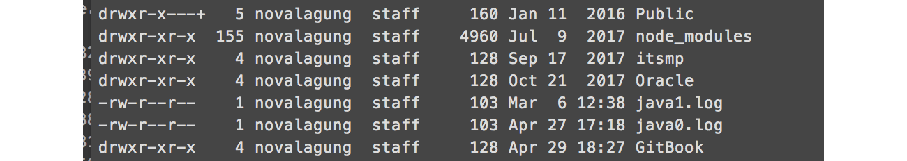
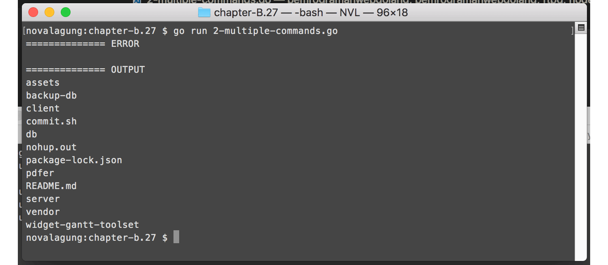

# C.29. SSH & SFTP

Pada chapter ini kita akan belajar cara untuk me-remote server lewat protokol SSH (Secure Shell).

> Protokol SSH digunakan untuk melakukan remote login secara aman/secure ke server tujuan. Komunikasi yang terjadi lewat SSH di-encrypt sehingga aman.

Go menyediakan package [golang.org/x/crypto/ssh](https://godoc.org/golang.org/x/crypto/ssh), berisi cukup banyak API untuk keperluan operasi yang berhubungan dengan protokol SSH.

## C.29.1. Otentikasi SSH

Buat folder projek baru, isinya file `main.go`, di dalamnya tulis kode berikut.

```go
package main

import (
    "golang.org/x/crypto/ssh"
    "io/ioutil"
    "log"
    "os"
)

func main() {
    const SSH_ADDRESS = "0.0.0.0:22"
    const SSH_USERNAME = "user"
    const SSH_PASSWORD = "password"

    sshConfig := &ssh.ClientConfig{
        User:            SSH_USERNAME,
        HostKeyCallback: ssh.InsecureIgnoreHostKey(),
        Auth: []ssh.AuthMethod{
            ssh.Password(SSH_PASSWORD),
        },
    }

    // ...
}
```

Variabel `sshConfig` di atas adalah objek pointer cetakan struct `ssh.ClientConfig`. Objek bertipe ini nantinya digunakan untuk otentikasi SSH.

Pada kode di atas, tiga buah konstanta dengan prefix `SSH_*` disiapkan. Credentials username dan password disisipkan sebagai property objek `sshConfig`. Bisa dilihat pada property `Auth`, isinya adalah slice `ssh.AuthMethod` dengan satu buah element yaitu `ssh.Password()`. Konfigurasi seperti ini dipakai jika **otentikasi menggunakan username dan password**.

Jika otentikasi dilakukan menggunakan **identity file**, maka gunakan kode berikut.

```go
const SSH_ADDRESS = "192.168.0.24:22"
const SSH_USERNAME = "user"
const SSH_KEY = "path/to/file/identity.pem"

sshConfig := &ssh.ClientConfig{
    User:            SSH_USERNAME,
    HostKeyCallback: ssh.InsecureIgnoreHostKey(),
    Auth: []ssh.AuthMethod{
        PublicKeyFile(SSH_KEY),
    },
}

func PublicKeyFile(file string) ssh.AuthMethod {
    buffer, err := ioutil.ReadFile(file)
    if err != nil {
        return nil
    }

    key, err := ssh.ParsePrivateKey(buffer)
    if err != nil {
        return nil
    }

    return ssh.PublicKeys(key)
}
```

Silakan pilih jenis otentikasi sesuai dengan yang di dukung oleh remote server.

Selanjutnya, dalam fungsi `main()`, buat koneksi baru ke server tujuan menggunakan `ssh.Dial()`. Statement ini mengembalikan objek `*ssh.Client`, pemanggilannya sendiri membutuhkan 3 parameter.

 - Isi argument pertama isi dengan `"tcp"`, hal ini dikarenakan protokol tersebut digunakan dalam SSH. 
 - Argument ke-2 diisi dengan alamat tujuan server.
 - Argument ke-3 diisi dengan objek `sshConfig`.

```go
// ...

client, err := ssh.Dial("tcp", SSH_ADDRESS, sshConfig)
if client != nil {
    defer client.Close()
}
if err != nil {
    log.Fatal("Failed to dial. " + err.Error())
}
```

## C.29.2. Session & Run Command

Dari objek `client`, buat session baru, caranya dengan mengakses method `.NewSession()`.

```go
session, err := client.NewSession()
if session != nil {
    defer session.Close()
}
if err != nil {
    log.Fatal("Failed to create session. " + err.Error())
}
```

Pada session, set tiga koneksi standar IO: stdin, stdout, dan stderr; ke standard IO sistem operasi.

```go
session.Stdin = os.Stdin
session.Stdout = os.Stdout
session.Stderr = os.Stderr 
```

OK, semua persiapan sudah cukup. Sekarang coba jalankan salah satu command seperti `ls`.

```go
err = session.Run("ls -l ~/")
if err != nil {
    log.Fatal("Command execution error. " + err.Error())
}
```

Jalankan aplikasi untuk mengetes hasilnya.



## C.29.3. Penggunaan `session.StdinPipe()` untuk Run Multiple Command

Ada beberapa cara yang bisa digunakan untuk menjalankan banyak command via SSH, cara paling mudah adalah dengan menggabung commands dengan operator `&&`. 

Alternatif metode lainnya, bisa dengan memanfaatkan `StdinPipe` milik session. Cukup tulis command yang diinginkan ke objek stdin pipe tersebut.

> Method `.StdinPipe()` mengembalikan objek stdin pipe yang tipenya adalah `io.WriteCloser`. Tipe ini merupakan gabungan dari `io.Writer`, `io.Reader`, dan `io.Closer`.

Mari kita praktekan, salin kode sebelumnya ke file baru, hapus semua baris kode setelah statement pembuatan session. 

Siapkan variabel untuk menampung objek default stdin pipe milik session.

```go
var stdout, stderr bytes.Buffer
session.Stdout = &stdout
session.Stderr = &stderr

stdin, err := session.StdinPipe()
if err != nil {
    log.Fatal("Error getting stdin pipe. " + err.Error())
}
```

Jalankan command prompt di remote host, menggunakan perintah `.Start()`. Pilih unix shell yang diinginkan dengan menuliskannya sebagai argument pemanggilan method `.Start()`. Pada tutorial ini kita menggunakan unix shell `bash`.

```go
err = session.Start("/bin/bash")
if err != nil {
    log.Fatal("Error starting bash. " + err.Error())
}
```

Method `.Start()` dan `.Run()` memiliki kesamaan dan perbedaan. Salah satu kesamaannya adalah kedua method tersebut digunakan untuk menjalankan perintah shell, yang eksekusinya akan selesai ketika perintah yang dijalankan selesai, contoh: `.Start("ls -l ~/")` dan `.Run("ls -l ~/")`, kedua statement tersebut menghasilkan proses dan output yang sama.

Sedangkan perbedaannya, method `.Start()` bisa digunakan untuk memilih command line interpreter atau shell (pada contoh ini `bash`), lalu memanfaatkannya untuk eksekusi banyak shell command dengan cara dilewatkan ke stdin pipe. 

> Pemanggilan method `.Start()` dan `.Run()` hanya bisa dilakukan sekali untuk tiap session.

Selanjutnya, siapkan commands dalam slice, untuk mempermudah eksekusinya. Lakukan perulangan pada slice tersebut, lalu tulis command ke dalam objek stdin pipe. Pastikan command terakhir yang dieksekusi adalah `exit` untuk mengakhiri shell.

```go
commands := []string{
    "cd /where/is/the/path",
    "cd src/myproject",
    "ls",
    "exit",
}
for _, cmd := range commands {
    if _, err = fmt.Fprintln(stdin, cmd); err != nil {
        log.Fatal(err)
    }
}
```

Statement `fmt.Fprintln()` digunakan untuk menuliskan sesuatu ke objek `io.Writer`. Objek stdin pipe kita sisipkan sebagai parameter pertama, lalu shell command sebagai parameter setelahnya.

Selain `fmt.Fprintln()`, ada juga `fmt.Fprint()` dan `fmt.Fprintf()`.

> Statement yang paling sering kita gunakan, yaitu `fmt.Print()`, isinya sebenarnya memanggil `fmt.Fprint()`, dengan parameter pertama `io.Writer` diisi dengan `os.Stdout`.

Gunakan method `.Wait()` milik session untuk menunggu banyak command yang dieksekusi selesai terlebih dahulu. Kemudian tangkap output stdout dan stderr nya lalu tampilkan.

```go
err = session.Wait()
if err != nil {
    log.Fatal(err)
}

outputErr := stderr.String()
fmt.Println("============== ERROR")
fmt.Println(strings.TrimSpace(outputErr))

outputString := stdout.String()
fmt.Println("============== OUTPUT")
fmt.Println(strings.TrimSpace(outputString))
```

Jalankan aplikasi untuk melihat hasilnya.



Output dalam banyak command muncul setelah semua command berhasil dieksekusi. Statement `session.Wait()` adalah blocking.

Jika ingin eksekusi command dan pengambilan outpunya tidak blocking, manfaatkan `.StdoutPipe()`, `.StderrPipe()`, dan goroutine untuk pengambilan output hasil eksekusi command.

## C.29.4. Transfer File via SFTP

Transfer file antara client dan server bisa dilakukan lewat protokol SSH, dengan memanfaatkan SFTP (SSH File Transfer Protocol). Penerapannya sebenarnya bisa dilakukan cukup menggunakan API yang disediakan oleh package golang.org/x/crypto/ssh, namun pada bagian ini kita akan menggunakan 3rd party library lain untuk mempermudah penerapannya. Library tersebut adalah [github.com/pkg/sftp](https://github.com/pkg/sftp).

Mari kita praktekan, salin kode sebelumnya ke file baru, hapus semua baris kode setelah statement pembuatan client. Kemudian, go get package tersebut, lalu import.

Buat objek sftp client, objek ini merupakan superset dari objek ssh client.


```go
sftpClient, err := sftp.NewClient(client)
if err != nil {
    log.Fatal("Failed create client sftp client. " + err.Error())
}
```

Kita akan menggunakan sample file di lokal untuk di transfer ke server. Mekanisme-nya sama seperti pada transfer file via ftp, yaitu dengan menyiapkan file kosong di sisi server, lalu meng-copy isi file di lokal ke file di server tersebut.

OK, siapkan file tujuan transfer terlebih dahulu.

```go
fDestination, err := sftpClient.Create("/data/nginx/files/test-file.txt")
if err != nil {
    log.Fatal("Failed to create destination file. " + err.Error())
}
```

Lalu baca file di lokal, gunakan `io.Copy` untuk mengcopy isi file.

```go
fSource, err := os.Open("/Users/novalagung/Desktop/test-file.txt")
if err != nil {
    log.Fatal("Failed to read source file. " + err.Error())
}

_, err = io.Copy(fDestination, fSource)
if err != nil {
    log.Fatal("Failed copy source file into destination file. " + err.Error())
}

log.Println("File copied.")
```

Jalankan aplikasi untuk melihat hasilnya.


---

 - [sftp](github.com/pkg/sftp), by pkg team, BSD-2-Clause License

---

<div class="source-code-link">
    <div class="source-code-link-message">Source code praktek chapter ini tersedia di Github</div>
    <a href="https://github.com/novalagung/dasarpemrogramangolang-example/tree/master/chapter-C.29-golang-ssh-sftp">https://github.com/novalagung/dasarpemrogramangolang-example/.../chapter-C.29...</a>
</div>
